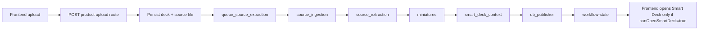

# MVP Backend Prune Map: Upload to Smart Deck

Date: 2026-07-03
Branch: `main`
Scope: backend MVP Upload -> Smart Deck pipeline ownership. This document is the canonical backend prune/ownership map for source extraction, miniatures, Smart Deck context, and readiness publication.

## Objective

Make the backend Upload -> Smart Deck path understandable and pruneable without preserving duplicate historical paths by default.

This document maps the current MVP path, identifies duplicated responsibilities, records completed cleanup, and proposes the remaining target module layout and refactor order. Duplicate/stale docs for the same feature were absorbed here.

## Absorbed Duplicate Docs

These docs overlapped this feature path and are now pruned or superseded by this document:

| Former document | Reason absorbed |
| --- | --- |
| `docs/upload-to-smart-deck-trace.md` | Duplicated Upload -> Smart Deck graph, readiness contract, stage meanings, admin debug checklist, and delete/retire guidance. |
| `docs/jun26/frontend-worker-boundary.md` | Duplicated worker-stage ownership and contained stale claims that `source_extraction` emitted Smart Deck workspace payloads. |
| `docs/codebase-audit/upload-to-smart-deck-loading-audit.md` | Historical production incident audit that claimed source extraction called Smart Deck workspace prep. That was true for the incident, but is no longer the canonical architecture. |
| `docs/source_enrichment_readiness_payloads.md` | Duplicated `sourceWorkspace`/`sourceEnrichment` payload notes and claimed extraction-run payload ownership that now belongs to `smart_deck_context`. |

## Current Canonical MVP Path

The current backend path for Upload -> Smart Deck is workflow-job based:

```text
upload route / retry route
  -> deck_workflow_service.queue_source_extraction()
  -> workflow_job_service.ensure_pipeline_jobs_for_run()
  -> deck_processing_worker_service.process_next_durable_deck()
  -> workers.job_handlers.get_workflow_job_handler()
  -> workers.source_pipeline_runtime stage handlers
  -> workers.publisher_runtime.handle_db_publisher()
  -> deck_workflow_service.get_deck_workflow_state()
  -> GET /api/products/deck-aistack-codes/decks/{deck_id}/workflow-state
```

The current source pipeline job sequence is defined in `app/services/workflow_job_service.py`:

```text
source_ingestion
source_extraction
miniatures
smart_deck_context
db_publisher
brand_extraction
```

Target MVP sequence should be:

```text
source_ingestion
source_extraction
miniatures
smart_deck_context
db_publisher
```

`brand_extraction` should be treated as optional/non-blocking for the MVP open condition unless product requirements explicitly make brand readiness blocking.

## Dependency Graph



## One Readiness Contract

The frontend and admin should trust only:

```text
GET /api/products/deck-aistack-codes/decks/{deck_id}/workflow-state
canOpenSmartDeck === true
```

Everything else is diagnostic or derived display state. Smart Deck should not open from slide counts, local UI state, generated-slide counts, workspace heuristics, legacy extraction-run status, or fallback readiness endpoints.

## Verified Route Ownership

Current code evidence:

- Frontend intake uses `POST /api/products/deck-aistack-codes/decks/upload-session` from `src/routes/(product)/decks/new/+page.svelte`.
- Backend canonical upload session/completion routes live in `app/api/routes/products.py`.
- Frontend processing and Smart Deck loaders read only canonical `workflow-state`.
- `upload_rescue.py` still exposes overlapping product-shaped routes, but current frontend code does not use it for the normal intake path.

That means the current production-shaped product path is:

```text
frontend /decks/new
  -> products.py upload-session / upload-completion / upload
  -> deck_workflow_service.queue_source_extraction()
  -> workflow-state
```

`upload_rescue.py` remains a legacy compatibility surface until admin or other non-frontend callers are proven absent.

## Current Stage Ownership

| Stage | Owner | Current responsibility |
| --- | --- | --- |
| `source_ingestion` | workflow job / source pipeline runtime | Confirm the source file is saved and associated with the deck. |
| `source_extraction` | `deck_structure_service.extract_and_persist_deck_structure()` | Persist source slides, blocks, deterministic source assets, and extraction metrics only. It does not prepare Smart Deck workspace payloads. |
| `miniatures` | `deck_preview_service.extract_source_previews()` through `presentation_miniature_service` | Render source previews and persist only `source_preview` assets plus existing slide preview paths. It does not create source slides. |
| `smart_deck_context` | `smart_deck_job_service.prepare_smart_deck_source_workspace()` through `source_pipeline_runtime.handle_smart_deck_context()` | Prepare source workspace, source versions, enrichment, and `sourceWorkspace` / `sourceEnrichment` job output. |
| `db_publisher` | `workers/publisher_runtime.py` | Publish `smart_deck_ready`, transition deck ready, and set `nextAction=open_smart_deck`. |

## Current Files Participating

| File | Current role | Ownership classification | Keep for MVP |
| --- | --- | --- | --- |
| `app/api/routes/deck_workflow.py` | Product workflow-state and retry/queue route surface. | translates contract | Yes |
| `app/api/routes/products.py` | Product upload route family also queues source extraction. | translates contract | Yes, but consolidate with other upload route surfaces later |
| `app/api/routes/deck_intake.py` | Intake route surface that can queue source extraction. | translates contract | Maybe, depending active frontend route |
| `app/api/routes/upload_rescue.py` | Rescue upload route family that can queue source extraction. | legacy compatibility | Prune candidate after route audit |
| `app/services/deck_workflow_service.py` | Creates source workflow jobs and builds canonical workflow-state. | owns workflow contract | Yes |
| `app/services/workflow_job_service.py` | Defines job types, pipeline sequence, dependencies, status transitions. | owns job contract | Yes |
| `app/services/deck_processing_worker_service.py` | Worker kind mapping, job claiming, heartbeat/recovery dispatch. | owns worker dispatch | Yes |
| `app/workers/job_handlers.py` | Maps job type to worker handler. | translates worker contract | Yes |
| `app/workers/source_pipeline_runtime.py` | Executes source_ingestion, source_extraction, miniatures, brand_extraction, smart_deck_context. | owns stage execution | Yes |
| `app/workers/publisher_runtime.py` | Publishes deck readiness states after upstream jobs complete. | owns readiness publication | Yes |
| `app/services/deck_structure_service.py` | Extracts, clears, and persists source structure. It no longer prepares Smart Deck workspace. | overloaded persistence service | Yes, split later |
| `app/services/pdf_deck_extraction_service.py` | Extracts PDF metadata/text/OCR/images. Thumbnail rendering is opt-in and disabled in the source extraction path. | owns extraction | Yes, split later |
| `app/services/deck_preview_service.py` | Renders source previews and persists `source_preview` assets against existing source slides. It honors `publish_ready_state`. | overloaded renderer/persistence | Yes, split later |
| `app/services/presentation_miniature_service.py` | Explicit compatibility shim around `extract_source_previews()`. The source pipeline no longer depends on it directly. | legacy compatibility | Prune candidate |
| `app/services/slide_thumbnail_service.py` | Renders a page thumbnail via `pdftoppm`; called by PDF structure extraction. | duplicate renderer | Remove from active MVP path later |
| `app/services/smart_deck_job_service.py` | Prepares Smart Deck source workspace/context. | owns Smart Deck context | Yes |

## Duplicated Responsibilities

### 1. Thumbnail and Preview Rendering

There are two independent renderers:

| Renderer | File | Called by | Output |
| --- | --- | --- | --- |
| `pdftoppm` renderer | `app/services/slide_thumbnail_service.py` | `pdf_deck_extraction_service.extract_pdf_deck_structure()` | thumbnail asset payloads during structure extraction |
| PyMuPDF renderer | `app/services/deck_preview_service.py` | `presentation_miniature_service.extract_presentation_miniatures()` from `source_pipeline_runtime.handle_miniatures()` | persisted `DeckSlide` previews and `DeckSlideAsset(asset_type="source_preview")` |

Historical problem:

```text
source_extraction renders thumbnail payloads
miniatures renders source previews
```

Current target:

```text
source_extraction extracts text/structure only
miniatures renders and persists all source previews/thumbnails
```

Status: implemented. `extract_pdf_deck_structure(..., include_thumbnails=False)` is used by source extraction. `include_thumbnails=True` remains opt-in for non-MVP callers until `slide_thumbnail_service.py` can be removed safely.

### 2. Slide and Asset Persistence

Both services can create slide/asset-like records or payloads:

| File | Current behavior |
| --- | --- |
| `deck_structure_service.py` | Clears and persists `DeckSlide`, `DeckSlideBlock`, and `DeckSlideAsset` from deterministic structure extraction. |
| `deck_preview_service.py` | Upserts `DeckSlide` and `DeckSlideAsset(asset_type="source_preview")` while rendering previews. |

Historical problem:

The miniatures step currently has permission to create/update source slides, even though source extraction also owns slide persistence.

Current target:

```text
source_structure_persistence owns DeckSlide and DeckSlideBlock rows
source_preview_persistence owns source preview DeckSlideAsset rows and thumbnail_path updates only
```

Status: implemented at service boundary. `deck_preview_service.py` now requires existing source slides and updates preview fields plus `DeckSlideAsset(asset_type="source_preview")`; it does not construct `DeckSlide` rows.

### 3. Smart Deck Context Preparation

The Smart Deck source workspace used to be prepared in two places:

| File | Current behavior |
| --- | --- |
| `deck_structure_service.py` | Calls `prepare_smart_deck_source_workspace()` inside `extract_and_persist_deck_structure()`. |
| `source_pipeline_runtime.py` | Calls `prepare_smart_deck_source_workspace()` again in `handle_smart_deck_context()`. |

Historical problem:

`source_extraction` and `smart_deck_context` overlap. This makes it unclear which stage actually owns Smart Deck workspace readiness.

Current target:

```text
source_extraction persists extracted source structure only
smart_deck_context prepares Smart Deck source workspace only
```

Status: implemented. `deck_structure_service.py` no longer imports or calls `prepare_smart_deck_source_workspace()`. The only source pipeline owner of that call is `source_pipeline_runtime.handle_smart_deck_context()`, which emits the `sourceWorkspace` and `sourceEnrichment` payloads.

### 4. Readiness Publication

Readiness is currently publishable from more than one surface:

| File | Current behavior |
| --- | --- |
| `publisher_runtime.py` | `handle_db_publisher()` transitions deck to `READY` for `publishTarget="smart_deck_ready"` and sets workflow phase/nextAction to open Smart Deck. |
| `deck_preview_service.py` | Historically called `transition_deck_state(... DeckState.READY ...)` after rendering previews. It now honors `publish_ready_state`; source pipeline miniatures calls it with `False`. |
| `deck_structure_service.py` | Historically accepted `publish_ready_state` and prepared Smart Deck source workspace during extraction. It now does source structure only. |

Problem:

`db_publisher` should be the only source pipeline stage that marks the deck openable. A rendering service should not decide product readiness.

Target:

```text
only db_publisher may publish smart_deck_ready
workflow-state is the only readiness contract
frontend opens Smart Deck only when workflow-state canOpenSmartDeck=true
```

### 5. Product Upload Route Surfaces

Several route files can upload or queue processing:

```text
app/api/routes/products.py
app/api/routes/deck_intake.py
app/api/routes/upload_rescue.py
app/api/routes/product_upload_compat.py
app/api/routes/decks.py
```

Problem:

Multiple upload/queue route families make it difficult to prove which route owns the production frontend path.

Target:

```text
one product upload route family
one retry route
one workflow-state endpoint
```

No route pruning should happen until the frontend route audit confirms which route family is live.

## Prune and Merge Candidates

| Candidate | Proposed action | Risk | Why |
| --- | --- | --- | --- |
| `app/services/presentation_miniature_service.py` | Completed as compatibility shim. Remove after all non-worker callers are proven absent. | Low | The source pipeline no longer routes through it; it remains only as a compatibility adapter. |
| `app/services/slide_thumbnail_service.py` | Remove from active MVP path after `pdf_deck_extraction_service` stops calling it. | Medium | It is the duplicate renderer, but removing it changes deterministic extraction payload shape if callers expect thumbnail assets. |
| Thumbnail rendering inside `pdf_deck_extraction_service.py` | Completed for MVP path; remove opt-in rendering after no non-MVP callers depend on it. | Medium | Source extraction now disables thumbnails, but the renderer import remains for opt-in callers. |
| `deck_preview_service.extract_source_previews()` READY transition | Completed for MVP path; it now honors `publish_ready_state`. Keep monitoring callers. | Medium | Source pipeline passes `False`; only explicit non-MVP callers may publish via this path. |
| `deck_structure_service.extract_and_persist_deck_structure()` Smart Deck workspace prep | Completed. Keep workspace prep in `smart_deck_context` only. | Medium | Source extraction no longer emits `sourceWorkspace`. |
| `deck_structure_service._clear_existing_structure()` broad destructive cleanup | Split into scoped cleanup modules and make non-destructive source versions the target model. | High | This touches generated slides, design versions, Smart Deck state, analysis, Smart Edit, and preferences. |
| Extra product upload route families | Prune or redirect to canonical upload route after frontend route audit. | Medium | Route behavior may still be used by deployed frontend or admin tooling. |
| Generation/export job types in `deck_processing_worker_service.py` | Keep out of MVP source-processing map; do not delete yet. | Medium | They are not part of Upload -> Smart Deck readiness but are part of post-open generation/export. |
| `brand_extraction` in `SOURCE_PIPELINE_JOB_SEQUENCE` | Make optional/non-blocking or move outside the required source pipeline. | Medium | Current tests indicate optional-brand behavior exists, but it still appears in the source sequence and can confuse readiness. |

## Files That Must Not Be Deleted

These files are active in the current source workflow and should be split or tightened before any deletion:

```text
app/api/routes/deck_workflow.py
app/services/deck_workflow_service.py
app/services/workflow_job_service.py
app/services/deck_processing_worker_service.py
app/workers/job_handlers.py
app/workers/source_pipeline_runtime.py
app/workers/publisher_runtime.py
app/services/deck_structure_service.py
app/services/pdf_deck_extraction_service.py
app/services/deck_preview_service.py
app/services/smart_deck_job_service.py
```

## Proposed Target Modules

Target folder:

```text
app/services/deck_processing/
```

Proposed modules:

| Target module | Responsibility |
| --- | --- |
| `source_pipeline.py` | Own the required MVP source pipeline sequence and stage dependency policy. |
| `pdf_structure_extractor.py` | Convert PDF to metadata, text, OCR fallback, blocks, and embedded image references only. No thumbnails. |
| `source_structure_persistence.py` | Persist extracted source slides/blocks/assets to DB. |
| `source_preview_renderer.py` | Render page previews/thumbnails from source PDF. No DB writes. Implemented as `app/services/deck_processing/source_preview_renderer.py`. |
| `source_preview_persistence.py` | Persist preview assets and update slide thumbnail/rendered image paths. Implemented as `app/services/deck_processing/source_preview_persistence.py`. |
| `source_workspace_context_service.py` | Prepare Smart Deck source workspace from persisted source slides. |
| `deck_readiness_publisher.py` | Publish `smart_deck_ready` and update deck state. This should wrap or replace the source-ready part of `publisher_runtime.py`. |
| `workflow_state_read_model.py` | Build the product-facing workflow-state response. This can be split from the current large `deck_workflow_service.py`. |
| `mvp_worker_policy.py` | Map worker kinds to allowed MVP job types and prevent legacy/generic workers from owning source readiness. |

Target path:

```text
upload/retry route
  -> queue_source_extraction()
  -> source_pipeline jobs
  -> source_ingestion
  -> source_extraction: pdf_structure_extractor + source_structure_persistence
  -> miniatures: source_preview_renderer + source_preview_persistence
  -> smart_deck_context: source_workspace_context_service
  -> db_publisher: deck_readiness_publisher
  -> workflow_state_read_model
```

## Suggested Refactor Order

### Phase 0: Current audit

Status: this document.

Deliverable:

```text
docs/refactor/mvp-backend-prune-map.md
```

### Phase 1: Stop duplicate readiness and thumbnail side effects

Do first because it reduces product confusion without changing route shape.

Status: implemented on `main` as of commit `095a354`.

1. `deck_preview_service.extract_source_previews(..., publish_ready_state=False)` strictly honors `publish_ready_state`.
2. `db_publisher` remains the source pipeline stage that publishes `smart_deck_ready`.
3. `pdf_deck_extraction_service.extract_pdf_deck_structure()` does not render thumbnails during source extraction.
4. Miniatures is the only source preview rendering stage in the MVP path.
5. Workflow-state remains the only readiness read contract.

### Phase 2: Split overloaded services

1. Split PDF extraction from DB persistence.
2. Completed: source preview rendering and source preview persistence are split behind `deck_preview_service.extract_source_previews()`.
3. Completed: Smart Deck source workspace preparation moved out of source extraction and into `smart_deck_context`.
4. Reduce `deck_structure_service.py` to orchestration/compatibility while new modules own the work.

### Phase 3: Prune thin wrappers and dead routes

1. Remove or convert `presentation_miniature_service.py` into a clear compatibility shim.
2. Remove `slide_thumbnail_service.py` from active MVP path after call sites are gone.
3. Verified current frontend route family: `products.py` owns the canonical upload-session/upload-completion/upload path. Next prune step is to prove no admin or compatibility clients still depend on `upload_rescue.py` or `product_upload_compat.py`.
4. Remove rescue/compat route families only after production frontend and admin no longer call them.

### Phase 4: Narrow worker runtime

1. Keep `source_ingestion`, `source_extraction`, `miniatures`, `smart_deck_context`, and `db_publisher` as the source readiness chain.
2. Move generation/export jobs out of the source MVP map.
3. Keep stale-job rescue separate from source processing.
4. Treat `brand_extraction` as optional or post-ready unless product explicitly makes it blocking.

## Concrete Breakpoints to Verify Before Pruning

Before deleting or merging any candidate, verify:

1. Which frontend upload route is live in production.
2. Which backend route actually receives the upload.
3. Which route queues `queue_source_extraction()`.
4. Whether `workflow-state` returns `canOpenSmartDeck=true` only after `db_publisher`.
5. Whether `DeckSlide.thumbnail_path` is populated by miniatures after removing extraction thumbnails.
6. Whether Smart Deck workspace preparation succeeds when it runs only in `smart_deck_context`.
7. Whether admin tooling depends on rescue upload or legacy processing routes.
8. Whether brand extraction failure blocks Smart Deck opening.

## Admin Debug Checklist

Use this same order when Smart Deck does not open:

1. Check backend API health.
2. Read `/workflow-state` for the exact `deckId`.
3. Inspect the active source pipeline job.
4. Inspect worker heartbeat age for `source_extraction`, `miniatures`, `smart_deck_context`, and `db_publisher`.
5. Confirm source slides exist after `source_extraction`.
6. Confirm `source_preview` assets and slide `thumbnail_path` values exist after `miniatures`.
7. Confirm `sourceWorkspace` exists in `smart_deck_context` job output after `smart_deck_context`.
8. Confirm `db_publisher` published `smart_deck_ready` before expecting `canOpenSmartDeck=true`.

## Payload Ownership

| Payload field | Owner |
| --- | --- |
| `source.slideCount` | Source extraction / persisted `DeckSlide` rows |
| `source.assetCount` | Source extraction for deterministic source assets; miniatures for `source_preview` assets |
| `thumbnailPath` | Miniatures updates existing source slides |
| `sourceWorkspace` | `smart_deck_context` job output |
| `sourceEnrichment` | `smart_deck_context` job output |
| `canOpenSmartDeck` | `workflow-state` read model after publisher-ready phase |
| `nextAction=open_smart_deck` | `db_publisher` / workflow-state |

## Summary

The MVP should have one backend meaning for each step:

| Step | Owner |
| --- | --- |
| queue processing | `deck_workflow_service.queue_source_extraction()` |
| job sequence | `workflow_job_service.SOURCE_PIPELINE_JOB_SEQUENCE` |
| worker dispatch | `deck_processing_worker_service.py` + `workers/job_handlers.py` |
| PDF structure extraction | target `pdf_structure_extractor.py` |
| source structure persistence | target `source_structure_persistence.py` |
| preview rendering | target `source_preview_renderer.py` |
| preview persistence | target `source_preview_persistence.py` |
| Smart Deck source workspace | target `source_workspace_context_service.py` |
| readiness publication | `publisher_runtime.py` / target `deck_readiness_publisher.py` |
| frontend readiness contract | `GET /api/products/deck-aistack-codes/decks/{deck_id}/workflow-state` |

The highest-priority cleanup is not deleting files first. It is removing competing ownership:

```text
only source_extraction extracts structure
only miniatures renders previews
only smart_deck_context prepares the workspace
only db_publisher marks Smart Deck ready
only workflow-state tells the frontend to open
```
