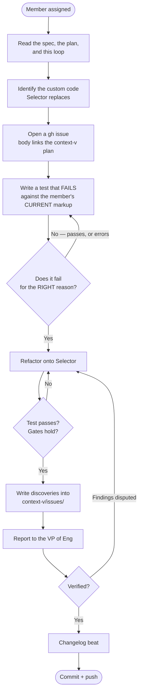

# Adopt Selector in one member

## What is different this time

The three previous adoption loops verified by **rendering and measuring**. That
worked because `Button`, `Chip` and `CardRow` are appearance with a little
behaviour, so a defect shows up as wrong pixels.

`Selector` is **behaviour with a little appearance**. A broken keyboard renders
perfectly. Three primitives already shipped defects that passed every gate —
one made its own button unfocusable while reporting `tabIndex="0"` and a correct
accessible name.

**So the test comes before the refactor**, and it is the load-bearing step.

## The loop



## Step 4 is the one people get wrong

**A test that fails because the component is missing is not the test.** It has to
fail against the member's *current* markup, describing the defect that is
shipping today:

- the `ArrowDown` that moves nothing
- the option that has no `tabindex="-1"`, so the widget is N tab stops
- the `role="menu"` with no `menuitem` children
- the `role="radiogroup"` with no radios

Run it. Read the failure. **If it fails for a reason other than the defect you
meant to describe, the test is wrong** — fix the test before touching the member.

This is also the only way to prove the nine surfaces were genuinely broken rather
than merely undocumented. A refactor with no red phase produces a green test and
proves nothing.

## What you are adopting

| | role triad | when |
|---|---|---|
| `Selector--Listbox` | `listbox` / `option` / `aria-selected` | choose from a set |
| `Selector--Menu` | `menu` / `menuitem`, no selected state | a list of **actions** |

`MenuItem` is the presentational row — icon, label, shortcut, danger tone. The
`Selector` owns the keyboard; `MenuItem` owns the appearance. Same split as
`ListContainer` and `CardRow`.

**There is no `Selector--Radio`.** Zero radios in the federation; shipping ahead
of consumers is how the federal layer got a spacing scale with no adopters.

## The contract you are inheriting

Seventeen tests already assert it in `packages/shared-ui/test/selector.test.ts`.
**You do not re-test the component** — you test that *your member* uses it.

1. One tab stop for the widget, not one per option.
2. Arrows move the active option, and focus follows.
3. Home / End, and typeahead on a printable character.
4. Enter / Space activate. Escape closes a popup and returns focus to its trigger.
5. The role triad is consistent — never a container role with the wrong children.

## Judgement

- **A menu is actions; a listbox is choices.** If the thing has a selected state,
  it is a listbox even when it is drawn as a popdown.
- **A combobox is not either of these.** An input that filters a list is a third
  organ with its own contract. If your surface has a text input driving the list,
  **leave it and raise it** — do not force it.
- **Escape must return focus to the trigger**, not to `<body>`. A popup that
  drops focus is worse than one that never opened.
- **Do not invent a keyboard where none was promised.** A plain list of buttons
  with no `role` is not broken — it is a list of buttons. Only adopt where a
  composite role is already declared, or where the surface genuinely is one.

## Inherited, not repeated

Everything mechanical comes from
[[Adopt-The-Shared-Button-In-One-Member]] — probe recipe, `resolve.alias` (NEVER
`source.alias`) with the mandatory sentinel grep, gate capture, raise-don't-chase,
and the ladder. **Rung 4 is `style=`, not `class=`.**

## Gates

```
pnpm --filter <pkg> test                     # your new test, green
node scripts/design-drift.mjs --member <p>   # must not increase
pnpm --filter <pkg> check                    # 0 errors
pnpm --filter <pkg> build
node scripts/verify-federation.mjs --fast    # must stay clean
```

## Related

- [[../plans/Build-Selector-And-Close-The-Keyboard-Contract]] — the plan
- [[../decisions/The-List-Surface-Paradigm-CardRow-ListContainer-And-Selection]] — D4
- [[Adopt-The-Shared-Button-In-One-Member]] — the mechanical half
- [[From-a-Raised-Issue-to-Fixed-and-Shipped]] — the gh-issue-to-shipped cadence this mirrors
