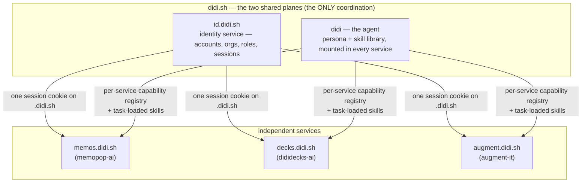

# didi.sh — One Login, One Agent, Three Services

## What changed

We own **`didi.sh`**. And with it, a posture decision: the three tools we've
been building organically for venture-capital work — each with obvious generic
demand beyond VC — get built out as **both independent services and
coordinated services**:

| Service | Repo today | What it is |
|---|---|---|
| **memos** | `memopop-ai` | multi-agent investment-memo orchestration |
| **decks** | `dididecks-ai` | slide-deck operating system for due-diligence-grade content |
| **augment-it** | `augment-it` | corpus curation + entity augmentation + grounded research workspace |

"Independent" means each ships alone, on its own repo, its own deploy, its own
capability registry, usable without the others. "Coordinated" means exactly
**two** things converge on didi.sh — no more:

1. **Shared auth.** Logging into *any* of the three requires an account on the
   shared identity service. One account, all three services. No per-service
   accounts exist.
2. **Shared agent.** One agent, named **didi**, present in all three services,
   loading specific agent skills based on what it is performing.

Everything else stays per-service. This doc maps what the domain purchase
changes architecturally (a lot, for auth; a naming-and-tier decision, for the
agent), what survives from the prior art unchanged (most of it), and what
forks next.

## The shape

Subdomain names are provisional (`id.` vs `auth.`, `augment.` vs `it.`, and
whether the apex hosts a landing/console) — flagged in open questions. The
structure is the commitment: **two planes, three services, apex domain owned.**

## Plane 1 — identity: the domain flips Fork 1

[[Shared-Auth-for-Applied-AI-Labs]] chose its Fork 1 as **Option A** — shared
library, per-app DB, *no central service* — and explicitly deferred SSO with
the note: *"B becomes attractive if we hit a wall where the
JOIN-by-`lossless_id` roll-up isn't enough (e.g., we want true SSO where
signing into memopop signs you into dididecks)."* One common login **is** that
wall, named in advance. Fork 1 flips to **B: a central identity service**.

### What the apex domain buys (why B just got cheap)

The original exploration was designed without a shared origin — three apps on
three unrelated domains, where SSO genuinely requires heavy machinery
(redirects, token exchange, a directory protocol). Under one apex domain the
hard part mostly dissolves:

- **One session cookie, scoped to `.didi.sh`** (HTTP-only, `Secure`,
  `SameSite=Lax`), issued by the identity service, readable by every
  `*.didi.sh` backend. Signing in anywhere = signed in everywhere, with no
  token-exchange choreography. This is the standard first-party-suite pattern
  (the reason google.com properties share a login).
- **Session validation is one shared check.** Each service's gate — augment-it's
  workspace token check on WS upgrade + per-capability authorization
  ([[../../augment-it/context-v/blueprints/Auth-Patterns-following-Astro-Knots-Patterns|Auth-Patterns-following-Astro-Knots-Patterns]]),
  dididecks' middleware, memopop's FastAPI dependency — validates the same
  session, either by a signed token it can verify locally (no network hop on
  hot paths) or by consulting the identity service (simplest v0). The
  session-table-as-contract idea from the original doc survives; the table
  just lives in one place now.
- **The roll-up seam collapses into the service.** Auth events are born
  central instead of outboxed per-app and ingested later — the cross-app
  dashboard the outbox was stubbed for becomes a query. (Per-app
  `auth_events_outbox` remains the right pattern for *app* events; it's no
  longer needed for *auth* events.)

### What the domain does — and does not — constrain (clarified 2026-07-06)

Three distinctions that came out of discussion, pinned so nobody re-derives
them:

- **Shared session ≠ federated login.** The `.didi.sh` cookie gives *one
  actual session*: sign in at decks, open memos, you're simply already in —
  no click, no redirect, one logout. "Log in with GitHub"-style federation is
  a different mechanism: each site runs a redirect + code-exchange dance and
  then issues its *own* separate session on its own domain (which is why
  logging out of GitHub logs you out of nothing else). If an app ever moves
  off `.didi.sh`, SSO doesn't die — it *downgrades* from shared-session to
  federated login, and we inherit the provider-side OAuth machinery
  (registered redirect URIs, code exchange, per-domain sessions). The
  identity service can grow into provider mode if GTM ever forces it; the
  point is to not stumble into that cost by parking an app on a marketing
  domain.
- **Domain topology ≠ repo or deploy topology.** DNS is a pointer layer.
  `decks.didi.sh`, `memos.didi.sh`, and `augment.didi.sh` can each CNAME to
  completely different infrastructure — three repos, three hosts, three
  independent deploy pipelines, exactly as they're built today. The
  pseudomonorepo stays what it is (independent repos aggregated for context,
  never a deployment unit). Per consumer repo, the didi.sh integration is a
  thin session-verification adapter plus env vars — no rearchitecture.
- **One cookie = one trust boundary.** Every `*.didi.sh` subdomain can read —
  and technically *set* — a `Domain=.didi.sh` cookie. Signed cookie values
  make forged cookies inert, but the operating rule stands regardless:
  **never host untrusted or client-controlled content on a `*.didi.sh`
  subdomain.** Client-published surfaces (`memos.acmevc.com`, GitHub-Pages
  client decks) already live off-domain; that stays a rule, not an accident.

### What survives from the prior architecture unchanged

Nearly everything below the topology line — the 2026-05-17 exploration's
choices were deliberately service-agnostic and move into the central service
intact:

- **The credential pathways:** OAuth (GitHub + Google Workspace, via
  `arctic`), magic-link email, pre-shared invite tokens (WhatsApp/1Password
  delivery). Invite-only; no self-serve signup; no passwords.
- **The org model:** one `organizations` table, **domain-as-id**, optional
  `firm_profile` extension, the personal-email bucket, the
  `@lossless.group` superuser fast-path.
- **Roles:** `superuser` / `org_owner` / `org_admin` / `editor` / `viewer` —
  org-wide, no per-resource ACLs. Authorization stays **per-service**: the
  identity service says *who you are and what orgs/roles you hold*; each
  service decides what that role may do against its own capabilities. (For
  augment-it, org ≈ workspace per
  [[../../augment-it/context-v/specs/Workspaces-as-Tenant-Primitive|Workspaces-as-Tenant-Primitive]].)
- **The stable person id** (`lossless_id`, UUIDv7 — possibly renamed
  `didi_id`; open question) — now minted in one place, which deletes the
  lazy-email-restitch problem between apps entirely.
- **The scale posture:** tens of people, a handful of client firms, code we
  own (~800 lines), no Auth0/Clerk. A central service does NOT mean a big
  service. It means the same small auth core **deployed once** instead of
  vendored three times — which is *less* total surface than Option A's
  three-copies-drifting problem.
- **The calmstorm inventory** (`dididecks-ai/context-v/specs/Calmstorm-Auth-Inventory.md`)
  remains the audited reference implementation for the session/token/invite
  mechanics.

### What stays hard (unchanged by the domain)

- **Tauri (memopop desktop).** No cookie jar worth trusting; system-browser
  OAuth against the identity service, deep-link back, refresh token in the OS
  keychain, bearer token on sidecar calls. Same design as before, now pointed
  at one endpoint.
- **Published client subdomains** (`memos.acmevc.com/deal-name`). A different
  origin, so the `.didi.sh` cookie does nothing there — the public-preview +
  magic-link viewer-auth design from the original exploration is untouched,
  still forks to its own doc when it gets real.
- **The superuser boundary, deletion policy, email provider** — all the
  original "deliberately left open" items remain open, just answered once
  instead of three times.

### Relation to the two-client convergence

[[Two-Clients-One-Flow-Corpora-Auth-and-Deployment-Converge]] left "where does
the first auth implementation land" as its open question #1 (augment-it's
workspace service vs resuming the calmstorm extraction). **didi.sh answers it
differently than either option:** the first implementation is the identity
service itself, and augment-it — the deploy target with two live client teams
waiting — is its **first consumer**. reach-edu and humain-vc logins become
didi.sh accounts with `editor`/`viewer` roles in their orgs, enforced at
augment-it's capability gate. calmstorm's code is the quarry to extract *into
the service* rather than into a vendored package; memos and decks wire in as
consumers two and three.

## The GTM constraint — every service is its own front door

Added 2026-07-06, same day, after the naming sketch above: **nobody searches
for a one-source-fits-all platform.** They search for a deck designer, a memo
generator, a research tool — point solutions whose names match the query. So
the platform posture inverts the usual suite pattern, and the inversion is a
hard requirement on the identity service's shape:

- **The apex is not the front door.** `didi.sh` (and any account console on
  it) is connective tissue, not a landing page users get routed through. Each
  service owns its marketing surface, its positioning, and its signup moment.
- **Accounts are created FROM the app the user is in.** A user who arrives at
  decks signs up *in decks* — the service renders its own branded signup/login
  UI (its theme, its copy), and the didi.sh account is created underneath,
  with no visible "now leaving for the platform" hop. Invites land the same
  way: an invite link opens the service's own access page, not `id.didi.sh`.
- **Therefore the identity service is headless-first.** Its primary interface
  is an API the services call — create-account, start-oauth, redeem-invite,
  redeem-magic-link, session issue/verify — not a hosted login page the
  services redirect to. A hosted fallback page can exist, but the contract is:
  **the service owns the pixels; the identity service owns the record and the
  session.** The OAuth dance still round-trips through the identity host
  (provider callbacks need one stable redirect URI), styled thin enough to
  read as a blink, landing back in the app that started it.
- **Marketing domain ≠ app domain — and only the app domain must be didi.sh.**
  The `.didi.sh` cookie is what makes SSO free, so the *running apps* live on
  `*.didi.sh`. Each service's discoverable marketing site can live wherever
  its GTM wants (a product-named domain, SEO'd for its query), funneling into
  its app subdomain at signup. Point-solution GTM and cheap SSO don't
  conflict — as long as nobody puts an app itself on a non-didi.sh domain.
- **The family is discovered later, from inside.** "Your account also works on
  memos" is an in-product moment — and a natural line for didi to deliver —
  *after* the point solution has proven its value. Cross-service is expansion,
  not acquisition.

## Plane 2 — didi, the agent

The agent architecture is already specced and the didi decision keeps all of
it: [[In-App-Agent-Chat-Core-Package]] (chat UI package, capability registry
as the only side-effect surface, BYOK routing, transcripts, Chroma tenancy)
and [[Remote-Mount-Contract-for-In-App-Agent]] (chat is UI-only; state and
capabilities live in per-app `@<app>/workspace` packages; the chat reaches
each app only through a typed `WorkspaceAdapter`). That contract is exactly
what makes "one agent, three services" possible without coupling: **didi has
zero domain knowledge; each service's registry is what didi can do there.**

What didi adds on top of that spec is three things it deferred or didn't name:

### 1. A persona

One name, one voice, one presence across memos, decks, and augment-it. The
character-cast pattern (memopop's `Character-Cast-for-Live-Agent-Indication`)
gets an anchor character: didi is the one you talk to; the cast are the
workers didi dispatches. The brand seed was already there — **Didi**Decks —
now promoted from one product's name to the family's agent.

### 2. A shared skill library, loaded per task

"Didi loads specific agent skills based on what it is performing." This is
the trigger-shape discipline we already live in Claude Code, operationalized
for the in-app agent — and it slots into the core spec's existing prompt
architecture rather than changing it:

- **Skills ≠ capabilities.** A *capability* is a typed, gated side-effect
  (`slide.variant`, `source.add`, `agent.run`) owned by a service's workspace.
  A *skill* is method-knowledge — how Lossless does deck iteration, source
  curation, memo citation discipline — loaded into didi's context when the
  task matches. Capabilities bound what didi *can do*; skills shape how didi
  *does it well*. The precedent is already in-tree: augment-it's
  `context-v/agent-skills/decile-hub-interface` is an agent skill in exactly
  this sense, and the operator-facing `context-v/skills/` library is the
  authoring pattern to mirror (SKILL.md, trigger description, references).
- **Placement in the prompt stack:** the core spec's cache-slab design holds —
  static spine (didi's persona + guardrails), capability schemas, per-org
  reminders, then volatile context. Skills load in the volatile zone via
  retrieval (the spec's "hybrid spine" recommendation) or as an explicitly
  fetched slab when the task declares itself (user opens the curator → the
  source-curation skill loads). Which loading mechanism — retrieval-scored vs
  surface-declared vs both — is an open fork.
- **One library, service-scoped exposure.** The skill library is shared
  didi-wide (that's half the point of one agent), but what's *loadable* is
  scoped per service + per org tier, same as capabilities.

### 3. Cross-service continuity

The core spec scoped cross-app chat out of v1 ("cross-app belongs at the
roll-up tier"). didi.sh **is** the roll-up tier, named. One identity + one
agent means the continuity question is now *when*, not *where*: didi in decks
knowing what you curated in augment-it this morning is a
`(didi_id, org)`-scoped memory read across service transcripts — the Chroma
tenancy design (`client__{org_slug}` tenants, `client-app-sessions`
collection) already isolates it correctly per client. Still not v1; no longer
homeless.

### The runtime-placement fork (open, sharpened)

The core spec said per-app agent runtime for v1, "factor out only if
duplication hurts." didi.sh sharpens the alternative: a shared didi runtime
(`agent.didi.sh` or similar) that fronts the model call, persona, skill
loading, and BYOK routing once, while **capability invocation still goes
through each service's workspace** (auth, policy, and audit enforced where the
state lives — the Remote-Mount contract's invariant). Lean: keep v1 per-app
per the spec, but implement the persona + skill-library as a shared package
didi-wide from day one, so the runtime consolidation later is an ops change,
not a rewrite.

## Independent AND coordinated — the discipline

The both/and posture has teeth, mostly already written down:

- **No chat-required apps.** The Remote-Mount contract's anti-pattern list
  says it: every service must ship and function without didi mounted. didi is
  a multiplier, not a load-bearing wall.
- **Auth is the one hard dependency, by design.** No service grows its own
  account system, ever — that's the coordination bet. Mitigation for the SPOF
  this creates: signed sessions each service can verify locally, so a brief
  identity-service outage degrades new-login only, not every request.
- **Capabilities stay home.** No shared business logic, no shared domain
  state. The only didi-wide contracts are the `WorkspaceAdapter` interface,
  the skill format, and the identity claims.
- **Repos stay independent** (pseudomonorepo discipline unchanged); didi.sh
  is deploy topology + two shared packages/services, not a merge.

## What this does to the near-term sequence

The [[Two-Clients-One-Flow-Corpora-Auth-and-Deployment-Converge]] sequencing
survives with its auth thread re-targeted:

1. **Thread 1 (domain-type UI)** — untouched, still first, still local.
2. **Auth spec** — now the **didi.sh identity service spec** (see forks):
   central service, `.didi.sh` cookie, org/role claims, augment-it as first
   consumer for the reach-edu + humain-vc logins.
3. **Deployment** — gains its concrete target: augment-it deploys *as*
   `augment.didi.sh`, and the identity service deploys beside it. DNS, TLS,
   and subdomain topology stop being abstract questions in the deploy plan.
4. **didi the agent** — not on the client-login critical path. The curator
   and corpus flow ship agent-less; didi's first mount follows the core
   spec's rollout order (decks first, memos, then augment-it) *or* flips to
   augment-it-first since that's where the deployed surface and the client
   users are — decide when the identity service is real.

## Update 2026-08-21 — consumer 1 is live, and the local-auth question is closed

Seven weeks on, the identity plane stopped being a proposal. This section
records what shipped, what it cost, and what that implies for consumers two
and three. The plan above is unchanged in shape — this is evidence, not a
revision.

### What augment-it proved

`id.didi.sh` runs on Fly; `augment.didi.sh` and `ws.augment.didi.sh` run on
Railway. Since 2026-07-28 **one instance serves two client orgs** —
`humain.vc` and `reach.edu` — with the session carrying the workspace. Two of
this doc's open questions are answered by the fact of it: the subdomain is
`id.didi.sh` (Q1), and the stable person id shipped as **`didi_id`** (Q2).

The **headless contract held**, which was the load-bearing bet. The identity
service owns no pixels. augment-it's `SignInWall.svelte` (full-page, pre-auth)
and `DidiBadge.svelte` (in-header popover) each render their own surface and
call the same small API directly:

| Endpoint | Used for |
|---|---|
| `POST /api/magic-links` | issue — `{email, app}`; 202 for unknown addresses, no enumeration |
| `POST /api/magic-links/redeem` | redeem a token, set the `didi_session` cookie |
| `GET /api/me` | identity + memberships, which resolve to allowed workspaces |
| `POST /api/session/refresh` | re-mint an expired JWT while the 30-day row lives |
| `DELETE /api/session` | sign out everywhere |

Services verify server-side against JWKS (`ID_JWKS_URL`, `ID_ISSUER`,
`DIDI_AUTH=required`) rather than trusting a claim. Authorization stayed
per-service exactly as designed: id says *who you are and what orgs you hold*,
augment-it's `enforceTenant` decides what that may touch.

**Org ↔ workspace binding** is the one piece of genuinely new mechanism. Each
workspace declares its org in `clients/<id>/workspace.json` (`{"org_id":
"reach.edu"}`), with an env fallback (`WORKSPACE_ORG_MAP=humain-vc=humain.vc,
reach-edu=reach.edu`) for deploys where the clients directory lives on a
volume rather than in git. A workspace with no org binding is invisible to
client sessions — it fails safe.

**Do not copy this part.** It is the *pre-entities* implementation, and the
entities strategy supersedes it — see the next subsection.

### Tenancy moved to entities — consumers two and three inherit it rather than reinvent it

The single most important correction to this doc's original framing.
[[Flexible-Entity-Relationships-to-Mirror-Messy-IRL-Collaboration]]
(2026-08-20) rules that **organization, workspace, and project are three
conventional labels for the same kind of thing**: one `entities` table where
`kind ∈ organization | workspace | project` is a **display label carrying no
structural meaning**, with **no `parent_id`, no containment, and no
inheritance of anything, ever**. `entity_memberships` generalises
`workspace_memberships`, and the migration is stated: `workspaces` → `entities`
with `kind: workspace`, existing ids preserved.

The reasoning is empirical rather than aesthetic — **projects are
collaborations among many organizations**, so a project belonging to exactly
one org is the exception. Encode a hierarchy and the common case (three
companies on one project) becomes the thing you fight the schema to express.

This changes the advice above in two concrete ways:

1. **memos and decks must NOT invent their own workspace analogue.** A memo
   collection and a deck are `entities` with a `kind` label; who may see them
   is `entity_memberships`. augment-it's `workspace.json` + `WORKSPACE_ORG_MAP`
   is a pre-entities workaround for a service that had no entity model, not a
   pattern to replicate twice more.
2. **The identity service now does know what a workspace is** — it holds the
   entities and the memberships. What stays per-service is the *authorization*
   decision: id says which entities you hold and at what role, each service
   decides what that role may do against its own capabilities. The line moved;
   it did not disappear.

Two further rulings bear on consumer planning. **Credentials are lent by
people, never owned by entities** — the lending act is what confers admin, and
withdrawing keys leaves the work intact. And the `user:org:workspace:project`
tuple survives as an **acting context** — derived, sparse, rendered into audit
rows and MCP resource URIs — explicitly *not* a path and never stored, because
the copies would disagree. Any consumer tempted to persist that tuple should
read Ruling 1 first.

This is also what decision **O6** is waiting on: scopes stay at
`openid`/`profile`/`email` until the entity model lands, because entity-scoped
grants would otherwise invent a grammar before the thing it names exists.

### The plane grew a second door the day before this update

One correction to the framing above: as of the **2026-08-20 amendment** to
[[Id-Didi-Sh-Identity-Service]], didi.sh is not only a session-cookie service —
it is an **OAuth 2.1 + OIDC authorization server** (`/oauth2/authorize`,
`/oauth2/token`, `/oauth2/userinfo`, `.well-known` discovery, open Dynamic
Client Registration per RFC 7591). It grew that door for Claude Desktop's MCP
path and for Onyx, not for our own three services.

This matters for consumers two and three, because there are now **two** ways
to integrate and they suit different callers:

| Door | Shape | Fits |
|---|---|---|
| **Session cookie** (`.didi.sh`) | bespoke `fetch` against `/api/magic-links*`, service owns the pixels | first-party web surfaces on `*.didi.sh` — what augment-it does |
| **OAuth 2.1 / OIDC** (`/oauth2/*`) | standards flow, `id_token`, discovery, DCR | anything off-origin, third-party, or that already speaks OIDC |

For `memos.didi.sh` the cookie door remains the right one — same origin
family, fewer moving parts, and augment-it has already de-risked it. The OAuth
door becomes interesting exactly where the cookie cannot reach: **client-owned
domains** and **desktop clients**. `memopop-native` (Tauri) is the clearest
candidate — system-browser authorization-code flow against `/oauth2/authorize`
is now a supported path rather than something we would have to build, which
materially lowers the cost of the "stays hard" item recorded above.

Two constraints from that amendment carry directly into consumer planning:

- **O2 binds every access token to a `sid` — a user session.** There is no
  machine identity in the model. That sharpens rather than resolves the
  headless-agent question (see Q9).
- **O6 keeps scopes at `openid` / `profile` / `email`** and *defers*
  entity- and workspace-scoped grants until the entity model lands. So neither
  memos nor decks can express "this token may touch this org's memos" through
  scopes yet — per-service authorization stays where augment-it put it.

### Five scars worth inheriting rather than re-earning

1. **The CORS allowlist is a silent failure mode.** `id-didi-sh`'s production
   `cors_origins` (`config/runtime.exs`) was **empty** when augment-it first
   deployed, so every cross-origin browser call failed quietly — no error
   worth noticing, just nothing working. *Every new `*.didi.sh` consumer must
   be added to that list as it goes live.* This is the single highest-value
   line in this section.
2. **The cookie is `Domain=.didi.sh`, which is a hard topology constraint.**
   A consumer not served from a `*.didi.sh` origin gets nothing from it. This
   is fine for `memos.didi.sh`; it is fatal for client-owned domains, which
   remain a separate auth problem (unchanged, but now proven rather than
   predicted).
3. **Sessions expiring mid-flight turned the app into a zombie** — stale UI
   over a dead identity. The fix was an hourly `/api/session/refresh` plus a
   `visibilitychange` handler, and clearing `user` on `auth_required` so the
   sign-in wall re-asserts over the stale surface. See
   [[../../augment-it/context-v/issues/Session-Expiry-Turns-The-App-Into-A-Zombie|Session-Expiry-Turns-The-App-Into-A-Zombie]].
   Any consumer with long-lived tabs inherits this problem.
4. **`PUBLIC_*` config is baked at build time, not read at runtime.**
   `PUBLIC_ID_BASE` has exactly the property that just cost augment-it a
   production outage on `PUBLIC_WS_URL` — a correct value set on the service
   does nothing until a *rebuild*. See
   [[../../augment-it/context-v/issues/Every-Remote-Hardcodes-The-Workspace-WS-To-Localhost-So-Prod-Loads-No-Data|Every-Remote-Hardcodes-The-Workspace-WS-To-Localhost]].
   The generalisable rule: resolve shared endpoints in **one** module, never
   as a literal per surface.
5. **Local dev needs an escape hatch or nobody will run the wall.** augment-it
   echoes a `dev_token` from the issue endpoint and auto-redeems it when
   `PUBLIC_DEV_AUTO_LOGIN_EMAIL` is set — no inbox round-trip. It must be
   one-shot per tab (guarded in `sessionStorage`): an earlier component-local
   flag re-fired on the post-redeem reload and produced an infinite
   magic-link loop.

### The decision: no new local auth, anywhere

**We maintain didi.sh for augment-it regardless.** That single fact collapses
the build-vs-adopt question for the other two services — the marginal cost of
adopting is wiring, while the marginal cost of *not* adopting is another
independent auth implementation to secure, migrate, and keep alive forever.

The current state makes the asymmetry concrete:

| Repo | Auth today | Implication |
|---|---|---|
| `augment-it` | didi.sh, live, two orgs | the reference consumer |
| `dididecks-ai` | **three separate local implementations** — `client-sites/calmstorm-decks`, `chroma-decks`, `eventcut-ai`, each with its own `src/lib/auth/` (passcode + token + middleware), its own `db/schema.ts`, its own `invite.ts` | already the drift this plane exists to prevent |
| `memopop-ai` | **none** — `memopop-web-app`, `memopop-site`, `memopop-orchestrator`, `memopop-native` carry no session, cookie, or passcode code | greenfield; should never grow one |

dididecks is the more interesting case precisely because `calmstorm-decks` is
the implementation this doc's prior art cites as the audited reference. It
didn't stay one implementation. It became three, which is the predicted
failure mode arriving on schedule.

### Wiring memopop — greenfield, so go straight there

Nothing to migrate; the work is additive.

- **Web tier (`memopop-web-app`, `memopop-site`)** — copy augment-it's
  headless pattern, not its code: a full-page wall for the pre-auth state and
  a badge for the signed-in state, both calling the five endpoints above.
  Serve from `memos.didi.sh` so the cookie applies. Add that origin to
  `cors_origins` **before** testing, or you will debug a silent failure.
- **`memopop-orchestrator`** is a Python CLI/agent, not a browser. It needs
  **service-to-service** credentials, not a user session — a different story
  the identity spec does not yet tell. Flagged as an open question below
  rather than assumed.
- **`memopop-native` (Tauri)** stays the hard one, unchanged from the analysis
  above: system-browser OAuth, deep-link back, refresh token in the OS
  keychain, bearer on sidecar calls. Worth deferring until the web tier is
  proven.

The `memos` ↔ org mapping needs the same treatment augment-it gave workspaces:
a memo (or a memo collection) belongs to an org, and the session's memberships
decide visibility. Do not let it default to "any signed-in didi.sh account."

### Wiring dididecks — a migration, and it forks on *who is signing in*

The three deck sites are **client-viewer** surfaces, not operator surfaces.
That is a materially different population from augment-it's, and it is the
question that has to be answered before any code moves:

- **Authoring** — the people building decks are us and our clients' teams.
  These are unambiguously didi.sh accounts. Straightforward.
- **Viewing** — a passcode handed to a room of LPs is a *deliberately*
  low-friction, low-assurance affordance. Requiring each viewer to hold a
  didi.sh identity may be the right call (attribution, per-viewer analytics,
  revocation) or exactly the wrong one (friction on the surface whose entire
  job is to be openable).

A plausible resolution — to argue with, not adopt — is that **authoring
migrates and viewing does not**: deck authors sign in with didi.sh, while
per-deck viewer passcodes survive as a share mechanism, with the passcode
implementation consolidated into *one* package instead of three. That keeps
the low-friction share, ends the drift, and still means no new auth system.

Client-owned deck domains remain outside the cookie either way.

## Open questions

> **Resolved since drafting (2026-08-21):** Q1 (subdomain) and Q2 (`didi_id`)
> are settled by what shipped — see the update section above. Q6 (BYOK) and Q7
> (white-label) are untouched. Three new questions are appended at the end.

1. ~~**Subdomain names.**~~ **Resolved — `id.didi.sh`.** `id.didi.sh` vs `auth.didi.sh` vs `login.didi.sh`;
   `augment.didi.sh` vs `it.didi.sh` (the pun) vs renaming the service to
   match `memos`/`decks` vocabulary (`corpus.didi.sh`? `research.didi.sh`?).
   The apex-as-front-door half of this question is answered by the GTM
   section — the apex is never the acquisition path; at most it hosts a
   secondary account console ("your account, your orgs, your services")
   reached from inside the apps.
2. ~~**`lossless_id` → `didi_id`?**~~ **Resolved — shipped as `didi_id`.** The stable person id is about to be minted
   by the didi.sh service; naming it after the platform reads better in every
   downstream schema. Decide before the first row exists, not after.
3. **Is didi the platform brand or just the agent?** "didi.sh services" vs
   "the didi platform, with didi the agent as its face." Affects marketing
   copy, the apex page, and whether `dididecks` reads as redundant. The GTM
   section tilts this: the *services* carry the searchable product brands;
   didi.sh is connective tissue plus the agent's name — so didi is probably
   the agent (and the quiet account footer), not the headline.
4. **Skill loading mechanism** — retrieval-scored triggers, surface-declared
   packs, or both (lean: both — declare by surface, retrieve within).
5. **Agent runtime placement** — per-app v1 with shared persona/skill
   packages (the lean above), or straight to a shared runtime service.
6. **BYOK × central identity.** Keys hang off the user record — which now
   lives in the identity service. Does key storage centralize with it (web
   tier), or stay per-service? (Tauri keychain storage is unaffected.)
7. **White-label later.** Client-facing surfaces on client domains
   (`memos.acmevc.com`) were always a separate auth problem; a didi.sh
   account behind them is now the *authoring* identity either way. Unchanged,
   but worth restating so nobody expects the apex cookie to cover it.
8. **Do deck *viewers* need didi.sh identities, or only deck authors?** The
   fork named in the dididecks section above, and the one that decides whether
   the migration is small or large. Under the entities model the mechanism
   exists either way — a viewer would be an `entity_membership` at a `viewer`
   role on the deck's entity — so the question is no longer *can we* but
   *should we*: is a per-viewer identity worth the friction on a surface whose
   whole job is to open for a room of LPs? Answer before touching code.
9. **Machine identity for headless agents — sharpened by the 2026-08-20
   amendment, not answered by it.** `memopop-orchestrator` is a Python agent
   with no browser and no user session. didi.sh now speaks OAuth 2.1, but
   decision **O2 binds every access token to a `sid`** — a user session row —
   and no `client_credentials` grant exists. So the choice is explicit: add a
   machine-client grant (and with it a token lifecycle that is *not* a human
   session), run agents under a **delegated user identity** (the operator who
   launched the run, which keeps revocation and attribution in one place), or
   rule it out of the service's remit and let agents ride a service's own
   internal trust boundary. augment-it never had to ask, because its services
   talk over NATS behind the workspace gate. Lean: delegated user identity —
   it needs no new grammar and makes "who ran this memo" answerable.
10. **Do the three deck auth implementations migrate, freeze, or consolidate?**
   `calmstorm-decks`, `chroma-decks`, and `eventcut-ai` are live client
   surfaces. "Migrate all three now" competes with "consolidate into one
   package, migrate opportunistically" — and the answer depends on Q8.

## What forks from this

- **ai-labs spec: [[Id-Didi-Sh-Identity-Service]]** (written 2026-07-06) —
  supersedes the package-extraction plan in [[Shared-Auth-for-Applied-AI-Labs]]
  §Decisions: schema (carried over nearly verbatim), the **headless-first API
  contract** (services own the signup pixels; the GTM section above is a hard
  requirement, not a preference), the `.didi.sh` session contract,
  signed-token verification for services, the consumer wiring order
  (augment-it → decks → memos incl. Tauri), and what calmstorm's code
  contributes (behavioral reference, not extracted code — the spec picks a
  non-TS stack).
- **ai-labs blueprint: `Didi-Agent-Skills-Convention.md`** — the skill
  format, the library layout, service-scoped exposure, loading mechanics,
  and the relationship to `context-v/skills/` and `context-v/agent-skills/`
  precedents.
- **A naming decision record** (short, in this doc's next revision or the
  identity spec) — subdomains, `didi_id`, platform-vs-agent branding.
- **Amendments landed with this doc:** Fork-1 revision note in
  [[Shared-Auth-for-Applied-AI-Labs]]; auth-thread re-target in
  [[Two-Clients-One-Flow-Corpora-Auth-and-Deployment-Converge]].

## Related

- [[Id-Didi-Sh-Identity-Service]] — the spec this doc forked; **read its
  2026-08-20 authorization-server amendment before wiring any consumer**, it
  adds an OAuth 2.1 / OIDC door this exploration originally predated.
- [[Flexible-Entity-Relationships-to-Mirror-Messy-IRL-Collaboration]] — the
  entities strategy that replaces per-service workspace modelling; read
  Rulings 1 and 2 before designing tenancy for memos or decks.
- [[Shared-Auth-for-Applied-AI-Labs]] — the auth architecture didi.sh
  re-topologizes; everything below Fork 1 carries over.
- [[Two-Clients-One-Flow-Corpora-Auth-and-Deployment-Converge]] — the
  near-term convergence this gives a domain and an identity-service answer to.
- [[In-App-Chat-as-Agent-Surface-for-Client-Apps]] — the chat-as-menu
  exploration didi personifies.
- [[In-App-Agent-Chat-Core-Package]] — the package spec didi rides on
  (capability registry, BYOK, transcripts, Chroma tenancy, cache slabs).
- [[Remote-Mount-Contract-for-In-App-Agent]] — the WorkspaceAdapter contract
  that makes one agent across three services non-coupling.
- `dididecks-ai/context-v/specs/Calmstorm-Auth-Inventory.md` — the audited
  session/invite mechanics the identity service extracts from.
- `memopop-ai/context-v/specs/Character-Cast-for-Live-Agent-Indication.md` —
  the personification pattern didi anchors.
- `augment-it/context-v/agent-skills/decile-hub-interface/` — the in-tree
  precedent for an agent skill.
