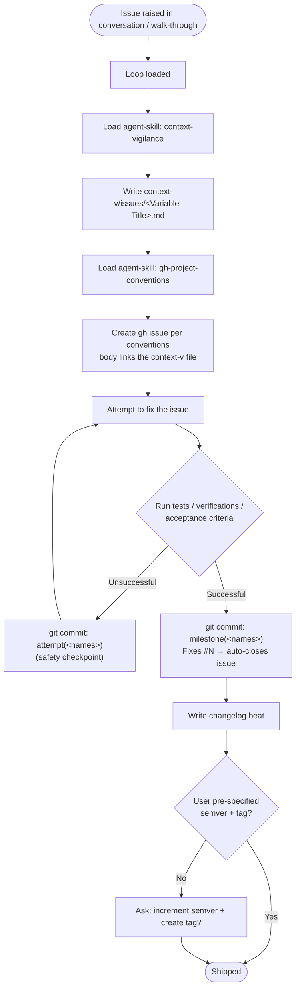

# From a Raised Issue to Fixed-and-Shipped

> `context-v/loops/` is **experimental** (per the context-vigilance skill).
> Siblings: [[Implement-Feature-Loop]] (per-ticket feature execution) and
> [[Loop-through-Spec-Write-Plans-Implement-Test-Changelog-Commit]] (spec-first
> feature cadence). This loop is the **bug lane**: a single defect, raised in
> conversation or a walk-through, driven to shipped.

## What this loop is

The cadence for turning *one raised issue* into *fixed, committed, and
ship-ready* code. It differs from the feature loops in two ways: it starts from
a **defect**, not a plan; and it hardens the fix cycle with a **safety-commit on
every failed attempt** so no diagnostic work is ever lost between tries.

The distinctive commit grammar:

- `attempt(<names>)` — a safety commit after a **failed** verification, so the
  next try starts from a saved checkpoint (not a dirty tree).
- `milestone(<names>)` — the commit that lands the **passing** fix. Pair it with
  a `Fixes #N` trailer so the gh issue auto-closes on push to the default branch.

## The loop

## Step-by-step

1. **Loop loaded** — this doc is the durable definition; each session that runs
   it is an execution.
2. **Load `context-vigilance`** — so the issue doc lands with correct frontmatter,
   folder role, versioning, and wikilinks.
3. **Write `context-v/issues/<Variable-Title>.md`** — title derived from the
   defect. Capture: Why Care, root cause, expected behavior, fix, resolution.
   `status: Resolved` once the fix lands.
4. **Load `gh-project-conventions`** (the `gh-cli-projects-tasks-conventions`
   skill) — for label/milestone prefill and the body-is-a-GitHub-link convention.
5. **Create the gh issue** — body's primary content is the clickable GitHub URL
   to the context-v file in *its own repo* on the current branch.
6. **Attempt to fix** — make the change.
7. **Verify** — run the tests, the build/typecheck, or the named acceptance
   criteria for this defect. No verification, no milestone.
8. **On failure → `attempt(<names>)`** — safety-commit the work-in-progress so the
   next iteration starts clean, then return to step 6.
9. **On success → `milestone(<names>)`** — commit the passing fix with a
   `Fixes #N` trailer; push; the issue auto-closes.
10. **Changelog + ship decision** — unless the user pre-specified, write the
    changelog beat, then **ask** whether to increment semver and cut a tag
    (per [[changelog-conventions]] and the repo's version discipline).

## Notes carried from the first run (2026-08-02)

- **Deploy caveat is part of "shipped."** For augment-it, a backend/frontend fix
  only reaches augment.didi.sh on the next redeploy — state that in the
  changelog and the resolution so "shipped" isn't mistaken for "live."
- **Data already mangled by the bug is a separate remediation** from the code
  fix — note it, don't conflate it with the fix commit.
- **`attempt()` never fired** on the first two runs (both fixes verified on the
  first try). The rung exists for the harder defects; its absence is a clean run,
  not a skipped step.

## See also

- [[Implement-Feature-Loop]] · [[Loop-through-Spec-Write-Plans-Implement-Test-Changelog-Commit]]
- [[changelog-conventions]] · the `gh-cli-projects-tasks-conventions` and `git-conventions` skills
