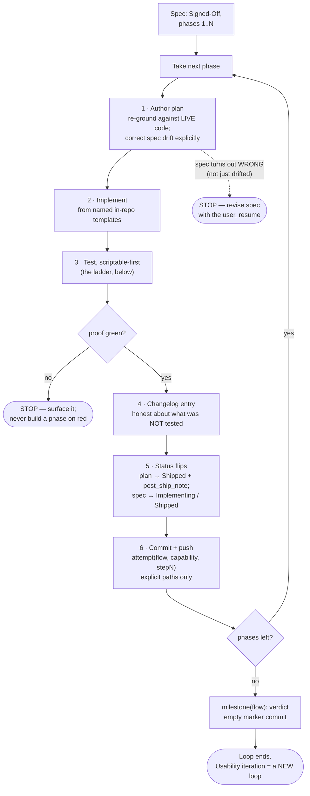
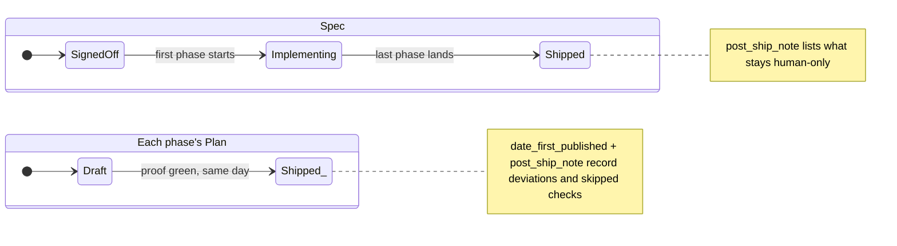

# Loop through a spec — plan → implement → test → changelog → commit

> `context-v/loops/` is an **experimental** folder (per the context-vigilance
> skill) and this is its first occupant here. Expect the shape to drift as
> more loops get codified.
>
> This one was codified *retrospectively* — the run came first because there
> was no example to write against. **Next time, invert it:** author (or
> update) the loop doc before running, using this file as the template. The
> doc is the durable definition; the session is the execution.

## What this loop is

A per-phase execution cadence for a spec that is already **Signed-Off** and
decomposed into phases. The spec is the contract; each iteration turns one
phase into a plan, lands it, proves it, records it, and pushes it — so the
repo is never more than one phase away from a green, documented, pushed
state. First proven on [[../specs/Augment-From-DB-Flow]] (five phases in one
session, 2026-07-22).

**Preconditions:** a Signed-Off spec with a phase decomposition whose Phase 1
is service/data-layer work (surfaces come after their capabilities — this
ordering is what makes later phases UI-only and cheap); a proof-script
convention; the changelog and git-conventions skills.

## The loop at a glance



## The iteration (one phase per pass)

1. **Author the plan** — `context-v/plans/<Spec>-Phase-N-<Name>.md`,
   `spec_reference` in frontmatter. Before writing steps, **re-ground
   against the live code**: read the exact files the phase touches. Where
   reality diverges from the spec's anticipated snippets, the plan corrects
   the spec and says so explicitly (Phase 1 found three such divergences;
   Phase 2 found a whole missing verb). The plan names its verification
   before implementation starts.
2. **Implement** — smallest dependency-ordered steps, every new file copied
   from a named in-repo template (the plan lists which). Service verbs cross
   their three files (handler → capabilities map+timeout → typed client
   wrapper); remotes follow the scaffold of the newest shipped remote.
3. **Test, scriptable-first** — climb the ladder, cheapest to dearest;
   stop climbing only where the next rung would pollute shared data:

   ```text
   cost/risk ▲   ┌──────────────────────────────────────────────────────┐
             6   │ operator browser walk-through ── NAMED, not faked    │  humans only
             ────┼──────────────────────────────────────────────────────┤ ─────────────
             5   │ live end-to-end, side-effect-safe only               │
                 │   ✓ stream-scan flip test   ✗ test persons in canon  │
             4   │ container rebuild + raw-NATS proof of new verbs      │
                 │   (the running stack is OLD code until you rebuild)  │
             3   │ standing regression: prove-<spec>-capabilities.mjs   │  every phase,
                 │   written in Phase 1, re-run every phase             │  scripted
             2   │ dev-server smoke: curl :PORT/remoteEntry.js          │
             1   │ builds — each remote + THE SHELL (catches            │
                 │   federation-registration typos)                     │
             0   │ svelte-check + tsc --noEmit on everything touched    │
                 └──────────────────────────────────────────────────────┘
   ```
4. **Changelog** — one entry per phase, changelog-conventions shape, honest
   about what was NOT tested and why.
5. **Status flips** — plan → `Shipped` + `date_first_published` +
   `post_ship_note` recording deviations and skipped checks; spec →
   `Implementing` on the first phase, `Shipped` (+ post_ship_note listing
   what remains human-only) when the last phase lands.
6. **Commit + push** — one commit per phase:
   `attempt(<flow-slug>, <capability>, stepN): <impact-first headline>`,
   body per git-conventions (why before how, proof summary included). Stage
   explicit paths only — never sweep in unrelated dirty state (submodules
   like `clients/*` stay untouched for deliberate tidying). Push each phase;
   don't batch.

### What one pass leaves behind (the artifact trail)

Every iteration deposits the same four artifacts plus one commit — this is
the proving run's Phase 2, but every phase leaves the identical shape:

```text
augment-it/
├── context-v/
│   ├── specs/Augment-From-DB-Flow.md          ← status flip (+ post_ship_note at the end)
│   └── plans/
│       └── Augment-From-DB-Phase-2-….md       ← NEW: the plan, → Shipped + post_ship_note
├── changelog/
│   └── 2026-07-22_02_Org-Workbench-….md       ← NEW: one entry, honest about untested legs
├── apps/ | services/ | shell/                 ← the code, from named in-repo templates
└── (git) attempt(augment-from-db, org-workbench, step2): …   ← one pushed commit
```

### Status lifecycles the loop drives



## Exit conditions

- **All phases shipped** → an empty `milestone(<flow-slug>): <verdict>`
  marker commit naming the step range and the known follow-ups. Then stop —
  usability iteration is a NEW loop with its own findings, not a tail on
  this one.
- **A phase's proof won't go green** → stop the loop, surface it; don't
  proceed to a phase that builds on red.
- **The spec turns out wrong mid-phase** (not just drifted — wrong) → stop,
  revise the spec with the user, resume.

## Hard-won rules (from the first run)

- **Quote YAML `revisions:` entries.** Any list item containing `: ` breaks
  standard YAML parsers ("mapping values are not allowed in this context").
  Double-quote every revision string at write time — this bit four files,
  two of them pre-existing.
- **The proof script is the loop's spine.** Written once in Phase 1, re-run
  every phase; it converts "did we break the floor?" from a worry into a
  ten-second check.
- **svelte-check is not optional even when the build passes** — it caught a
  prop declared in a type but missing from the destructure that rsbuild
  happily bundled.
- **Existing seams beat new machinery.** Phase 5 was a half-day because
  `curated_index_urls` already existed; the plan-authoring step's job is to
  find that seam BEFORE writing code.
- **Splash content needs `git add -f`** (the `.gitignore` `content` rule
  silently drops `splash/src/content/*`), and splash deploys only from
  `main` — a card authored on a work branch ships at reconciliation.
- **Cross-service needs go through NATS verbs, never shared DB access** —
  the dedup read (`content.urls.check`) is the pattern, per the domains.ts
  precedent.

## Related

- [[../specs/Augment-From-DB-Flow]] — the proving run's spec (Shipped)
- [[../plans/Augment-From-DB-Phase-1-Service-Capabilities]] through
  [[../plans/Augment-From-DB-Phase-5-Stream-Scan-Mode]] — the five iterations
- `changelog/2026-07-22_01` … `_05` — the paper trail, one per pass
- context-vigilance skill §Experimental tier — what `loops/` is for;
  changelog-conventions + git-conventions skills — the formats steps 4 and 6 follow
