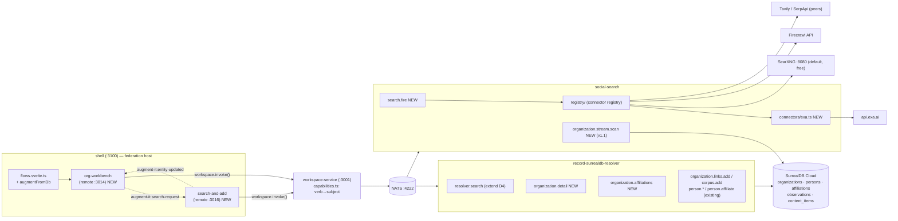
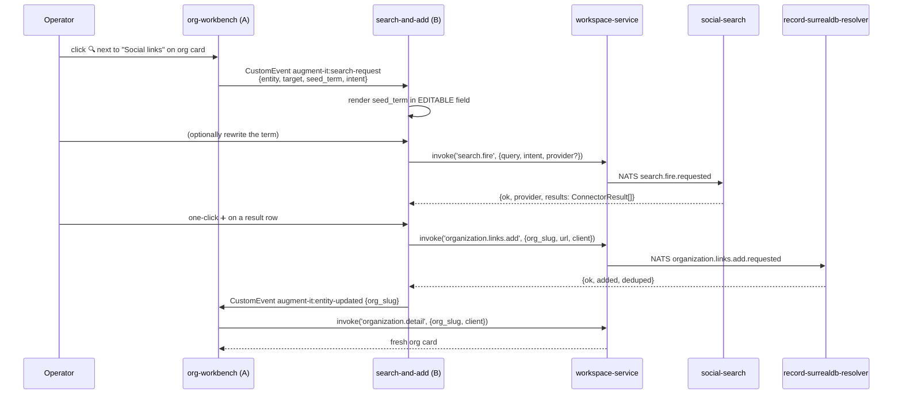
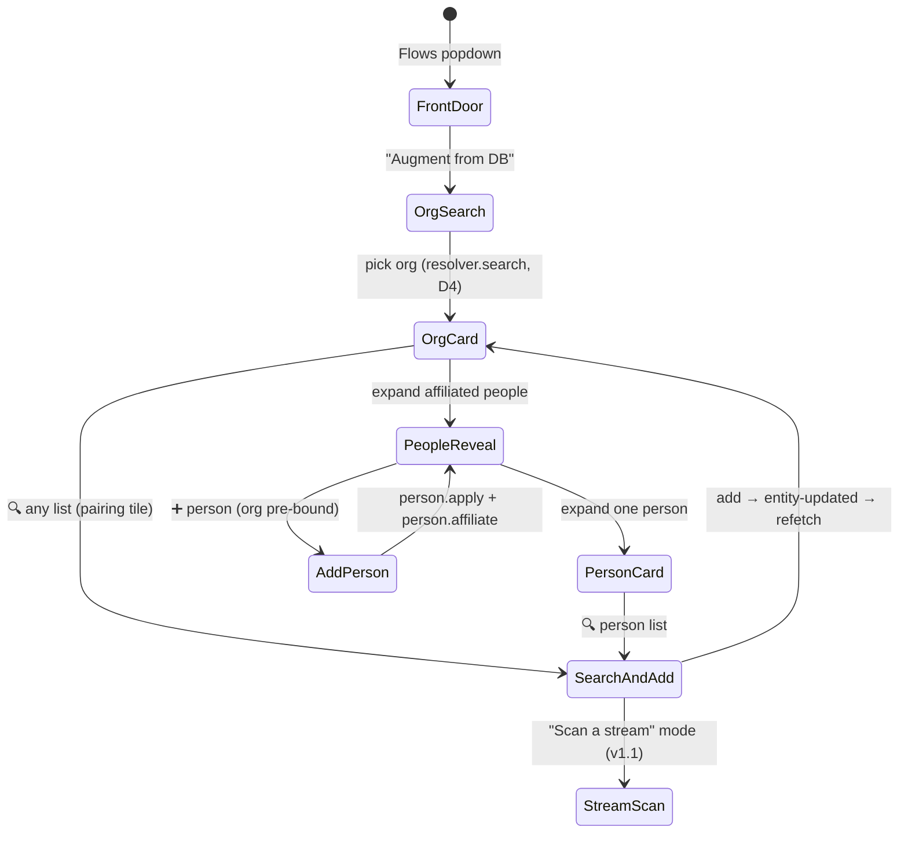

# Augment from DB — Org Workbench + Search-and-Add

## Summary

A new flow, **"Augment from DB"**, registered in the shell's FLOWS registry, built from **two new microfrontends**:

1. **`org-workbench`** (`apps/org-workbench`, port **3014**) — pick the DB + table (SurrealDB → `organizations`), smart-search to one org, and work an **org card**: identity/social links, pulse streams, corpus items, and a reveal of affiliated people with nested person cards. Every list is additive with a ➕. Add a person to the org and the affiliation edge + observation are generated automatically.
2. **`search-and-add`** (`apps/search-and-add`, port **3016**) — the provider-pluggable search surface. An **always-visible, always-editable search term**, a provider palette (SearXNG default · Firecrawl · **Exa (new)** · Tavily/SerpApi as peers), and result rows with one-click add targeted at whatever entity+list launched the search.

The exploration of record is [[../explorations/Augment-From-DB-Flow-Two-New-Microfrontends]]; this spec locks its open questions into decisions and decomposes the build into five handoff-ready phases. The controlling insight from the 2026-07-21 code scan: **the data model and most verbs already exist — this is a surfaces-and-four-capabilities build, not a platform build.**

## Goals

- Register `augmentFromDb` as its own flow behind the front door (never spliced into `CSV_AUGMENTATION_ROTATION`).
- One screen per org that **views and edits in place** (the [[Augment-From-Affiliations]] operator ruling — no "two loops, two apps").
- Affiliations generated implicitly when adding a person in org context (`person.affiliate` with the org pre-bound), supporting **N affiliations per person** from day one.
- Every fired search shows its term in an editable field; re-fire on edit; provider hot-swappable per fire.
- One-click add lands on the correct target: `organization.links.add` / `organization.corpus.add` / `person.links.add` / `person.corpus.add` (DB-side), or `source.add` (domain corpus) when launched from a domain context later.
- Exa joins the connector registry as a peer provider (env key **`EXA_AI_API_KEY`** — already present in `.env`).
- Stream-scan mode (v1.1): fire a `media_streams[]` entry through the existing entity-pulse packs and dedup results against `content_items.url` before display.

## Non-goals

- **No new tables, no schema changes.** `organizations` / `persons` / `affiliations` / `observations` / `content_items` as they stand.
- **No batch/bulk enrichment.** Gate-every-step is the product's origin thesis; nothing in this flow fires without an operator action, and adds are metadata-first.
- **No filesystem writes for org/person corpus.** Entity corpus stays DB-only (`org_corpus[]` / `personal_corpus[]` → `content_items`), same as the people-corpus decision of record. The SurrealDB↔filesystem bridge ([[../explorations/Funder-Fit-Engine-Org-Corpora-and-the-Story-Unlock-Cycle]], corpora-builder's gap) is a separate effort.
- **No LinkedIn/Facebook wall-timeline fetching guarantees.** Blog/RSS/newsroom streams are the dependable v1.1 path; social-wall depth is an experiment behind the same UI, not a commitment.
- **No embedding/KAG search in v1.** Org search is candidate matching (names + slug + aliases + domains); the seam for smarter relevance is the capability boundary, not the UI.
- **No parallel search abstraction.** Exa and any future provider extend `services/social-search/src/registry` — nothing else.

## Decisions (resolving the exploration's open questions)

| # | Question | Decision |
|---|---|---|
| D1 | Creds posture | **Proxy.** Both remotes are credential-free; all reads/writes go `workspace.invoke()` → NATS → `record-surrealdb-resolver`. No third browser-creds surface. The two read capabilities this requires (`organization.detail`, `organization.affiliations`) are Phase 1. |
| D2 | A↔B launch contract | **Window CustomEvent, then capability writes.** `org-workbench` dispatches `augment-it:search-request` (detail typed below); `search-and-add` listens, fires, and writes via capabilities itself; on success it dispatches `augment-it:entity-updated` and org-workbench re-fetches. Consistent with the shell's no-shared-federation posture (state coherence via events, never shared memory). A `PAIRINGS` entry tiles them side-by-side. |
| D3 | Step-8 shape | **Mode of `search-and-add`** ("Scan a stream"), not a third remote. Same results rows, same one-click add, plus an `already_in_corpus` badge from `content_items.url` dedup. Revisit as its own remote only if per-stream cadence/new-since-last-scan UI proves genuinely different. |
| D4 | Smart-search depth | **Extend `searchOrgs` matching to `aliases[]` + `domains[]`** (today: names + slug only) and keep `LIMIT 8` autocomplete semantics. No embeddings in v1. |
| D5 | Where org-corpus adds land | **DB-only** via existing `organization.corpus.add` (`org_corpus[]` + `content_items` find-or-create). |
| D6 | Exa scope | **Search-only connector** (`search.web` + social intents), `EXA_AI_API_KEY`, following the `tavily.ts` + `TAVILY_REG` pattern. Exa contents/similarity endpoints are future capabilities. |

## Constraints & assumptions (inherited, load-bearing)

1. Relevance lives **only** on the `affiliations` edge ([[Augment-From-Affiliations]]) — never on `persons`/`organizations`.
2. N affiliations per person; `person.affiliate` is callable repeatedly ([[../issues/Person-DB-Resolver-Needs-Multiple-Organizations-Per-Person]]).
3. Org identity over the wire is the **slug**, never a RecordId (RecordIds don't survive JSON over NATS — `resolver.ts` header comment). Person identity is `person_uuid`.
4. Client-tagging on every canonical write: `client_access ∪ [client]` ([[Client-Tagging-on-Canonical-Writes]]).
5. Additive, dedup-by-URL writes (`shapeLink` / `findOrCreateContent` semantics); never destructive.
6. All UI↔service traffic is `workspace.invoke(verb, args)` → `CAPABILITY_TO_SUBJECT` map in `services/workspace/src/capabilities.ts` → NATS `<verb>.requested` request/reply. New verbs need a map entry + a timeout entry.
7. Remote mount contract: federation module exposing one mount function taking `HTMLElement`, returning `{ destroy }`, importing `@augment-it/theme/theme.css` before local css (see `apps/person-enrichment/src/mount.ts`).
8. Cross-remote events ride `window` CustomEvents in the `augment-it:` namespace (`augment-it:navigate`, `augment-it:enrich-record` precedent).
9. Ports 3014 and 3016 are free in the remote band; shell host is 3100; never 3000.
10. Assumption: `EXA_AI_API_KEY` in the repo-root `.env` is valid and passed through docker-compose to `social-search` (verify in Phase 1 — add to the service's env passthrough if absent).

## Architecture

### System view



### The search→add loop (the flow's heartbeat)



### Flow navigation



## File tree — existing (reused) vs anticipated (NEW)

```text
augment-it/
├── shell/
│   ├── src/
│   │   ├── flows.svelte.ts                 # EDIT — add augmentFromDb FLOWS entry
│   │   └── remotes.ts                      # EDIT — AUGMENT_FROM_DB_ROTATION, 2 RemoteEntry, 1 Pairing
│   └── rsbuild.config.ts                   # EDIT — 2 lines in the federation remotes map
├── apps/
│   ├── person-enrichment/src/pulse-dimensions/   # REUSED — LinkList, AffiliationCard,
│   │   │                                         #   NameFields, OrgCreate (copy-adapt, see Phase 4)
│   ├── pack-runner/src/ConnectorPalette.svelte   # REUSED — copy-adapt provider palette
│   ├── corpora-curator/src/SourceList.svelte    # REUSED — result-row/list idioms
│   ├── org-workbench/                      # NEW (:3014)
│   │   ├── package.json / tsconfig.json / rsbuild.config.ts
│   │   └── src/
│   │       ├── index.ts / mount.ts / app.css / css.d.ts
│   │       ├── App.svelte                  # header strip · OrgSearch · OrgCard
│   │       ├── lib/
│   │       │   ├── org-client.ts           # typed wrappers over workspace.invoke
│   │       │   └── types.ts
│   │       ├── OrgSearch.svelte            # autocomplete (resolver.search)
│   │       ├── OrgCard.svelte              # links / streams / corpus lists + ➕/🔍
│   │       ├── AdditiveList.svelte         # generic list w/ kind badges, ➕, 🔍
│   │       ├── PeopleReveal.svelte         # organization.affiliations → person rows
│   │       ├── PersonCard.svelte           # nested links/corpus + ➕/🔍
│   │       └── AddPersonInline.svelte      # person.candidates→apply→affiliate
│   └── search-and-add/                     # NEW (:3016)
│       ├── package.json / tsconfig.json / rsbuild.config.ts
│       └── src/
│           ├── index.ts / mount.ts / app.css / css.d.ts
│           ├── App.svelte                  # mode switch: Search ⇄ Scan-a-stream (v1.1)
│           ├── lib/
│           │   ├── search-client.ts        # search.fire / stream.scan wrappers
│           │   ├── search-context.svelte.ts# holds the active SearchRequestDetail
│           │   └── types.ts
│           ├── TermBar.svelte              # THE editable search term + re-fire
│           ├── ProviderPalette.svelte      # connectors.inventory → chips
│           ├── ResultRow.svelte            # title/url/snippet + one-click ➕
│           └── ResultsList.svelte
├── services/
│   ├── record-surrealdb-resolver/src/
│   │   ├── resolver.ts                     # EDIT — searchOrgs matches aliases+domains (D4);
│   │   │                                   #   NEW getOrgDetail()
│   │   ├── person-resolver.ts              # NEW listOrgAffiliations() (lives here — person-shaped)
│   │   └── handlers.ts / person-handlers.ts# EDIT — 2 new subject subscriptions
│   ├── social-search/src/
│   │   ├── connectors/exa.ts               # NEW — Exa connector (EXA_AI_API_KEY)
│   │   ├── connectors/types.ts             # EDIT — ProviderId += 'exa'
│   │   ├── registry/register-connectors.ts # EDIT — EXA_REG
│   │   ├── search-fire.ts                  # NEW — generic query fire via registry
│   │   ├── stream-scan.ts                  # NEW (v1.1) — stream URL → items + corpus dedup
│   │   └── server.ts                       # EDIT — subscribe search.fire.requested (+ scan)
│   └── workspace/src/capabilities.ts       # EDIT — 4 verb→subject entries + timeouts
└── context-v/
    ├── specs/Augment-From-DB-Flow.md       # this file
    └── plans/                              # NEW — one plan per phase at kickoff
```

## Capability contract

### Reused as-is

| Verb (workspace.invoke) | Serves |
|---|---|
| `resolver.search` `{q, client}` → `{ok, candidates[]}` | org autocomplete (extended per D4) |
| `organization.links.add` / `organization.corpus.add` | ➕ on org lists; one-click add targets |
| `person.candidates` / `person.search` / `person.apply` | add-person match-or-create |
| `person.affiliate` `{person_uuid?, org_action:'match', org_slug, role?, client}` | the automatic affiliation (org pre-bound) |
| `person.links.add` / `person.corpus.add` | ➕ on person lists; one-click add targets |
| `affiliation.detail` | person-row expansion fallback / cross-check |
| `connectors.inventory` `{intent?}` | provider palette chips (id, display_name, short_label, cost_tier, status) |

### New (Phase 1)

```text
organization.detail        → organization.detail.requested        (record-surrealdb-resolver)
  args   { org_slug: string; client: string }
  result { ok: true; org: OrgDetail } | { ok: false; error }

organization.affiliations  → organization.affiliations.requested  (record-surrealdb-resolver)
  args   { org_slug: string; client: string }
  result { ok: true; people: AffiliatedPerson[] } | { ok: false; error }

search.fire                → search.fire.requested                (social-search)
  args   { query: string; intent?: Capability; provider?: string;
           include_domains?: string[]; max_results?: number }
  result { ok: true; provider: string; results: ConnectorResult[]; fired_at: string }
         | { ok: false; error }        // per-fire errors localized, run never dies

organization.stream.scan   → organization.stream.scan.requested   (social-search, v1.1 / Phase 5)
  args   { org_slug: string; stream_url: string; stream_kind: string; client: string }
  result { ok: true; items: (ConnectorResult & { already_in_corpus: boolean })[] }
```

Anticipated wire types:

```ts
// apps/org-workbench/src/lib/types.ts
export type OrgDetail = {
  org_id: string;                 // display only — slug is the wire identity
  slug: string;
  complete_name: string | null;
  conventional_name: string | null;
  aliases: string[];
  domains: string[];
  org_links: { url: string; kind: string; url_domain: string; added_at: string }[];
  media_streams: { url: string; kind: string; party: string; url_domain: string; added_at: string }[];
  org_corpus: { url: string; kind?: string; added_at?: string }[];
};

export type AffiliatedPerson = {
  person_uuid: string;
  name: string | null;
  headline: string | null;
  role: string | null;            // affiliation kind
  relevance: number | null;       // read-only here; rated in affiliation-rating-resolver
  personal_links: { url: string; kind: string }[];
  personal_corpus_count: number;
};

// shared by both remotes — the A→B launch envelope (D2)
export type SearchRequestDetail = {
  entity: { type: 'organization'; org_slug: string }
        | { type: 'person'; person_uuid: string };
  target: 'links' | 'corpus' | 'streams';
  seed_term: string;              // pre-built from entity context; ALWAYS editable
  intent?: string;                // e.g. 'search.social.linkedin' — filters the palette
};
// window.dispatchEvent(new CustomEvent('augment-it:search-request', { detail }))
// window.dispatchEvent(new CustomEvent('augment-it:entity-updated',
//   { detail: { org_slug?: string; person_uuid?: string } }))
```

## Anticipated functions (grounded in current idioms)

### `getOrgDetail` — `services/record-surrealdb-resolver/src/resolver.ts`

```ts
export async function getOrgDetail(
  db: Surreal,
  org_slug: string,
  client: string,
): Promise<{ org: OrgDetail | null }> {
  const r = await db.query(
    `SELECT id, slug, complete_name, conventional_name, aliases, domains,
            org_links, media_streams, org_corpus
       FROM organizations
       WHERE slug = $slug AND client_access CONTAINS $client
       LIMIT 1`,
    { slug: org_slug, client },
  );
  const row = ((r?.[0] as OrgRow[]) ?? [])[0];
  if (!row) return { org: null };
  return { org: shapeOrgDetail(row) }; // String(id), []-defaults for the three lists
}
```

### `listOrgAffiliations` — `services/record-surrealdb-resolver/src/person-resolver.ts`

Graph query over the `person->affiliations->organization` edge, org-side. Follows the module's re-look-up-by-slug discipline:

```ts
export async function listOrgAffiliations(
  db: Surreal,
  org_slug: string,
  client: string,
): Promise<{ people: AffiliatedPerson[] }> {
  const r = await db.query(
    `SELECT in.person_uuid AS person_uuid, in.name AS name,
            in.headline AS headline, in.personal_links AS personal_links,
            array::len(in.personal_corpus ?? []) AS personal_corpus_count,
            kind AS role, relevance
       FROM affiliations
       WHERE out = (SELECT VALUE id FROM ONLY organizations
                     WHERE slug = $slug AND client_access CONTAINS $client LIMIT 1)
       ORDER BY relevance DESC`,
    { slug: org_slug, client },
  );
  // shape + []-default personal_links; relevance may be NONE → null
  return { people: shapeAffiliatedPeople((r?.[0] as unknown[]) ?? []) };
}
```

> Implementation note: verify the `ONLY … LIMIT 1` subquery form against the
> installed SurrealDB version during Phase 1; the fallback is the two-query
> pattern `resolveOrgRow()` already uses (look up the org's live RecordId by
> slug, then filter `WHERE out = $org_id`). Either satisfies the contract.

### D4 — extend `searchOrgs` matching (same file, additive to the WHERE)

```sql
OR string::lowercase(array::join(aliases ?? [], ' '))            CONTAINS $q
OR string::lowercase(array::join(domains[*].domain ?? [], ' '))  CONTAINS $q
```

### Exa connector — `services/social-search/src/connectors/exa.ts` (mirrors `tavily.ts`)

```ts
// Exa connector — neural/keyword web search. Reads EXA_AI_API_KEY (the name
// already present in the repo-root .env); throws if missing so the caller
// records outcome:'error' for that one fire rather than failing the run.
// API ref: https://docs.exa.ai/reference/search

import type { Connector, ConnectorResult } from './types';

const EXA_ENDPOINT = 'https://api.exa.ai/search';

export const exaConnector: Connector = async (query, opts) => {
  const apiKey = process.env.EXA_AI_API_KEY;
  if (!apiKey) throw new Error('EXA_AI_API_KEY is not set');

  const res = await fetch(EXA_ENDPOINT, {
    method: 'POST',
    headers: { 'content-type': 'application/json', 'x-api-key': apiKey },
    body: JSON.stringify({
      query,
      numResults: opts.max_results,
      includeDomains: opts.include_domains?.length ? opts.include_domains : undefined,
      contents: { text: { maxCharacters: 500 } },   // snippet-sized, keeps cost down
    }),
    signal: opts.signal,
  });
  if (!res.ok) {
    const text = await res.text().catch(() => '');
    throw new Error(`Exa ${res.status}: ${text || res.statusText}`);
  }
  const json = (await res.json()) as {
    results?: { title?: string; url: string; publishedDate?: string; text?: string }[];
  };
  return (json.results ?? []).map((r) => ({
    url: r.url,
    title: r.title ?? r.url,
    content: r.text ?? '',
    published_date: r.publishedDate,
  })) satisfies ConnectorResult[];
};
```

Registration (`register-connectors.ts`, after `GOOGLE_NEWS_RSS_REG`):

```ts
const EXA_REG: ConnectorRegistration = {
  id: 'exa',
  display_name: 'Exa (neural search)',
  short_label: 'ex',
  capabilities: ['search.web', ...SOCIAL_INTENTS],
  cost_tier: 'paid',
  requires_env: ['EXA_AI_API_KEY'],
  status: 'available',
  fire: async (opts: ConnectorFireOpts) =>
    exaConnector(opts.query, {
      include_domains: opts.include_domains,
      max_results: opts.max_results,
      signal: opts.signal,
    }),
};
// registerExistingConnectors(): registry.register(EXA_REG);
// connectors/types.ts: ProviderId += 'exa'
```

### `search.fire` handler — `services/social-search/src/search-fire.ts` + `server.ts`

The generic query-shaped fire the flow needs (today's `connector.fire` is row-URL-bound). Resolves through the registry — provider explicit, else intent-resolved, else the SearXNG free default:

```ts
export async function fireSearch(
  registry: ConnectorRegistry,
  args: { query: string; intent?: Capability; provider?: string;
          include_domains?: string[]; max_results?: number },
): Promise<{ provider: string; results: ConnectorResult[] }> {
  const reg = args.provider
    ? registry.byId(args.provider)
    : registry.resolve(args.intent ?? 'search.web'); // free-tier first
  if (!reg) throw new Error(`no connector for ${args.provider ?? args.intent}`);
  const results = await reg.fire({
    query: args.query,
    intent: args.intent ?? 'search.web',
    include_domains: args.include_domains,
    max_results: args.max_results ?? 10,
  });
  return { provider: reg.id, results };
}
// server.ts: subscribe('search.fire.requested') — same try/catch + msg.respond
// shape as the existing connector.fire block.
```

### workspace capability map — `services/workspace/src/capabilities.ts`

```ts
// CAPABILITY_TO_SUBJECT
'organization.detail':        'organization.detail.requested',
'organization.affiliations':  'organization.affiliations.requested',
'search.fire':                'search.fire.requested',
'organization.stream.scan':   'organization.stream.scan.requested',   // Phase 5
// TIMEOUTS
'organization.detail': 30_000,
'organization.affiliations': 30_000,
'search.fire': 30_000,           // one query, one provider — pack.search's budget
'organization.stream.scan': 60_000, // multi-stage like pack.entity_pulse
```

### Shell registration — `flows.svelte.ts` / `remotes.ts` / `rsbuild.config.ts`

```ts
// remotes.ts
export const AUGMENT_FROM_DB_ROTATION: string[] = ['orgWorkbench'];
// searchAndAdd joins EXTRA_REMOTES (reachable via pairing/event, not a
// numbered step — the personEnrichment/corporaCurator precedent), plus:
export const PAIRINGS: Pairing[] = [ /* …existing…, */ {
  key: 'orgWorkbench+searchAndAdd',
  left: 'orgWorkbench',
  right: 'searchAndAdd',
  defaultLeftPct: 55,   // org card keeps the majority; results rail on the right
}];

// flows.svelte.ts
{
  id: 'augmentFromDb',
  label: 'Augment from DB',
  description:
    'Start from a canonical organization in SurrealDB — search to it, see its links, streams, corpus, and people, and augment any of them through provider-pluggable search with one-click add.',
  rotation: AUGMENT_FROM_DB_ROTATION,
},

// rsbuild.config.ts remotes map
orgWorkbench: 'orgWorkbench@http://localhost:3014/remoteEntry.js',
searchAndAdd: 'searchAndAdd@http://localhost:3016/remoteEntry.js',
```

### Add-person with automatic affiliation — `apps/org-workbench/src/AddPersonInline.svelte` (core logic)

```ts
// The "magic": org is pre-bound from the card context, so the operator only
// resolves the person. Affiliation + paired observation come from the
// existing person.affiliate capability — callable again later for the same
// person against other orgs (N-affiliation assumption).
async function addPerson(input: { name: string; linkedin_url?: string; role?: string }) {
  const { candidates } = await invoke('person.candidates', {
    record: { name: input.name, linkedin_profile_url: input.linkedin_url ?? null },
    client,
  });
  const choice = await pickOrCreate(candidates);          // operator gate — always
  const applied = await invoke('person.apply', {
    action: choice.kind, person_id: choice.person_uuid,   // 'match' | 'create'
    record: { name: input.name, linkedin_profile_url: input.linkedin_url ?? null },
    client,
  });
  await invoke('person.affiliate', {
    person_uuid: applied.person_uuid,
    org_action: 'match', org_slug,                        // pre-bound from the card
    role: input.role ?? null, client, source: 'org-workbench',
  });
  window.dispatchEvent(new CustomEvent('augment-it:entity-updated', { detail: { org_slug } }));
}
```

## Implementation phases

Each phase becomes (or is treated as) a plan in `context-v/plans/`, per the spec→plan→prompt cascade. Phases 1–4 are v1; Phase 5 is v1.1. Every phase ends green on its own — no phase depends on a later one to be demonstrable.

### Phase 1 — Service capabilities + Exa (no UI)

**Scope:** `getOrgDetail` + `listOrgAffiliations` + handler subscriptions in `record-surrealdb-resolver`; D4 `searchOrgs` extension; `exa.ts` + `EXA_REG` + `ProviderId` union; `search-fire.ts` + `search.fire.requested` subscription; four `capabilities.ts` entries; confirm `EXA_AI_API_KEY` reaches the social-search container (docker-compose env passthrough).
**Success criteria (scriptable, no browser):** a `scripts/prove-augment-from-db-capabilities.mjs` NATS client returns (a) org detail for a known slug with all three lists, (b) ≥1 affiliated person for an org known to have edges (e.g. a FreedomFest org), (c) `search.fire` results from SearXNG with no provider arg, from `provider:'exa'` with results, and a localized `ok:false` when `EXA_AI_API_KEY` is temporarily unset, (d) `resolver.search` now matches an org by alias.
**Risk:** low — every pattern has a template in the same file it's edited in.

### Phase 2 — `org-workbench` remote: flow, search, org card (steps 1–4 view + ➕)

**Scope:** scaffold `apps/org-workbench` (:3014, copy `person-db-resolver`'s config shape); shell registration (FLOWS entry, rotation, REMOTES entry, rsbuild line); header strip (DB · ns/db · "Organizations ▾" — display-only until a second table exists); `OrgSearch.svelte` autocomplete over `resolver.search` (debounce ≥250ms, the person-enrichment idiom); `OrgCard.svelte` + `AdditiveList.svelte` rendering `org_links` (grouped identity/social by kind) / `media_streams` / `org_corpus`, each with a working ➕ (URL paste → kind auto-inferred server-side via existing add verbs); refresh on `augment-it:entity-updated`.
**Success criteria:** from the Flows popdown, pick "Augment from DB" → type 3 chars → pick an org → card renders all three lists from live data → paste a URL into ➕ on each list → the entry appears after refetch and is deduped on second add. Existing five flows unaffected (regression: flow switcher walk-through).
**Risk:** low-medium — Module Federation dev-loop gotchas are documented in [[../blueprints/Module-Federation-Rsbuild-Dev-Loop-Gotchas]]; follow it.

### Phase 3 — `search-and-add` remote: editable term, palette, results, one-click add (step 5 + constraint)

**Scope:** scaffold `apps/search-and-add` (:3016, EXTRA_REMOTES + PAIRING); `search-context.svelte.ts` listening for `augment-it:search-request`; `TermBar.svelte` (the standing constraint — term always visible, always editable, Enter/↻ re-fires); `ProviderPalette.svelte` from `connectors.inventory` (chips show `short_label` + cost tier; SearXNG preselected; missing-env providers render disabled); `ResultRow.svelte` with one ➕ that routes to the right verb from `SearchRequestDetail.entity` + `.target`; dispatch `augment-it:entity-updated` on success; 🔍 buttons land on org-workbench's lists (seed terms: `"<org name>" LinkedIn`, `"<org name>" blog`, etc. per target).
**Success criteria:** 🔍 on the org card's social list opens the pairing tile with a seeded editable term → edit the term → re-fire → swap provider to Exa → re-fire → ➕ a result → row shows "added ✓", org card refreshes with the new link, second ➕ of the same URL reports dedup. A fire with a failing provider shows a localized error and the term stays editable.
**Risk:** medium — the A↔B event/refetch loop is the one genuinely new interaction pattern; everything inside each remote is copied idiom.

### Phase 4 — People reveal, person cards, add-person (steps 6–7)

**Scope:** `PeopleReveal.svelte` over `organization.affiliations`; `PersonCard.svelte` nesting `personal_links` + corpus count with ➕ (existing `person.links.add` / `person.corpus.add`) and 🔍 (person-shaped `SearchRequestDetail`); `AddPersonInline.svelte` per the snippet above — copy-adapt `pulse-dimensions/` components (`LinkList`, `NameFields`) rather than import-across-apps (no shared dependency between remotes; knots-style copying is the standing rule).
**Success criteria:** an org with known affiliations lists its people with roles; expanding a person shows live links; adding a person by name + LinkedIn URL creates/matches the person, and the affiliation appears on re-expand *without any explicit affiliation step*; the same person added to a second org holds both affiliations; every write lands a paired observation (spot-check via `person.observations`).
**Risk:** medium — person resolution UX has the most operator-gating states; the person-db-resolver + person-enrichment surfaces are the working references.

### Phase 5 (v1.1) — Stream-scan mode (step 8)

**Scope:** `stream-scan.ts` in social-search: for `stream_kind` rss/blog_index/newsroom, drive the existing `entity-pulse` official-blog pack machinery (find-index → extract-posts); mark each item `already_in_corpus` by URL lookup against `content_items`; `organization.stream.scan` subscription + capability entries; "Scan a stream" mode in search-and-add (stream picker fed from the org card's `media_streams[]`, same ResultRow with the badge, ➕ → `organization.corpus.add`). Social walls (LinkedIn/Facebook) ride the same UI via their entity-pulse packs but are flagged experimental in the UI copy — no reliability commitment (Non-goal).
**Success criteria:** scanning a known blog_index stream returns items with correct `already_in_corpus` flags; adding one flips its badge on re-scan; scanning the same stream twice adds nothing without operator clicks.
**Risk:** medium-high on social walls (accepted, experimental), low on blog/RSS.

## v1.2 extensions — the roster front-column (shipped) and agent-crawl with an editable relevance brief (specified)

Two same-day extensions the first real workbench sessions demanded
(2026-07-24). The first is already live and recorded here so the spec stays
the source of truth; the second is specified here ahead of its plan.

### The coverage roster — the column in front of the flow (SHIPPED 2026-07-24)

The flow's original first move was the search box, which presumes the
operator knows which org to work. The real first question is usually
**"which orgs could and should have more corpus content?"** — so an
`OrgRoster` column now fronts the flow: every org the workspace client can
see (`client_access CONTAINS` the active client — the default filter IS the
workspace), name/slug-filterable, sorted by corpus count ascending (toggle),
zero-corpus in red, rows carrying `corpus · links · streams · people`
counts, click → the card. One new read (`organization.roster` — counts via
`array::len` + `count(<-affiliations)`, no arrays on the wire). gh #32,
changelog `2026-07-24_05`; workspace-scope legibility follow-ups live in
[[../plans/Workspace-Scope-Legibility-Empty-Workspace-And-Stale-Restore-Handling]].

### Didi in the workbench — "crawl for relevant X", chat verb AND button

The workbench gains agent actions, arriving through two equivalent doors:

- **Chat**: the didi rail (integration owned by
  [[../plans/Didi-Chat-In-Org-Workbench-Verify-Team-Page-Into-People-Objects]])
  understands *"crawl for relevant identity links"* and *"crawl for relevant
  pulse streams"* against the org in view.
- **Button**: a `crawl` action on the org card's links and streams lists
  fires the identical capability with zero typing — the chat verb and the
  button are one implementation with two triggers.

Three crawl targets, same contract:

1. *"crawl for relevant identity links"* → org_links candidates.
2. *"crawl for relevant pulse streams"* → media_streams candidates.
3. *"crawl for relevant team members"* → the agent finds the org's team /
   leadership / people page(s), extracts people, and **selects per the
   relevance brief's people policy** before staging. The default policy
   (reach-edu's brief): **all major leadership, plus all team members
   covering Education & Workforce Development and related
   strategies/topics** — not the whole staff directory of a large org.
   Staged people objects ride the flow
   [[../plans/Didi-Chat-In-Org-Workbench-Verify-Team-Page-Into-People-Objects]]
   establishes: into state, operator alters/verifies on the card, approval →
   `person.apply` + `person.affiliate` (role from the page, the team-page
   URL as observation source — and the page itself is an org_link candidate
   of kind team_page). The identifier half also answers
   [[Person-Bio-Pages-Are-Affiliation-Signals-Not-Just-Identity-Links]]'s
   sibling note: the crawl recognizes team/bio pages by shape, not just URL.

**Why an agent, why now:** identity links and pulse streams are exactly the
shape web-search-equipped agents get mostly right, quickly — "official site,
LinkedIn, X, YouTube, blog/newsroom index for ‹org›" is a solved retrieval
problem. The expectation is the agent fills most of a thin org's lists in
one crawl; the per-row accept gate exists for the tail (wrong org with a
similar name, dead links, fan pages), not the norm. This inverts the manual
🔍 flow's economics: the operator stops composing queries and starts
adjudicating candidates.

Behavior contract (both doors):

1. The agent takes the org (name, domains, existing list entries) **plus the
   relevance brief** (below) and drives the existing search/crawl substrate
   (connector registry / packs — the manual 🔍 search-and-add's agentic
   sibling: search-and-add is operator-term-driven; crawl is agent-driven,
   multi-query, brief-informed).
2. Results land as **candidates in state, never direct writes** — the same
   staged-objects gate the team-page plan establishes. The operator accepts
   per-row; accepts ride the existing verbs (`organization.links.add`,
   `organization.streams.add`). Dedupe against existing entries by URL
   before presenting (candidates the org already has are noise).
3. Per [[Client-Tagging-on-Canonical-Writes]], accepted writes carry the
   client; the crawl itself is read-only against the world.

### The relevance brief — editable context held in state

"Relevant" is not inferable from the org row alone — it's the operator's
standing intent (e.g., reach-edu cares about US higher-ed / workforce
funders and their education-adjacent publication streams). The brief is:

- **A small editable context document** — plain prose, owned by the
  operator, loaded into every crawl (and eventually every didi action in
  this workbench). First-class UI: view + edit in place (a panel off the
  workbench header; the State-Inspector issue's "what does the app
  believe" ethos applied to agent context). It carries both the topical
  scope (what subject matter is relevant) and the **people policy** (who
  from a team page is worth ingesting — leadership always; staff filtered
  by coverage area).
- **Scoped per workspace client** (reach-edu's brief ≠ humain-vc's), with
  per-org additions later if needed.
- **Storage — open question**: localStorage is the v1 floor, but a brief
  the agent reads server-side wants to live where the workspace service can
  hand it to the model (a `clients`-table field in the canonical layer, or
  a workspace-service-owned doc). Decide in the plan; lean server-side so
  chat and button share one source of truth.

### v1.2 open questions

- [ ] Crawl substrate: drive `search.fire`/packs, or the Firecrawl/Tavily
  connectors directly with agent-composed queries? (The packs already
  encode per-target shapes; lean packs-first.)
- [ ] Relevance brief storage (above) — localStorage floor vs
  workspace-service-owned per-client doc. Lean server-side.
- [ ] Does the crawl surface reuse search-and-add's ResultRow/candidate UI
  (likely — same accept-per-row gate) or stage into the chat rail?
- [ ] Chat rail placement: the didi-chat plan owns whether the rail is the
  existing `apps/chat` remote or a workbench-embedded rail — this spec only
  requires the capability be callable from both rail and button.

## Handoff notes (what makes >70% first-go likely)

- Every new file has a **named template in-repo**: remote scaffold ← `apps/person-db-resolver`; client lib ← `apps/record-db-resolver/src/lib/resolver-client.ts`; service fns ← `resolver.ts` / `person-resolver.ts` neighbors; connector ← `connectors/tavily.ts`; registration ← `TAVILY_REG`; NATS handler blocks ← any block in `handlers.ts`.
- Every new verb crosses the same three files: service handler → `capabilities.ts` map+timeout → typed client wrapper. No new transport, auth, or state machinery anywhere in this spec.
- The two things with **no in-repo precedent** — the `augment-it:search-request`/`entity-updated` event pair (D2) and the registry-resolved `search.fire` — are both under a page of code and specified above with types.
- Known trap list: no `shared` block in federation (each remote owns its Svelte runtime — do not import runtime state across remotes); slugs/uuids over the wire, never RecordIds; `|| default` not `?? default` for env-configurable remote URLs; theme.css before app.css in mount.ts; port 3000 never.

## Open questions (deliberately few)

- [ ] Should `search.fire` results be persisted (a lightweight fire log for "what did I already try") or stay ephemeral in v1? Leaning ephemeral; the corpus/links additions are the durable record.
- [ ] Seed-term templates per target: hardcode the first set in org-workbench, or read from the pack definitions' query templates? Hardcode v1; revisit when packs and this flow converge.
- [ ] Does the humain-vc pinned deploy get this flow? (`applyPinnedDefault` currently soft-defaults to buildCorpora; adding this flow changes nothing there, but env-configurable remote URLs for the two new remotes should be added when/if this flow ships to a pinned instance.)

## Related

- [[../explorations/Augment-From-DB-Flow-Two-New-Microfrontends]] — the exploration of record (prior-art index lives there; not repeated here)
- [[Augment-From-Affiliations]] · [[Record-DB-Resolver]] · [[Sparse-Person-Enrichment-Surface]] · [[Pulse-Pattern]] — the shipped surfaces this flow reuses
- [[../issues/Search-Providers-as-First-Class-SearXNG-Default]] (Resolved) · [[Connector-Inventory-and-Per-Record-Palette]] (Partially-Shipped) — the search-provider substrate
- [[Entity-Pulse-Bundle]] (Partially-Shipped) — Phase 5's machinery
- [[../blueprints/Module-Federation-Rsbuild-Dev-Loop-Gotchas]] · [[../blueprints/Connecting-To-And-Using-SurrealDB]] · [[Client-Tagging-on-Canonical-Writes]]
- [[../issues/How-People-Orgs-And-Relationships-Actually-Enter-SurrealDB]] — the authoritative data-model account
