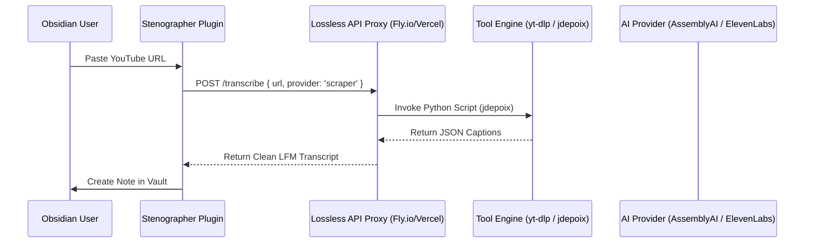

## The Problem: The "JavaScript Wall"

Obsidian plugins are restricted to the JavaScript/TypeScript environment of the Electron-based app. Many of the most powerful transcription and scraping tools (e.g., `yt-dlp`, `jdepoix/youtube-transcript-api`, `whisper.cpp`, `vibe`) are written in Python, Rust, or C++.

**Current hurdles:**
1. **Dependency Hell:** Asking users to install Python, `ffmpeg`, and `yt-dlp` locally is a massive UX barrier.
2. **Environment Mismatch:** Calling Python scripts from a TS plugin requires child processes that are brittle across macOS/Windows/Linux.
3. **API Complexity:** Managed services are great but can be expensive and don't always offer the specialized scraping logic found in community tools.

## The Solution: A "Homegrown" API Proxy

Instead of bundling these dependencies into the plugin, we can host a lightweight **Lossless API Helper**. This service acts as a "Translator" and "Runner" for the tools we love.

### Conceptual Architecture

---

## Technical Strategy

### 1. Hosting Environment (The "Where")
- **Fly.io / DigitalOcean:** Best for tools that require **Python** or **C++ binaries** (like `yt-dlp`). It allows us to deploy a Docker container containing the exact environment needed.
- **Vercel / Next.js:** Best for simple JS/TS proxies that just bridge to other managed APIs (like Supadata or ElevenLabs).
- **Modal.com:** Specialized for "Serverless AI." Excellent if we want to run our own Whisper instances without managing a full server.

### 2. Authentication & Security (The "How")
- **Internal API Keys:** Use a simple `X-Lossless-Key` header to prevent public abuse of our proxy.
- **Secret Passthrough:** Users enter their *own* API keys (OpenAI, ElevenLabs) in the plugin settings. These are passed *through* our proxy to the final provider, ensuring we don't bear the token costs.

### 3. The "Stenographer" Bridge
The proxy would handle the "Dirty Work" of ingestion:
- **Scraper Mode:** Uses `jdepoix/youtube-transcript-api` to fetch existing captions (fast/free).
- **AI Mode:** Ingests the URL via `yt-dlp` on the server and passes the audio stream to a provider (AssemblyAI/Deepgram) for speaker-aware transcription.
- **LFM Formatter:** Normalizes the response into the **LFM `:::transcript` syntax** before returning it to the plugin.

## Use-Case Comparison

| Feature | Local-Only | Homegrown Proxy | Managed API (Supadata) |
| :--- | :--- | :--- | :--- |
| **UX** | Hard (Local installs) | **Easy** (One-click) | **Easy** (One-click) |
| **Cost** | Free | **Low** (Server cost) | High (Usage-based) |
| **Control** | High | **Total** | Low |
| **Maintenance**| High (OS bugs) | **Medium** (Single server) | Low |

## Recommendation

For the `content-farm` plugins, we should build a unified **Lossless Helper** on **Fly.io**. This gives us a single endpoint to solve the "Ingest" problem for `Stenographer`, `Metafetch`, and any future tools that need to "reach out" beyond the vault.
