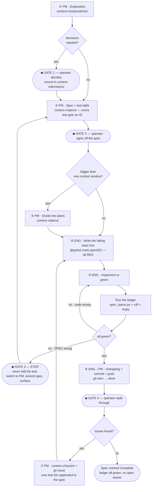

# Spec to Shipped with TDD

> `context-v/loops/` is an **experimental** folder per the context-vigilance
> skill. This loop descends from augment-it's three
> ([[Loop-through-Spec-Write-Plans-Implement-Test-Changelog-Commit]],
> [[Implement-Feature-Loop]], [[From-a-Raised-Issue-to-Fixed-and-Shipped]]) and
> adds the three things they lack: **explicit roles**, **TDD with the tests
> enumerated in the spec**, and **a derived ledger** so an unattended run cannot
> lose track of where it is.
>
> Written **before** its first run, deliberately — augment-it's first loop doc
> was codified retrospectively and its own note says *"next time, invert it."*
> This is the inversion.

## What this loop is

The full lifecycle for one **spec**: from the exploration that produces it,
through implementation, through the operator's walk-through, through the issues
that walk-through raises, to the spec being marked complete.

It exists so the operator can **let the agent loose** and re-enter only to
(a) check work and (b) make decisions. Every step below is designed around that:
each gate is a place where the agent genuinely cannot proceed alone, and
everything between gates is meant to run without supervision.

**Preconditions:** a signed-off spec with an enumerated test table (§The spec's
test table). `uv sync` clean. `scripts/spec_status.py` present.

## The two roles

The role is not decoration — it is a **permission boundary**, and stating it is
how the operator knows which hat produced a given artifact.

```
┌─ LEAD PRODUCT MANAGER ──────────────────────────────────────────────┐
│ WRITES   explorations/ · decisions/ · specs/ · plans/ · issues/     │
│          changelog/ · gh issues and project items                    │
│ NEVER    writes code. writes tests. decides what the operator        │
│          reserved. marks a spec complete without the ledger.         │
└──────────────────────────────────────────────────────────────────────┘
                              ⇅  announce every switch
┌─ LEAD ENGINEER ──────────────────────────────────────────────────────┐
│ WRITES   core/src/ · core/tests/ · plan status flips                 │
│ NEVER    changes a spec's intent. weakens/skips/deletes a test to    │
│          reach green. builds a phase on top of a red one.            │
└──────────────────────────────────────────────────────────────────────┘
```

**The load-bearing rule:** *the Lead Engineer may not edit the test to fit the
code.* When a spec test cannot go green against honest code, that is information
— the spec was wrong — and it is a **gate**, not an obstacle. Switch to Lead
Product Manager, amend the spec, surface it to the operator, resume.

An agent that quietly relaxes an assertion has destroyed the only signal the
operator was relying on while away.

## The loop



## Step by step

### ① Lead Product Manager — explore

`context-v/explorations/` when the destination is unclear. Ends when you have
enough to write a spec, or have learned you don't need one. Where the exploration
forces a choice with no obvious default, that is **Gate 1**.

### ② Lead Product Manager — spec, with the tests enumerated

The spec is a coherent set of features. What makes it runnable-against is the
**test table**: every behaviour the spec promises, written as a natural-language
Given/When/Then with a stable ID.

Write the tests as **observable behaviour**, not implementation. `CAPTURE-02`
below survives a total rewrite of the dedup internals; a test phrased as "calls
`normalize_url` before writing" would not.

### ③ Lead Product Manager — divide, only if needed

If the spec is too big for one context window, split into
`context-v/plans/<Spec>-Phase-N-<Name>.md`, each with `spec_reference` in
frontmatter and each owning a **subset of the spec's test IDs**. A plan that
owns no test IDs is not a plan — it is a note.

Before writing steps, **re-ground against the live code**: read the exact files
the phase touches. Where reality diverges from what the spec anticipated, the
plan corrects the spec and says so explicitly. (augment-it's proving run found
three such divergences in Phase 1 and a whole missing verb in Phase 2 — this
step is not ceremony.)

### ④ Lead Engineer — write the failing tests first

Every ID in scope gets a test function carrying its marker:

```python
@pytest.mark.spec("CAPTURE-02")
def test_second_add_of_same_url_writes_no_duplicate(tmp_store):
    ...
```

Run the ledger. Expect **RED for every ID in scope, MISSING for none.** That is
the TDD floor: a red ledger with no missing IDs proves the tests exist and
genuinely fail before any implementation is written.

### ⑤ Lead Engineer — implement to green

Smallest dependency-ordered steps. After each, climb the ladder cheapest-first:

```text
cost ▲  ┌─────────────────────────────────────────────────────────┐
      4 │ operator walk-through ─────── humans only, GATE 4        │
      ──┼─────────────────────────────────────────────────────────┤
      3 │ live end-to-end against the dev bucket, side-effect-safe │
      2 │ uv run python scripts/spec_status.py ── THE LEDGER       │
      1 │ uv run pytest                                            │
      0 │ ruff check · ruff format --check · mypy src              │
        └─────────────────────────────────────────────────────────┘
```

Rung 0 runs on every file touched, not at the end. Rung 3 writes **only** to the
designated dev bucket — never to a client corpus.

### ⑥ Changelog, commit, push

Per `changelog-conventions` and `git-conventions`. One entry per meaningful
chunk — a plan landing, a spec completing, a group of issues resolving — **not
per commit.** Be honest about what was *not* tested and why; that paragraph is
the most valuable one in the entry for whoever resumes.

Commit grammar inherited from the sibling loops:

- `attempt(<scope>, stepN): …` — a safety checkpoint after a **failed**
  verification, so no diagnostic work is lost between tries.
- `feat(<scope>): …` / `fix(<scope>): …` — ordinary landed work.
- `milestone(<scope>): <verdict>` — the spec running dry. Pair with `Fixes #N`
  so the gh issue auto-closes.

Stage explicit paths only. Never sweep in unrelated dirty state.

Mark the gh project item done as you go, per
`gh-cli-projects-tasks-conventions` — the item body's primary content is the
clickable GitHub URL to the context-v file **in this repo**, not a deep path
through the parent monorepo.

### ⑦ Lead Product Manager — issues from the walk-through

Each finding becomes `context-v/issues/<Variable-Title>.md` plus a gh issue.
Then the part that keeps the loop honest:

> **A resolved issue appends new test IDs to the spec's table.**

Otherwise the same defect returns and the ledger never learns. The fix lane
itself follows [[From-a-Raised-Issue-to-Fixed-and-Shipped]] — this loop hands off
to it rather than restating it.

## The spec's test table

Every spec carries one. IDs are `<SPEC-SLUG-FRAGMENT>-<NN>`, stable forever —
**never renumbered**, because renumbering silently orphans test markers. Retire
an ID by striking it and noting why; do not reuse it.

```markdown
## Tests

| ID | Given / When / Then |
|---|---|
| `CAPTURE-01` | Given a reachable URL and a domain, when `corpora add` runs, then a file exists at `live/<type>/<slug>/sources/<date>_<title-slug>.md` with `url`, `fetched_at`, and `status: candidate` |
| `CAPTURE-02` | Given a URL whose normalized form already exists in the corpus, when `corpora add` runs again, then no second file is written and the command reports the existing path |
| `CAPTURE-03` | Given a URL that 404s, when `corpora add` runs, then a file is still written with `machine_verdict` recording the failure and `content_pulled: false` |
```

**The Status column is deliberately absent.** Status is derived by running
`scripts/spec_status.py`. A hand-written status column is a lie waiting to
happen — it is exactly the prose-loses-state failure this loop exists to prevent.

## Gates — where the agent stops

| # | Gate | Why it can't be automated |
|---|---|---|
| 1 | A decision with no obvious default | It's the operator's call. Use `AskUserQuestion` with a recommendation first. |
| 2 | Spec sign-off before implementation | Implementing an unsigned spec risks building the wrong thing well. |
| 3 | A test that can't go green honestly | The spec is wrong. Editing the test would hide it. |
| 4 | Operator walk-through | A green suite proves the buttons work; only a human judges whether the surface is *usable*. |

Everything between gates runs unattended. The full permission list — including
the destructive actions that always require confirmation regardless of gate — is
[[../contracts/Autonomy-Gates]].

## Exit conditions

- **Spec complete** — `spec_status.py` reports every ID GREEN, zero MISSING, and
  no open issue references the spec. Flip `status: Complete`, add a
  `post_ship_note` listing what remains human-only, and cut a
  `milestone(<scope>)` commit.
- **Blocked on a gate** — stop and surface. Do not proceed to work that builds on
  an unresolved gate.
- **The spec turns out wrong** (not drifted — wrong) — stop, switch to Lead
  Product Manager, revise with the operator, resume.

## Anti-patterns this loop is built against

Each of these has actually happened somewhere in this tree:

- **Editing a test to reach green.** Destroys the operator's only unattended
  signal. Gate 3 exists solely for this.
- **Hand-written status.** `status: Shipped` in frontmatter while the suite is
  red. Derive it.
- **Renumbered test IDs.** Orphans every marker silently; the ledger reports
  MISSING for tests that exist under an old name.
- **A resolved issue with no new test.** Guarantees the regression returns.
- **Batching pushes.** Each landed chunk pushes on its own, so the repo is never
  more than one chunk from a green, documented, pushed state.
- **Sweeping `git add -A`.** Picks up unrelated dirty state, including
  submodules the operator is tidying deliberately.

## Related

- [[../contracts/Autonomy-Gates]] — the permission contract this loop's gates enforce
- [[../plans/Corpora-Builder-MVP-R2-Native-With-Checkpoint-History]] — the seven phases this loop will run against
- [[Loop-through-Spec-Write-Plans-Implement-Test-Changelog-Commit]] · [[Implement-Feature-Loop]] · [[From-a-Raised-Issue-to-Fixed-and-Shipped]] — the augment-it ancestors
- [[Design-Front-Loading-and-the-Fable-Build-Loop]] — the exploration that named the machine-checkable-state gap this loop closes
- The `context-vigilance`, `git-conventions`, `changelog-conventions`, and `gh-cli-projects-tasks-conventions` skills — the formats each step follows
