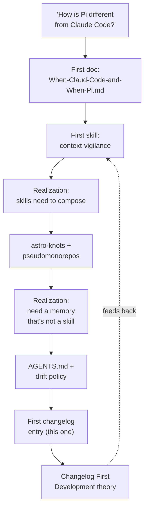
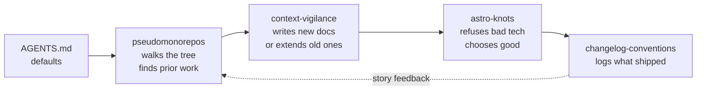

# Lossless Skills v0.0.0.1: From a Question to a Repo

## Why Care?

If you've ever wished your AI coding agent showed up to the project already knowing your conventions — your filename rules, your tech taboos, your team's voice, the exact framework you'd refuse to ship — this repo is one path to that future.

[`lossless-group/lossless-skills`](https://github.com/lossless-group/lossless-skills) is now a public collection of [Agent Skills](https://agentskills.io/specification) that codify The Lossless Group's working conventions. Skills work in [Pi](https://github.com/badlogic/pi-mono), [Claude Code](https://docs.claude.com/en/docs/agents-and-tools/claude-code), [OpenAI Codex](https://openai.com/codex), and anything else that follows the standard. Install once, get them everywhere.

For the broader audience: this is the Lossless Group's "[Lost in Public](https://www.lossless.group/lost-in-public)" practice in action — a session that started as a question became a working artifact, and we're publishing the artifact and the journey in the same breath.

## What's New?

Four skills shipped:

- **[`context-vigilance`](https://github.com/lossless-group/lossless-skills/tree/main/context-vigilance)** — codifies the `context-v/` framework: six folders organized into Planning (`specs/` ↔ `prompts/`), Reflective (`blueprints/` ↔ `reminders/`), and Journey (`explorations/`, `issues/`) modes. Four-part `epoch.major.minor.patch` versioning, Train-Case filenames and tags, "norms not rules" ethos.
- **[`astro-knots`](https://github.com/lossless-group/lossless-skills/tree/main/astro-knots)** — the vision-mission and tech conventions for our family of ~10+ Astro sites. The Tech Hierarchy (HTML & CSS first), the approved list (Astro, Svelte, GSAP, Reveal), the hard prohibitions (React, JSX, Angular, "bloat").
- **[`pseudomonorepos`](https://github.com/lossless-group/lossless-skills/tree/main/pseudomonorepos)** — our coined term for parent repos that aggregate children primarily to host parent-level `context-v/`. Encodes the **search-first-before-creating** discipline: walk the tree, find prior work, surface findings, link rather than duplicate.
- **[`changelog-conventions`](https://github.com/lossless-group/lossless-skills/tree/main/changelog-conventions)** — what produced this entry. Frontmatter contract (`publish: true`, `lede`, ISO dates, `authors:` for humans only, `augmented_with:` for AI tooling, `files_changed:` for the diff trail), filename pattern, and the foundational [Changelog First Development](https://github.com/lossless-group/lossless-skills/blob/main/changelog-conventions/references/changelog-first-development.md) theory.

Plus repo infrastructure:

- A global `~/.pi/agent/AGENTS.md` that loads on every Pi session — encodes the **drift policy** ("observe inconsistency, surface it, but don't auto-fix as a side effect") and the new authorship convention (humans in `authors`, tooling in `augmented_with`).
- A running [`CANDIDATES.md`](https://github.com/lossless-group/lossless-skills/blob/main/CANDIDATES.md) backlog of future skills: `lfm`, `lossless-loop`, `obsidian-integration`, `submodule-hygiene`, `astro-component-patterns`, `lossless-house-style`, plus emerging ones from active studies (`study-pattern`, `profiles-doctype`).

## The Story

The session opened with a cold question: "how is Pi different from Claude Code?" That answer fit in one Markdown file. Then came the actual interesting question — *what could a Pi skill do that we couldn't do before?* — and the rest of the session was the answer unfolding.



A few moments worth marking:

**The folder discovery.** While building `context-vigilance`, a search for prior work surfaced unexpected folders in real `context-v/` directories: `inquiry/`, `profiles/`, `plans/`. Rather than force them into the canonical six, we wrote the **"When you find a seventh folder"** section: *don't fight it, identify the cognitive mode, discuss before assimilating, default to keeping it.* The framework stays open instead of closed.

**The authorship pivot.** Late in the session, we hit the question of credit: when Claude Sonnet writes 80% of a doc, is it an "author"? The answer became a small but real philosophical stance: **AI agents augment human authorship; they don't co-author.** New frontmatter convention emerged: `authors:` is humans only, `augmented_with:` is for tooling, formatted as `<tool> on <model name version>` (e.g., `Pi on Claude Sonnet 4.5`). This entry is the first to use it.

**The "memory that isn't a skill" question.** Halfway through, we needed somewhere to encode "observe drift, but don't auto-fix it" — a rule that should apply across all skills, not live inside one. That's exactly what Pi's global `AGENTS.md` is for. Naming the file changed how we use it: it's the bedrock layer; skills are the loaded-on-demand layer above it.

**Changelog First Development.** Writing the first changelog entry made us notice we were doing exactly what we'd later articulate as the methodology: framing the work *as a story being told* shaped what got built. The arc we're telling here is the same arc we lived. That's the whole theory in one paragraph.

## How It Works

The skills don't stand alone — they compose. Here's the architecture as it stands:

```
~/.pi/agent/
├── AGENTS.md                  ← loads every session
└── skills/                    ← cloned from lossless-skills repo
    ├── context-vigilance/     ← how we document
    ├── astro-knots/           ← how we build (and what we refuse to build)
    ├── pseudomonorepos/       ← how we navigate (and find prior work)
    ├── changelog-conventions/ ← how we ship-log
    └── changelog/             ← this skills repo also eats its own dog food
        └── 2026-05-04_01.md   ← this entry
```

Each `SKILL.md` has a tight `description` field that controls when it auto-loads — so the agent doesn't pay token cost for skills it isn't using. References (deeper docs) load on demand inside a skill. Templates exist for the predictable shapes; the skill teaches when to deviate.

The composition flows like this when working in a Lossless tree:



## What's Next

The shipped four are the start. The [backlog](https://github.com/lossless-group/lossless-skills/blob/main/CANDIDATES.md) is longer than the shipped list — and intentionally so. Top of the queue:

- **`lossless-loop`** — the dedicated skill for the 5-phase Start → Progress → Reflect → Publish → Market lifecycle. The diagram and spec already live inside `pseudomonorepos/references/lifecycle-workflow.md` waiting to graduate.
- **`lfm`** — Lossless Flavored Markdown patterns. The package is in production at [`@lossless-group/lfm`](https://jsr.io/@lossless-group/lfm); the skill makes its capabilities loadable for agents working on content.
- **A comparative blueprint** linking `context-vigilance` to the active studies on [open specs and standards](https://github.com/lossless-group/) (spec-kit, ai-skills, AGENTS.md, OpenSpec) and [memory layers for agents](https://github.com/lossless-group/) (mem0, neo, statebench). Once those studies converge.

Long-running goal: aggregate every changelog across every Lossless repo via the GitHub API into a "Lossless Changelog" umbrella feed. Entries written in this format will render well in that aggregated context.

## Related

- [Context Vigilance project page](https://www.lossless.group/projects/gallery/context-vigilance)
- [Astro Knots project page](https://www.lossless.group/projects/gallery/astro-knots)
- [Lost in Public](https://www.lossless.group/lost-in-public)
- [Agent Skills Specification](https://agentskills.io/specification)
- The repo: <https://github.com/lossless-group/lossless-skills>
