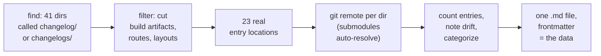

# First Aggregator Feedstock — 23 Changelogs, 222 Entries, One Data File

## Why Care?

The Lossless Group has had a long-running goal: aggregate every changelog across every Lossless repo into one umbrella feed via the GitHub API. Until tonight, the aggregator's feedstock — a list of where changelog content actually lives, paired with each upstream remote URL — didn't exist as a single artifact. Now it does, at `site/data_site/changelog-locations-index.md`.

For the audience: this is the moment **Changelog First Development gets a multiplier.** When the aggregator ships, every shipping signal across the family becomes visible in one place. Cadence becomes pulse. Pulse becomes signal. Signal becomes trust.

For the team: this is also the first real test of the **search-first discipline** the `pseudomonorepos` skill teaches. The discipline says walk the tree, find prior work, surface findings, link rather than duplicate. Tonight: literal `find`. Same instinct.

## What's New?

A new data file in the `lossless-site` repo:

```
site/data_site/changelog-locations-index.md
```

Frontmatter holds the structured data for machines:

- **23 changelog locations** discovered across the lossless-monorepo tree
- **222 total entries** (Markdown files) across them
- **18 unique upstream remotes** (one external — `mem0`, vendored for study)
- **Drift surfaced and noted**: plural `changelogs/`, legacy `context-v/changelog/` nesting, dirname↔remote mismatches, one suspicious git remote URL

Body holds the human-readable summary, a leaderboard, and a regeneration script.

The file is on disk but **not committed** — `lossless-site` is the original beast and was deliberately not poked tonight.

## The Story

The session had been deep in skill-building all evening. The pivot to the index file felt like a natural rest stop: a concrete artifact that exercises the conventions we'd just shipped.



The trick was **what to filter**. The naive `find -name changelog` returned 41 paths. Most of them weren't entry sources at all:

- `.vercel/output/...changelog` — build artifacts, rendered HTML
- `src/pages/changelog` — Astro routes (`index.astro`, `[slug].astro`), not entries
- `src/layouts/changelog`, `src/components/changelog` — code, not content
- `public/changelog` — static assets

Filtering those out left **23 directories that actually hold entries**. The filter list became part of the file's frontmatter (`filters_applied.excluded_paths`) so the regeneration is reproducible.

The other small move was honoring the **drift policy** the way it was designed to be honored. Tonight's tree walk surfaced a *lot* of inconsistency: plural-vs-singular folder names, legacy nesting under `context-v/`, local directory names that don't match their upstream repo names (banner-site → emblem-site, perplexed → perplexed-plugin), and one git remote URL that looks like an honest mistake (`changelog_matter-site.git`). The temptation was to fix some of it on the way past. The discipline — and the reason the policy exists — was to **observe, note, surface, but not auto-fix.** Every drift item went into `drift_note` fields in the index, and a "Drift, Surfaced Not Fixed" section in the body lists the cleanup candidates for whenever a future authorized pass happens.

## How It Works

The index is generated, not handwritten. The full reproduction recipe is in the data file itself, but the gist:

```bash
ROOT="/Users/mpstaton/code/lossless-monorepo"

find "$ROOT" -type d \( -name changelog -o -name changelogs \) \
  -not -path '*/node_modules/*' \
  -not -path '*/.git/*' \
  # ... (full exclusions in the file)
  -not -path '*/src/pages/*' \
  -not -path '*/src/layouts/*' \
  | while read -r dir; do
    rel="${dir#$ROOT/}"
    remote=$(git -C "$dir" remote get-url origin 2>/dev/null)
    count=$(find "$dir" -maxdepth 1 -name '*.md' -type f | wc -l)
    # build YAML entry
done
```

`git -C "$dir" remote get-url origin` is the load-bearing line — it walks up from the changelog directory to find the nearest `.git`, which means it correctly resolves submodule remotes too. So `astro-knots/sites/banner-site/changelog` returns `emblem-site.git` (the actual upstream of that submodule), not the `astro-knots` parent's remote.

The output went through a quick three-way validation:

- ✓ YAML frontmatter parses cleanly
- ✓ Sum of declared `entry_count` values matches the live count: 222
- ✓ Number of unique remotes matches the declared count: 18

(One off-by-one caught on the unique-remotes count and corrected. Validation prevented shipping wrong data.)

## Top of the Tree

| Project | Entries | Notes |
|---|---|---|
| `ai-labs/investment-memo-orchestrator/changelog` | 61 | Most active changelog in the family |
| `ai-labs/memopop-ai/apps/memopop-orchestrator/changelog` | 60 | Same upstream as above (submodule); diverges by 1 |
| `astro-knots/sites/dark-matter/changelog` | 24 | Has `releases/` subfolder; remote URL looks misconfigured |
| `astro-knots/sites/fullstack-vc/changelog` | 16 | |
| `astro-knots/sites/banner-site/changelog` | 11 | Local dirname ≠ upstream repo name |

## What's Next

- **The file lives on disk but is uncommitted in `lossless-site`.** Tomorrow's first move is reviewing it before merging — `lossless-site` is a deliberate beast.
- **The index is the feedstock; the aggregator is the next build.** That's a separate project — fetch each remote's `changelog/` (or `context-v/changelogs/`, etc.) via the GitHub API, normalize, render as one feed.
- **Drift cleanup is on the docket** as an explicitly-authorized future task. The candidates are pre-sorted in the index file's body for whenever it gets prioritized.
- **A regeneration skill or extension** could turn the bash script into a one-command refresh — likely a future chapter of `lossless-loop` or a small dedicated skill.

## Related

- The data file: `lossless-monorepo/site/data_site/changelog-locations-index.md` (uncommitted)
- [`changelog-conventions/references/changelog-first-development.md`](../changelog-conventions/references/changelog-first-development.md) — the methodology this serves
- [`pseudomonorepos/references/search-first.md`](../pseudomonorepos/references/search-first.md) — the discipline this exercises
- The drift policy: `~/.pi/agent/AGENTS.md`
- [Previous entry: Lossless Skills v0.0.0.1](./2026-05-04_01.md)
