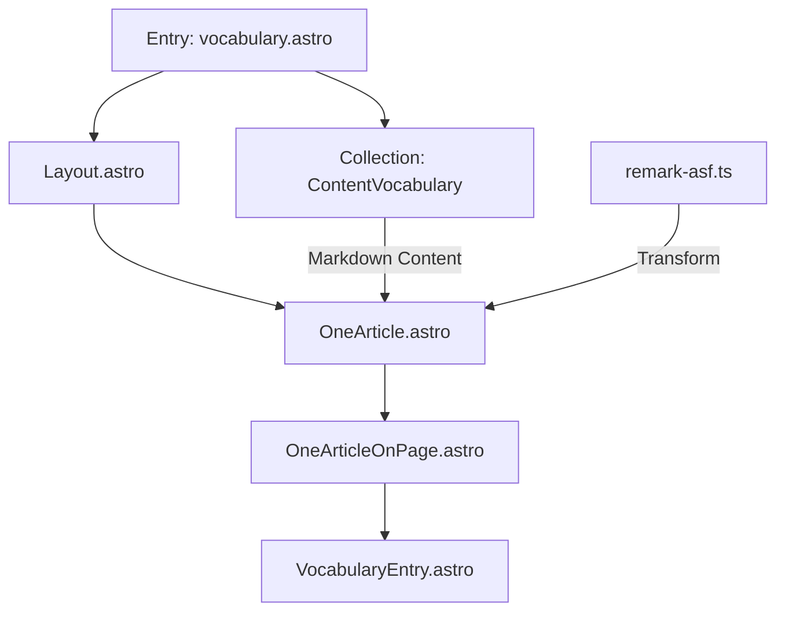

# Constraints:
Vocabulary Collection markdown files almost never have any metadata or frontmatter.  

Most Vocabulary markdown files have NO CONTENT AT ALL AS OF THIS PROMPT. 

We need to be flexibile with how we typecheck, refer to the `.windsurfrules` file for more information. 

# Goal

## High-level objective
Develop a maintainable full Component Pipeline for a Vocabulary Collection using the existing components that structure and manage HTML and CSS rendering for content collections and individual markdown entries. 

### Separation of Structure and Presentation
What do I mean by that? Well, we separate the structural styles from the presentational styles that are applied upon render of a specific Content Collection.  

### Separation of Generalized and Specialized Components
What do I mean by that? Well, we separate the generalized components from the specialized components that are applied upon render of a specific Content Collection.  

# Implementation

## Component Pipeline diagram



## Data Flow and Props

### Entry Point (`[vocabulary].astro`)
```typescript
// Expected URL pattern
// /more-about/some-vocabulary-term

// Data fetching
const { vocabulary } = Astro.params;
const entry = await getEntry('vocabulary', vocabulary);

// Process markdown content
const { Content } = await entry.render();
```

### Collection Configuration
```typescript
// content/config.ts
export const collections = {
  vocabulary: defineCollection({
    // No required frontmatter - extract title and slug from filename
    type: 'content',
    schema: z.object({
      title: z.string().optional(), // Optional, can be derived from filename
      definition: z.string().optional(),
      usage_examples: z.array(z.string()).optional(),
      related_terms: z.array(z.string()).optional(),
      category: z.string().optional(),
      tags: z.array(z.string()).optional()
    })
  })
};
```

### Example Vocabulary Entry Structure
```markdown
// content/vocabulary/example-term.md
---
definition: "A clear, concise definition"
usage_examples: 
  - "Example in context 1"
  - "Example in context 2"
related_terms:
  - "similar-term"
  - "opposite-term"
category: "Technical"
tags:
  - "programming"
  - "development"
---

Additional markdown content explaining the term in detail...
```

## Component Pipeline

### Base Structure
```text
[vocabulary].astro (entry)
  → Layout.astro (base layout)
    → OneArticle.astro (content structure)
      → OneArticleOnPage.astro (general content)
        → VocabularyEntry.astro (specialized view)
```

### Component Data Flow
```typescript
// [vocabulary].astro
<Layout title={entry.data.title || entry.slug}>
  <OneArticle
    Component={OneArticleOnPage}
    data={{
      title: entry.data.title || entry.slug,
      content: Content // From entry.render()
    }}
  />
</Layout>

// OneArticle.astro
interface Props {
  Component: any;
  data: {
    title: string;
    content: any;
  };
}

// OneArticleOnPage.astro
interface Props {
  title: string;
  content: any;
}

// VocabularyEntry.astro
interface Props {
  entry: CollectionEntry<'vocabulary'>;
  content: any;
}
```

### Component Responsibilities

1. `[vocabulary].astro`
   - URL parameter handling
   - Data fetching from collection
   - Error handling for missing terms
   - Initial markdown processing

2. `Layout.astro`
   - Base page structure
   - Navigation
   - Common styling

3. `OneArticle.astro`
   - Content structural layout
   - Component composition
   - Props forwarding

4. `OneArticleOnPage.astro`
   - General article rendering
   - Common article styling
   - Content flow structure
   - Markdown content rendering

5. `VocabularyEntry.astro`
   - Specialized vocabulary styling
   - Term definition formatting
   - Usage examples display
   - Related terms linking

6. `remark-asf.ts`
   - Markdown transformation
   - Custom syntax handling
   - Content preprocessing

## Implementation Steps

1. Create Entry Point
```astro
---
// site/src/pages/more-about/[vocabulary].astro
import { getEntry } from 'astro:content';
import Layout from '../../layouts/Layout.astro';
import OneArticle from '../../layouts/OneArticle.astro';
import OneArticleOnPage from '../../components/articles/OneArticleOnPage.astro';

const { vocabulary } = Astro.params;
const entry = await getEntry('vocabulary', vocabulary);

if (!entry) {
  return Astro.redirect('/404');
}

const { Content } = await entry.render();
---

<Layout title={entry.data.title || entry.slug}>
  <OneArticle
    Component={OneArticleOnPage}
    data={{
      title: entry.data.title || entry.slug,
      content: Content
    }}
  />
</Layout>
```

2. Create Specialized Component
```astro
---
// site/src/components/vocabulary/VocabularyEntry.astro
import type { CollectionEntry } from 'astro:content';

interface Props {
  entry: CollectionEntry<'vocabulary'>;
  content: any;
}

const { entry, content } = Astro.props;
const { definition, usage_examples, related_terms } = entry.data;
---

<article class="vocabulary-entry">
  <h1>{entry.data.title || entry.slug}</h1>
  
  {definition && (
    <div class="definition">{definition}</div>
  )}
  
  <div class="content">
    <Content />
  </div>
  
  {usage_examples && usage_examples.length > 0 && (
    <section class="usage-examples">
      <h2>Usage Examples</h2>
      <ul>
        {usage_examples.map(example => (
          <li>{example}</li>
        ))}
      </ul>
    </section>
  )}
  
  {related_terms && related_terms.length > 0 && (
    <section class="related-terms">
      <h2>Related Terms</h2>
      <ul>
        {related_terms.map(term => (
          <li><a href={`/more-about/${term}`}>{term}</a></li>
        ))}
      </ul>
    </section>
  )}
</article>

<style>
  .vocabulary-entry {
    max-width: 65ch;
    margin: 2rem auto;
    padding: 1rem;
  }
  
  .definition {
    font-size: 1.2rem;
    line-height: 1.6;
    margin: 1rem 0;
    padding: 1rem;
    background: var(--surface-2);
    border-radius: 0.5rem;
  }
  
  .content {
    margin: 2rem 0;
  }
  
  .usage-examples, .related-terms {
    margin-top: 2rem;
    padding: 1rem;
    background: var(--surface-1);
    border-radius: 0.5rem;
  }

  h2 {
    font-size: 1.4rem;
    margin-bottom: 1rem;
  }

  ul {
    list-style: none;
    padding: 0;
  }

  li {
    margin: 0.5rem 0;
  }

  a {
    color: var(--text-1);
    text-decoration: none;
    border-bottom: 1px solid var(--text-2);
  }

  a:hover {
    color: var(--text-2);
  }
</style>
```

## Testing Strategy

1. Create test vocabulary entries:
   - Simple term with just markdown content
   - Complex term with all optional frontmatter fields
   - Term with related terms for testing navigation

2. Test edge cases:
   - Missing vocabulary parameter
   - Non-existent vocabulary term
   - Malformed markdown content
   - Missing optional fields

3. Verify component pipeline:
   - Confirm proper inheritance of styles
   - Check responsive behavior
   - Validate markdown transformations
   - Test related terms navigation

4. Accessibility checks:
   - Proper heading hierarchy
   - ARIA labels where needed
   - Keyboard navigation
   - Color contrast

## Initial Structure for Vocabulary Collection:

**NOTE**: we may need to use a more simple render pipeline at first, as we have found in the past we can "get lost" in finding bugs or unexpected behavior.  

However, the goal is to be able to "abstract" both the structure and presentation of the content collection, and the specialized components that are applied upon render of a specific Content Collection from the generalized components that will be shared amonst content rendering pipelines.    


Entry Point: `site/src/pages/more-about/[vocabulary].astro`

Collection Path: `content/vocabulary`

Base Layout: `site/src/layouts/Layout.astro`

Content Structural Layout: `site/src/layouts/OneArticle.astro`

Content Utility Functions: `site/src/utils/markdown/remark-asf.ts` [^9af7f5]

Render Component for One Entry (Generalized): `site/src/components/articles/OneArticleOnPage.astro`

Render Component for One Entry (Specialized): `site/src/components/vocabulary/VocabularyEntry.astro`

# Footonotes
***
[^9af7f5]: We are trying to use a different library in the render pipeline, because we have found it hard to parse various "extended markdown" and "flavored markdown" syntax with regular expressions. 

We need to master the ability to render "flavored" markdown because 
1. a short term goal of rendering specialized extended markdown related to our current use of Obsidian as a markdown editor tool.  
2. a long term goal to introduce our own flavor, which will include ways of managing complex metadata, and rendering ebooks and magazine style content.

We believe using the `remark-asf` library will allow us to handle these cases more effectively.