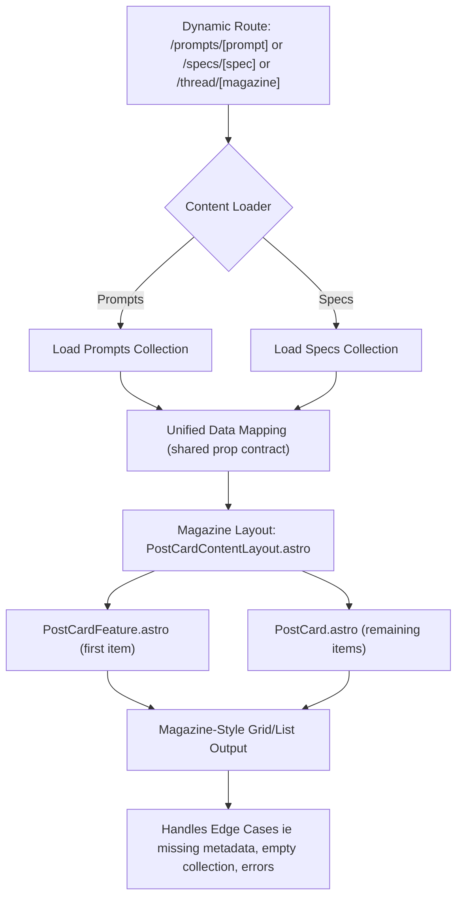

# Goals

Use the magazine-style layout for the new Specs Collection, reusing as many components and render pipeline as possible. 

## Context

The Specifications collection generally is EXACTLY like the prompts collection. They are only differentiated by scope and length.  The metadata/yaml is the same.

A specification should be a long, detailed, fully-integrated technical document that is a step-by-step guide for a contractor-developers or AI Coding Assistants. 

It's unlikely that a Specification could be implemented in one fell swoop.  

A Specification may draw from, be the result of, or orchestrate the use of multiple prompts. 

### Specifications Directory:
`content/specs`

## Review the Implementation to improve this Prompt.

### Study the Prompts implementation.

#### The Magazine-Style Render Pipeline
`site/src/pages/thread/[magazine].astro`
`site/src/layouts/PostCardContentLayout.astro`
`site/src/components/PostCardFeature.astro`
`site/src/components/PostCard.astro`


#### Render an Individual Prompt
`site/src/pages/prompts/[prompt].astro`

***

# Implementation Guidance: Magazine-Style Layout for Specs Collection

## 1. Data Flow & Render Pipeline

- **Specs markdown file** (in `content/specs/`)
- → **Astro content collection** (loads all specs, same as prompts)
- → **Dynamic route page** (e.g., `site/src/pages/specs/[spec].astro` or magazine thread page)
- → **Layout component** (`PostCardContentLayout.astro`)
- → **Card components** (`PostCardFeature.astro`, `PostCard.astro`)
- → **Final HTML output** (magazine-style grid/list, fully responsive)

## 2. Component & Prop Contract

- Reuse all prop contracts, interfaces, and layouts from the prompts magazine-style pipeline.
- Ensure all components accept EITHER a prompt or a specification, with minimal branching logic.
- Standardize frontmatter for both content types (see prompt collection for reference).
- All card components must accept:
  - `id: string`
  - `title: string`
  - `lede: string`
  - `authors: string[]`
  - `tags: string[]`
  - `date_authored_initial_draft: string`
  - `summary?: string`
  - `image?: string`
  - `url: string`

## 3. Ideal Example

### Sample Spec Frontmatter (YAML)
```yaml
title: Example Specification Title
lede: A concise summary of the specification's purpose.
date_authored_initial_draft: 2025-04-17
authors:
  - Jane Doe
  - AI Code Assistant
tags:
  - User-Interface
  - Specification
status: Draft
```

### Example: See a Real Specification

For a complete, real-world example of a specification file, see:
- [Filesystem-Observer-for-Consistent-Metadata-in-Markdown-files.md](../../../specs/Filesystem-Observer-for-Consistent-Metadata-in-Markdown-files.md)

## 3a. Render/Data Flow Diagram



**Legend:**
- **A:** Dynamic route determines which collection (prompts or specs) to load.
- **B:** Loader fetches the appropriate content collection.
- **E:** Data is mapped to a unified prop contract so all downstream components can be generic.
- **F, G1, G2:** Magazine layout and card components render the content, with minimal conditional logic.
- **H:** Final output is a responsive magazine-style grid or list.
- **I:** Edge cases and errors are handled at the layout/UI level.

## 4. Refactor Guidance for Dual Compatibility
- Refactor the magazine-style render pipeline to accept either prompts or specifications as content sources.
- Use shared utility functions for content loading and prop mapping.
- Avoid duplicating layout or component logic; use conditional rendering only where absolutely necessary.
- Reference the `site/src/pages/more-about` flow as a model for supporting multiple content types.

## 5. Acceptance Criteria
- A specification renders in the magazine-style layout, with all metadata and content visible, using the same components as prompts.
- The pipeline can accept either prompts or specifications without code duplication.
- All props and frontmatter fields are documented and validated.
- Edge cases (missing metadata, empty collections) are gracefully handled.

## 6. Error Handling
- If a spec is malformed or missing required metadata, **omit it from the rendered output** and report the error using our standard reporting/logging methods (see [Maintain-Consistent-Reporting.md](lost-in-public/reminders/Maintain-Consistent-Reporting.md)).
- Never allow errors in build or usability due to missing or malformed YAML/frontmatter—**the UI and build must always succeed, even if some content is omitted**. This is a core rule from [.windsurfrules].

## 7. Cross-Linking & Relationships
- Specifications may reference prompts or other specs in their body or metadata.
- Support for linking and navigation between related content types should be included in the layout and/or card components.

## 8. Audience
- This prompt is for developers, product managers, and AI coding assistants who need to implement or extend the specs collection UI.
- The goal is to enable rapid onboarding and extension of the magazine-style layout for any structured content collection.

***

**References:**
- [Create-a-Magazine-Style-Layout.md](../user-interface/Create-a-Magazine-Style-Layout.md)
- [Create-a-Reusable-Content-Collections-UI-Structure.md](../user-interface/Create-a-Reusable-Content-Collections-UI-Structure.md)
- [Conditional-Logic-for-Content.md](../render-logic/Conditional-Logic-for-Content.md)
- [Create-a-Changelog-UI.md](../user-interface/Create-a-Changelog-UI.md)

***

**Note:**
- All YAML frontmatter must use proper indentation and list syntax (never JS array style).
- All code and layout changes must be modular, DRY, and aggressively commented as per project rules.

***

## Important Implementation Note: Collection Definition

- When creating the Astro content collection for specifications (in `site/src/content.config.ts`), strictly follow the project's established pattern:
  - Use `defineCollection` with a flexible zod schema that matches the frontmatter structure, always with `.passthrough()` and no hard validation.
  - Use a loader such as `glob` to target all markdown files in the `content/specs` directory.
  - Add `.transform()` logic if needed to normalize or enrich loaded data (e.g., extracting filename as `slug`).
- **Aggressive, comprehensive commenting is required**—use section and function openers/closers as described in `.windsurfrules`.
- Never introduce hard validation or block rendering due to missing frontmatter fields; all schemas must be non-blocking and resilient to missing/extra data.
- Always keep collection definitions modular, DRY, and compliant with all project directory and naming conventions.

***

## Directory and Code Organization Guidance

- The following directories are established and MUST be used for their respective purposes:
  - `site/src/utils` — for all utility/helper functions.
  - `site/src/types` — for all shared TypeScript type definitions and interfaces.
  - `site/src/styles` — for all shared CSS/SCSS and style modules.
- **Before writing any new code, any Consultant or AI Code Assistant MUST:**
  - LOOK for existing utilities, types, and styles in these directories.
  - SEARCH the codebase to avoid duplication and ensure consistency.
  - READ existing code and documentation to understand context and conventions.
- This is a mature project: code reuse, modularity, and adherence to directory structure are mandatory. Do not create new files or utilities without first confirming that no suitable solution exists.

***
