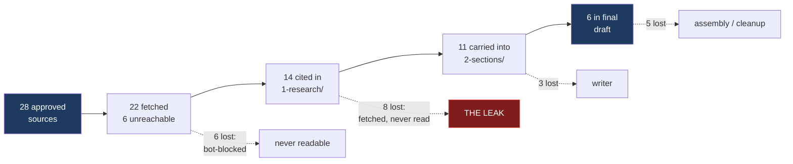
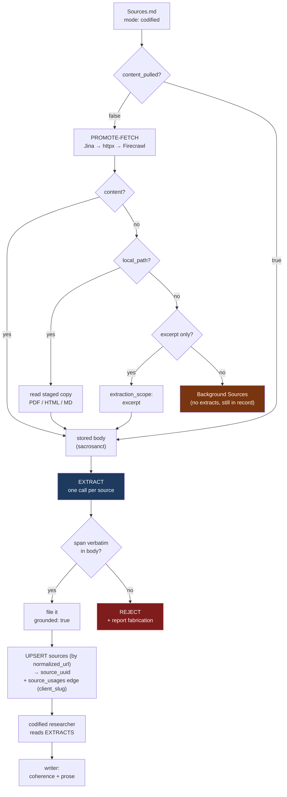

# Extract Sources Where Possible, with Fallback to Ground Content

## Why Care?

A memo generator that reads four of twenty-eight approved sources and writes the
rest from parametric memory produces prose indistinguishable from real work. The
citations point at real, retrieved, live URLs. The numbers are roughly true. And
some of the quotes were never in the documents they are attributed to.

Six months of fixes have targeted the *output* — coverage rules, citation
promoters, post-writing patches. The defect is in the *input*. A research agent
handed twenty-eight raw URLs and a 750-word target will read a handful and
confabulate the remainder, because that is cheaper and nothing downstream can
tell the difference.

This spec makes **reading its own step**. Every approved source gets a dedicated
pass that pulls its quotes, claims and stats onto disk, verbatim-checked against
the document. Once that exists, "cite every source" stops being a rule to
enforce and becomes a property of the input.

Measured on TrustedRouter v0.0.2 (28 approved sources, codified mode):

| Stage | Distinct approved sources |
|---|---|
| approved in `Sources.md` | 28 |
| cited in `1-research/` | 14 |
| carried into `2-sections/` | 11 |
| present in final draft | 6 |

The writer lost 3. **Research lost 14** — half the corpus never produced a
single citable line.



The red box is what this spec targets: sources whose content **was successfully
fetched** and still produced nothing. That is not a retrieval problem or a
writing problem. It is the absence of a reading step.

## The failure this closes

Ranked by how hard each is to detect, worst last:

| Failure | Caught by |
|---|---|
| Invented URL | retrieved-source record (`.provenance.json`) |
| Dead URL | liveness ladder (`remove_invalid_sources`) |
| Real number, wrong company | attribution audit (`3-attribution-audit.md`) |
| **Quote attributed to a document that does not contain it** | **this spec** |

The last one is the reason for the whole design. A model can fake having read a
source — assert a quotation, attach `[^7]`, and move on. Every other check
passes, because the URL is genuine. The only thing that catches it is comparing
the asserted span against the document's actual text, which is free at extraction
time because we already hold the bytes.

```
  A citation asserting:  "Capacity reached 10 GW" [^7]

  ┌─ was [^7] a URL a retriever returned? ──────── retrieved-source record ─┐
  │      no → fabricated URL          ✗ caught today                        │
  │      yes ↓                                                              │
  ├─ does [^7] resolve right now? ─────────────────────── liveness ladder ──┤
  │      no → dead / soft-404         ✗ caught today                        │
  │      yes ↓                                                              │
  ├─ is the claim about OUR company? ─────────────────── attribution audit ─┤
  │      no → competitor's number     ✗ caught today                        │
  │      yes ↓                                                              │
  ├─ does [^7]'s TEXT contain "Capacity reached 10 GW"? ──── GROUNDING ─────┤
  │      no → THE MODEL FAKED READING IT                                    │
  │           ▲ nothing above catches this — the URL is genuine             │
  └─────────────────────────────────────────────────────────────────────────┘
```

## Scope

**In:** per-source promote-fetch, the `# Extracts` body section, grounding
verification of extracted spans, SurrealDB registration and `source_uuid`
write-back, `hex_code` minting, and the fallback path when content cannot be
pulled.

**Out:** building any part of `corpora-builder` itself (adoption is copy-from,
not a shared dependency), the hex-code *reference* citation system, `domains`
semantics, and `source_uuid` from a shared registry — all unresolved or deferred
per [[Source-File-Schema-Reconciliation]].

## Contract



### 1. One source, one file — the shape already specified

Follow `agent-skills/source-with-extracts-md/SKILL.md`. Frontmatter carries short
scalars; the body carries content and extracts. Extracts are **never** YAML —
quotes and stats are full of `: " $ % [ ]`, every character that breaks it.

That skill marks itself *assumed and evolving*. Deviations get documented here
rather than treated as errors.

### 2. Two-tier fetch, and `content_pulled` means what it says

On save: cheap metadata plus a ~200-char excerpt. On **promote**: pull the full
body and flip `content_pulled: true`.

Every per-source file in `io/lossless/deals/TrustedRouter/inputs/sources/`
currently reads `status: promoted` with `content_pulled: false`. The promote
tier was never wired — that gap is what this spec closes first.

Fetch order: **Jina Reader → httpx → Firecrawl**. Exa is not wired in this repo;
SearXNG serves candidate discovery, not content pull.

The stored body is **sacrosanct**: verbatim as fetched, never LLM-summarized.
Everything derived goes under `# Extracts`.

### 3. Extraction is one pass per source

One model call per source, never a batch. Batching is what allows a source to be
silently skipped; a dedicated pass leaves nowhere to hide and removes context
pressure.

Output goes to the body:

```markdown
# Extracts

## Quotes
:::quote{page="12"}
"Installed capacity will reach 10 GW by 2030 — a 40% CAGR."
:::

## Claims
:::claim{confidence="high"}
Routing layers are structurally exposed to model-provider margin compression.
:::

## Stats
:::stat{unit="USD" period="2026"}
$113M Series B at ~$1.3B valuation.
:::
```

### 4. Grounding verification is mandatory and mechanical

Every `:::quote` and `:::stat` must appear **verbatim** in the stored body.
Checked by `src/grounding.py` after normalization (smart quotes, dashes, thin
spaces, whitespace) — normalization matters because extraction mangles those
constantly and a false positive here makes the check untrustworthy and therefore
ignored.

- Span found → filed, `grounded: true`.
- Span absent → **rejected, not filed**, and reported.
- `:::claim` is paraphrase by nature: filed, flagged unverifiable.

Unverifiable ≠ false. Report, never silently delete.

### 5. Fallback when content cannot be pulled

Some approved sources are genuinely unreachable — Reuters, NYT and McKinsey all
refuse bots. Six of the twenty-eight failed to fetch on the first codified run.
Degrade in this order:

1. **Analyst-staged local copy.** `local_path` on the source entry; PDF, HTML,
   markdown or text. This is why downloading the McKinsey article has to *work* —
   it contributed 25,057 characters once the fetcher could read it.
2. **Excerpt-only grounding.** Where only the ~200-char excerpt exists, extract
   from it and mark the file `extraction_scope: excerpt`. Do not extrapolate.
3. **Background-only.** No content at all ⇒ no extracts, and the source appears
   in the memo's `## Background Sources` block rather than as a citation. It
   stays in the diligence record; it just supports no specific claim.

An unfetchable source is never a licence to invent. Zero extracts is a valid,
honest outcome.

### 6. Register in SurrealDB — `sources` + `source_usages`

The registry already exists in `augment-it` and is the system of record for
information sources with URLs. memopop connects to the **same shared instance**;
it does not stand up its own.

**Connection** — the vars `augment-it` already uses (repo-root `.env`, also
consumed by `services/record-surrealdb-resolver`):

```
SURREAL_URL   SURREAL_NS   SURREAL_DB   SURREAL_USER   SURREAL_PASS
```

An MCP wrapper exists at `augment-it/scripts/mcp-surrealdb.sh`; for pipeline
writes memopop should talk to SurrealDB directly rather than through MCP, which
is an interactive-session tool.

**Two tables, and the split matters:**

```
sources         canonical, client-AGNOSTIC identity — UNIQUE on normalized_url
                one row per URL in the world, no client fields on it

source_usages   the edge: (client_slug, domain_type, domain_slug, source_uuid)
                + tags — this is where client scoping lives
```

This corrects a natural but wrong assumption: **do not put `client_access` on
`sources`.** A source is a fact about the world and is shared across every
client that ever cites it; deduping is by `normalized_url`, which is exactly why
the uniqueness constraint is there. Who may see it, and in what context, is a
property of the *usage*, not the source.

Note this also differs from the `client_access` convention on
`persons`/`organizations`/`events` documented in [[surrealdb-canonical-layer]] —
the sources registry uses singular **`client_slug`** on the edge instead. Per
that skill's own rule, the shape is confirmed per table rather than assumed.

**Write path on promote:**

```
1. normalized_url = canonical_url(url)
2. UPSERT sources WHERE normalized_url = $n   → take back source_uuid
3. CREATE source_usages SET
       source_uuid = $u,
       client_slug = 'lossless',
       domain_type = 'deal',
       domain_slug = 'trustedrouter'
4. write it into the local file's frontmatter as `source_uuid`
```

**`client_slug: lossless`** for this work — not previously used, because it is us
and had been treated as implied. Making it explicit is the point: a convention
applied only when load-bearing is not a convention. `domain_type: deal` /
`domain_slug: <deal>` mirrors augment-it's `thesis` / `<thesis-slug>` pairing.

**The local field is `source_uuid` — the same name the registry uses.**

An earlier draft of this spec called it `site_uuid`, on the reasoning that the
name should stay stable while the issuing system changes. The reasoning is right;
the field was wrong. `site_uuid` is already taken tree-wide: per
[[context-vigilance]], every `context-v` file mints its own `site_uuid` locally
with `uuidgen` as *that document's identity*. Reusing it for a
foreign-key-to-a-registry would give one field name two meanings in one repo.

So the local frontmatter mirrors the registry exactly:

```
SurrealDB  sources.source_uuid   ──►   local frontmatter  source_uuid
```

One name across `augment-it`, `corpora-builder` and memopop — which is what the
reconciliation blueprint exists to produce. `surreal_uuid` was considered and
rejected: it encodes a vendor in a field name, so migrating off SurrealDB makes
the name false and forces a rename across three apps.

If a second issuer ever appears, that is a separate scalar rather than a rename:

```yaml
source_uuid: 01H8X…       # the identifier
uuid_issuer: surrealdb    # add ONLY when a second issuer exists
```

Keep the name stable; put the issuer in its own key.

Identity on a source file therefore comes from two places, deliberately:

| Field | Minted by | Meaning |
|---|---|---|
| `source_uuid` | SurrealDB, on UPSERT | shared identity of this URL across apps |
| `hex_code` | locally, `tr -dc 'a-z0-9'` | this file's short local handle |

This also resolves open question 3 in [[Source-File-Schema-Reconciliation]],
which deferred `source_uuid` on the grounds that "memopop has no registry."
It does now — augment-it's, shared.

### 7. `hex_code` on every file

Six characters from `[a-z0-9]` — the full 36-symbol alphabet, not `[0-9a-f]`.
There is no byte-budget reason to restrict it, and the wider alphabet lowers
future collision probability. This already matches the tree-wide convention in
[[context-vigilance]]; this spec adopts it for source files rather than
inventing anything.

**Always generate, never type one:**

```bash
LC_ALL=C tr -dc 'a-z0-9' </dev/urandom | head -c6
# NOTE: source_uuid is NOT generated here — the registry issues it on UPSERT.
```

`source_uuid` is issued by the database, not generated locally; `hex_code` is
minted locally. Never hand-type either.

So a source file carries: standard citation metadata + `source_uuid` (issued
by the registry) + `hex_code` (minted locally).

### 8. The researcher reads extracts, not raw documents

`codified_section_researcher` composes sections from the extracted items rather
than raw markdown. The research file stays raw material — grabbing things and
putting them on file. Prose coherence and citation balance belong to the writer,
per [[Citation-Coverage-Promoter]] Phase 1, which already argues this split.

## Consistency with the rest of `ai-labs`

Adoption is **copy-from, knots-style — not a package**. Per
[[Source-File-Schema-Reconciliation]], a shared library across a Python
orchestrator, a Node service and a Tauri app would be three bindings and a
release cadence nobody wants.

| App | Writer | Status |
|---|---|---|
| `augment-it` | `services/content-ingest/src/corpus.ts` | live |
| `corpora-builder` | reference implementation | source of record |
| `memopop-ai` | `src/curation/source_file.py` | **this spec** |

## What changes on disk

Legend: `+` created · `~` modified · `=` unchanged (read-only reference)

```
lossless-monorepo/ai-labs/
│
├── memopop-ai/
│   ├── context-v/specs/
│   │   └── + Extract-Sources-Where-Possible-with-Fallback-to-Ground-Content.md
│   │
│   └── apps/memopop-orchestrator/
│       ├── src/
│       │   ├── + grounding.py                  verbatim span verification
│       │   ├── + surreal_registry.py           UPSERT sources → source_uuid;
│       │   │                                   CREATE source_usages edge
│       │   ├── ~ workflow.py                   wire promote-fetch + extract nodes
│       │   ├── agents/
│       │   │   ├── + source_extractor.py       one pass per source → # Extracts
│       │   │   └── ~ codified_section_researcher.py
│       │   │                                   promote-fetch; read extracts not raw
│       │   └── curation/
│       │       ├── ~ source_file.py            adopt canonical schema;
│       │       │                               source_uuid + hex_code fields
│       │       └── ~ fetch.py                  + Firecrawl tier
│       │                                       (fetch_local_file already added)
│       │
│       └── io/lossless/deals/TrustedRouter/     [gitignored — /io/*/]
│           └── inputs/
│               ├── ~ Sources.md                local_path on gated sources
│               ├── ~ sources/*.md              body + # Extracts +
│               │                               source_uuid + hex_code;
│               │                               content_pulled: false → true
│               └── = sources-pdf/              analyst-staged copies
│
├── corpora-builder/          = reference implementation — DO NOT modify
│   ├── = src/model/source.py
│   └── = context-v/blueprints/Source-File-Schema-Reconciliation.md
│
└── augment-it/               = reference impl + SHARED SERVICES — DO NOT modify
    ├── = services/content-ingest/src/corpus.ts     corpus writer to copy from
    ├── = services/record-surrealdb-resolver/       sources + source_usages
    │                                               (the registry we write into)
    ├── = scripts/mcp-surrealdb.sh                  MCP wrapper (interactive only)
    └── = .env                                      SURREAL_URL/NS/DB/USER/PASS
```

Two repos are touched; two are read-only. `corpora-builder` and `augment-it`
are consulted, never edited — the adoption rule is copy-from, and a change that
needs to happen in them is a blueprint amendment, not a memopop commit.

The per-source file changes shape like this:

```
BEFORE (today)                      AFTER (this spec)
─────────────────────────────       ─────────────────────────────────
---                                 ---
url: …                              url: …
title: …                            title: …
status: promoted                    status: promoted
content_pulled: false        ──►    content_pulled: true
excerpt: "first 200 chars…"         excerpt: "first 200 chars…"
verdict: approved                   verdict: approved
                                    source_uuid: <sources.source_uuid>
                                    hex_code: <6 × [a-z0-9]>
                                    normalized_url: <dedup key>
                                    client_slug: lossless
                                    extraction_scope: full | excerpt
---                                 ---
(empty body)                        <verbatim fetched body — sacrosanct>

                                    # Extracts
                                    ## Quotes
                                    :::quote{page="12"}
                                    "…verbatim span…"
                                    :::
                                    ## Claims
                                    ## Stats
```

## Open questions

1. **Does registration block a run?** If SurrealDB is unreachable, extraction
   must proceed and `source_uuid` backfill later. Database availability cannot gate
   whether a memo can be written.
2. **Who owns URL normalization?** `sources.normalized_url` is `UNIQUE`, so if
   memopop's `canonical_url()` disagrees with augment-it's JS normalizer, the
   same URL registers twice and cross-app dedup fails silently. This is now
   load-bearing rather than theoretical — carried over from
   [[Source-File-Schema-Reconciliation]] open question 1 and worth settling
   before the first write.
3. **Does `source_usages` need a memo-level grain?** Today the edge is
   (client, domain_type, domain_slug). A source used in TrustedRouter v0.0.2 but
   dropped in v0.0.3 is not distinguishable. Version-level usage may be wanted
   later; not required for this spec.
4. **Do the firm-private deals register too?** This spec covers `io/lossless`.
   Whether `io/<firm>/` sources should reach a shared registry is a
   confidentiality decision, not a technical one, and is deliberately not
   answered here.

## Related

- [[source-with-extracts-md]] — the per-source file shape and directive vocabulary
- [[Source-File-Schema-Reconciliation]] — the cross-app contract and adoption rule
- [[surrealdb-canonical-layer]] — `client_access` tagging and audit discipline
- [[Citation-Coverage-Promoter]] — the coverage problem this addresses at its source
- [[Reconciling-Perplexity-Citations-Against-Retrieved-Sources]] — the retrieved-source record this builds on
- [[Constraining-Memo-Writing-to-an-Approved-Source-Set]] — codified mode, the gate this feeds
