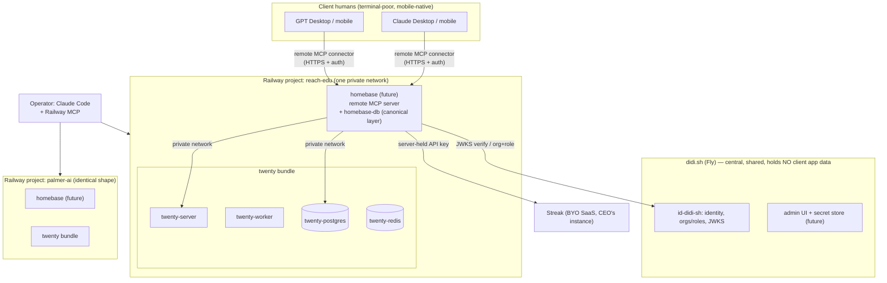
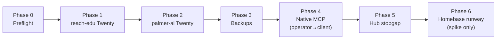

# Per-Client Stack Deployment — Twenty First

**Who this is for:** the lead-engineer session (Claude Code, clean context) executing this work with Michael step by step. Read this whole spec before Phase 0. Work **one phase at a time**; every phase ends in a **GATE** — verify, show Michael the evidence, get explicit go-ahead, then proceed. Do not batch phases.

**Skills to load at session start:** `use-railway`, `context-vigilance`, `pseudomonorepos`, `changelog-conventions`, `git-conventions`. The Railway MCP server is wired into sessions in this repo.

## Why Care?

Two paying clients are ready for their own self-hosted CRM. This is the first execution of a pattern designed to repeat: for these two clients, then more, then (as public guidelines) ~140 FullStackVC firms. The second deployment (palmer-ai) exists partly to prove the first wasn't hand-crafted. Everything hard-won about *why* the pattern looks like this lives in the explorations — this spec is the *what and in-what-order*.

## Context documents (read before executing; cite when deviating)

| Doc | What it holds |
|---|---|
| `self-host-stack/context-v/explorations/Per-Client-Self-Host-Stacks-Twenty-First-on-Railway.md` (v0.0.0.4) | The option space and recommendations this spec executes: Railway topology, secrets staging, hub, MCP layers, ops ordering |
| `ai-labs/context-v/explorations/Secrets-for-Collaborators-Who-Will-Never-Open-a-Terminal.md` (v0.0.0.5) | The persona (terminal-poor, credential-rich, ghosts silently, mobile-native), key-ownership economics, the `setup` skill, capability-plane reframe |
| `ai-labs/id-didi-sh/context-v/explorations/Serving-Secrets-Server-Side-as-an-MCP-Capability-Plane.md` (v0.0.0.4) | Homebase implementation-local notes; increments sketch; parent-spec-first doctrine |
| `ai-labs/context-v/specs/Id-Didi-Sh-Identity-Service.md` | Identity-plane contract (didi_id, sessions, orgs/roles, JWKS). Contract changes land THERE first |
| `ai-labs/context-v/extra/Client-Collaborator-Profiles-Ground-Truth.md` (PRIVATE, gitignored) | The six real humans. Never quote into public docs |
| `self-host-stack/client-stacks/reach-edu/` (gitignored) | Stack of record: `stack.md`, client-wide `secretspec.toml`, per-bundle folders. Scaffolded 2026-07-24 — the reference shape |
| `self-host-stack/core/twenty-crm/` | The Twenty deploy wrapper submodule (lossless-group fork) |
| anchor `CLAUDE.md` | Browser-drive verification doctrine (Playwright MCP, accessibility snapshots over screenshots), relocation hard-stop, skills sync |

**Warning:** `client-stacks/the-water-foundation/` is the OLD shape (vendored Twenty source). Never copy it; `reach-edu/` is the reference.

## Decisions already made — do NOT relitigate

| # | Decision | Rationale lives in |
|---|---|---|
| D1 | One Lossless-owned Railway workspace; **one Railway project per client** | self-host-stack exploration, "Decided already" |
| D2 | **No shared postgres — ever.** Each app bundle brings its own datastore. No multi-tenancy across clients. Uniformity via templates, not tenancy | Conversation 2026-07-24; exploration Layer notes |
| D3 | Bundles named by prefix on Railway (`twenty-server`, `twenty-postgres`…); folder-per-bundle in `client-stacks/<client>/`. Railway's service list is flat — prefixes ARE the folders there | stack.md conventions |
| D4 | Secrets now: gitignored `.env` + password-manager recovery + Railway vars; **client-wide union `secretspec.toml`** per client (declarations only). Vault (OpenBao-vs-Phase) deferred until homebase | ai-labs exploration, Axis 1 + tentative direction |
| D5 | **Clients get full READ-WRITE** database/API capability through the plane when it ships. Prefer app APIs where invariants matter; never impose read-only ceilings. Safety = engineering (transactions, didi_id audit, snapshots, confirm on bulk/destructive), not denial | self-host-stack exploration, Layer 2 correction 2026-07-24 |
| D6 | **Remote connectors only** for client AI access — Claude Desktop, GPT Desktop, Claude mobile, ChatGPT mobile (2 vendors × 2 form factors, all day-one). No local configs, no terminals, ever | ai-labs exploration, ground-truth section |
| D7 | Homebase = one small always-on container **inside each client's Railway project** (private-network access to bundle DBs; identity central via didi.sh JWKS). Final one-service-or-two contract call belongs to the id-didi-sh parent spec | ai-labs exploration OQ#2; id-didi-sh notes |
| D8 | Every client is a **mixed stack** (our self-hosted apps + their BYO SaaS, e.g. reach-edu's Streak). The plane fronts the whole roster | ai-labs exploration, mixed-stack section |
| D9 | Ops commitment order: backups → upgrade loop → monitoring (easy-win → hard slog) | self-host-stack exploration, Axis 4 |
| D10 | Blueprints get written reflectively AFTER the pattern is proven — this spec produces no blueprints; the retro after Phase 6 might | Michael, 2026-07-24 |

## Open decisions — surface, don't decide unilaterally

- Hub: dididecks-ai feature vs. standalone product (stopgap in Phase 5 is deliberately disposable)
- OpenBao vs. Phase as the eventual vault behind homebase
- One-service-or-two(-or-per-client) contract → id-didi-sh parent spec
- Whether "workspaces" become a first-class identity-plane concept (key attachment unit)

## Target architecture



The MCP access model, as layers (from the exploration):

```
Layer 1  Twenty native MCP        per-client API keys, app permissions      ← Phase 4
Layer 2  Direct Postgres          UNMEDIATED CHANNEL = operator-only;
                                  capability itself is NOT operator-only     ← Phase 1 (operator)
Layer 3  homebase capability plane clients, R/W, reports, skills, secrets    ← Phase 6 runway
```

## Phase plan



Each phase below: **Goal → Steps → GATE (verification + Michael's go-ahead)**.

---

### Phase 0 — Preflight

**Goal:** the session is oriented and nothing surprises us mid-deploy.

1. Run the skills-sync opening habit (anchor `CLAUDE.md`).
2. Read the context documents table above (at minimum: the self-host-stack exploration end-to-end, the ai-labs exploration's ground-truth + mixed-stack sections, `client-stacks/reach-edu/stack.md`).
3. `mcp__railway__whoami` and `list_workspaces` — confirm the Lossless workspace and note its ID into `reach-edu/stack.md`.
4. `search_templates` for Twenty. Record: template ID, what services it creates, which env vars it mints vs. expects, Twenty version it pins. If no acceptable template exists, the fallback is deploying `core/twenty-crm`'s wrapper images as services — flag to Michael BEFORE proceeding either way.
5. Reconcile the template's variable list against `client-stacks/reach-edu/secretspec.toml` (it is a pre-deploy stub — expected core set: APP_SECRET, PG URL, REDIS URL, SERVER_URL). Update the manifest to what Twenty ACTUALLY reads (grep-the-source doctrine, anchor CLAUDE.md).

**GATE 0:** Present to Michael: workspace confirmed, template choice + version + variable reconciliation diff. No resources created yet.

---

### Phase 1 — reach-edu: Twenty live

**Goal:** Twenty running in a `reach-edu` Railway project; Michael logged in as workspace admin; deployment recorded.

1. `create_project` → name `reach-edu`, in the Lossless workspace. Record project ID in `stack.md`.
2. Deploy the Twenty template INTO this project (`deploy_template` with the project/environment). Expected resulting canvas:

   ```
   Railway project: reach-edu          (flat service list; prefixes = bundles)
     twenty-server      ← web + API
     twenty-worker      ← background jobs
     twenty-postgres    ← Twenty's OWN database (D2: never shared)
     twenty-redis
   ```

   Rename services to the `twenty-*` prefix convention if the template names differ (D3).
3. Secrets: generate `APP_SECRET`; `set_variables` for anything the template didn't mint; write the real values to `client-stacks/reach-edu/twenty/.env` (gitignored) AND tell Michael exactly which values need a password-manager recovery copy (D4). Never print secret values into the transcript beyond what setting them requires.
4. `generate_domain` for twenty-server. Record URL in `stack.md`. (Custom `*.didi.sh` subdomain is Phase 5 material — don't block on it.)
5. Watch `list_deployments` / `get_logs` until healthy. Twenty's first boot runs migrations — expect minutes, not seconds.
6. **Browser-drive verification** (anchor CLAUDE.md doctrine — drive it BEFORE asking a human to): Playwright MCP against the generated URL — load login page, create the first workspace/admin account with credentials Michael supplies live, create a test Person and test Company, confirm both render in list views. Accessibility snapshots, not screenshots, except one screenshot of the logged-in dashboard for the record.
7. Write `client-stacks/reach-edu/twenty/restore-runbook.md` — even before backups exist (Phase 3), record: what services exist, where volumes live, what a from-scratch redeploy needs (D4 recovery posture).

**GATE 1:** Michael logs in himself (from his own browser, his own machine — the human rung the browser-drive augments, never replaces), pokes around, says go. Then: changelog entry in `self-host-stack/changelog/` per changelog-conventions.

---

### Phase 2 — palmer-ai: prove the pattern repeats

**Goal:** identical stack for palmer-ai, executed from the runbook, not from memory — divergences are pattern bugs.

1. Scaffold `client-stacks/palmer-ai/` by copying the reach-edu SHAPE (stack.md, secretspec.toml union, twenty/, homebase/ stub — their BYO-SaaS roster differs; no streak/, mixed stack TBD with Michael).
2. Repeat Phase 1 steps 1–7 for project `palmer-ai`.
3. **Record every point where Phase 1 knowledge didn't transfer cleanly** — those deltas are the seed of the eventual public FullStackVC guide (and the reflective blueprint, per D10, later).

**GATE 2:** Same as Gate 1, for Jason's stack. Changelog entry. Report the delta list to Michael.

---

### Phase 3 — Backups (ops easy win, D9)

**Goal:** both clients' `twenty-postgres` dumped on schedule to storage we control; restore proven, not assumed.

1. Per client project: a Railway **cron service** (`pg-dump-twenty`) on the private network running `pg_dump` → Railway bucket (or R2 — engineer proposes, Michael picks at the gate).
2. Schedule: daily, retain 14 days + 4 weeklies (proposal — confirm at gate).
3. **Restore drill:** restore yesterday's reach-edu dump into a scratch database (a temporary postgres service, deleted after), verify row counts on Twenty's core tables match. A backup that hasn't restored is a hope, not a backup. Update both restore-runbooks with the ACTUAL restore commands used.

**GATE 3:** Show Michael: dump exists off-project, drill output, runbooks updated. Changelog entry.

---

### Phase 4 — MCP access, Layer 1: Twenty native (operator first, then the client fast-follow)

**Goal:** Twenty's built-in MCP surface wired; Michael's own Claude connected; then ONE real client stakeholder connected on desktop AND mobile.

1. In each Twenty instance: mint a per-client API key; locate Twenty's MCP endpoint/config for the running version (verify against the deployed version's docs, not training data).
2. Connect **Michael's** Claude (Desktop + Code) as the operator pilot. Exercise: read a Person, create a Person, run a filtered search. Confirm writes land (browser-drive or DB query via `railway connect` — Layer 2, operator channel).
3. Draft the client-facing connection instructions as TWO renditions (ai-labs exploration, `setup` skill pattern): a human page (screenshots, no jargon — REMEMBER: these people answer "Markdown?" with "So, Word or Notion?") and an agent-context doc at a stable fetchable URL (one gesture per step, verifiable success criteria per step, recovery branches).
4. With Michael present: onboard ONE real stakeholder (Michael picks who) by handing them a link and having them ask their AI "Help me set this up." Observe. Do not rescue prematurely — the failure points are the data.
5. Repeat on their phone (D6: mobile parity is day one).

**GATE 4:** The stakeholder performed one real workflow ("add this person…") from their own AI app, desktop and mobile, without a terminal existing anywhere. Log the observed friction verbatim into the ai-labs exploration's Findings section. Changelog entry.

---

### Phase 5 — Hub stopgap

**Goal:** each client has ONE bookmarkable page listing their apps (mixed domain control makes this the memorable entry point).

1. Deploy an off-the-shelf start page (Homepage / Glance — engineer proposes) as a service in each client project, config listing: Twenty URL, (later) hub entries for docs and homebase. Passcode-gate it.
2. If DNS cooperation is cheap: mint `crm.<client>.didi.sh` + `home.<client>.didi.sh` custom domains (we control didi.sh — no client DNS needed).
3. Do NOT build the multi-tenant hub product — that's an open decision (hub-as-dididecks-feature vs. standalone). This phase is explicitly disposable.

**GATE 5:** Michael opens each hub on his phone, reaches Twenty from it. Changelog entry.

---

### Phase 6 — Homebase runway (spike, not build)

**Goal:** de-risk the capability plane WITHOUT building it — this phase produces knowledge, and its outputs land in the ai-labs/id-didi-sh docs, not in code we keep.

1. Execute **increment 0 from the id-didi-sh implementation notes**: a stub streamable-HTTP MCP server (any stack, disposable) deployed into the reach-edu project; test the add-connector + auth flow across the full matrix — Claude Desktop, GPT Desktop, Claude mobile, ChatGPT mobile. Record per-client-app: auth flows accepted, whether tools/resources/prompts each surface.
2. Write results into the ai-labs exploration's Findings section (it's the binding constraint for the whole plane architecture — OQ#1).
3. STOP. Homebase proper is gated on the id-didi-sh parent spec absorbing the capability-plane contract (one-service-or-two, workspace scoping, BYO-key custody). Surface that the spec amendment is now unblocked.

**GATE 6 (= spec complete):** Findings written; connector matrix known; Michael has what he needs to commission the id-didi-sh spec amendment. Retro conversation: is the pattern "nailed" enough that the blueprint (D10) gets written?

---

## Acceptance criteria (whole spec)

- [ ] Two clients on Twenty, own projects, own postgres, zero shared infrastructure (D1, D2)
- [ ] Both stacks reproducible from `client-stacks/<client>/` + password manager alone — the "Railway project vanished" test passes on paper
- [ ] Backups restore-drilled, not just scheduled
- [ ] One real terminal-poor stakeholder self-connected via "Help me set this up," desktop + mobile, and performed a real write workflow (D5, D6)
- [ ] Connector matrix (2 vendors × 2 form factors) documented in ai-labs Findings
- [ ] A changelog entry per phase; deltas + friction logged where the spec says
- [ ] No blueprint written yet unless the Phase 6 retro says the pattern is nailed (D10)

## Anti-goals (this spec deliberately does NOT)

- Build homebase, the admin dashboards, or the vault (explorations own that runway)
- Unify reach-edu's existing private repos or resolve multi-source-of-truth (tolerated for now, per Michael 2026-07-24)
- Onboard Human Ventures (Decile augmentation is a different first move — likely via [[decile-hub-connector]], not a Twenty deploy)
- Decide any item in the Open decisions list

## Related

- [[../explorations/Per-Client-Self-Host-Stacks-Twenty-First-on-Railway]] — parent exploration (Outcome section links back here)
- `ai-labs/context-v/explorations/Secrets-for-Collaborators-Who-Will-Never-Open-a-Terminal.md`
- `ai-labs/id-didi-sh/context-v/explorations/Serving-Secrets-Server-Side-as-an-MCP-Capability-Plane.md`
- `ai-labs/context-v/specs/Id-Didi-Sh-Identity-Service.md`
