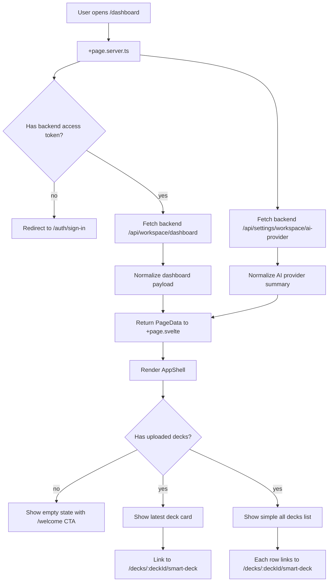
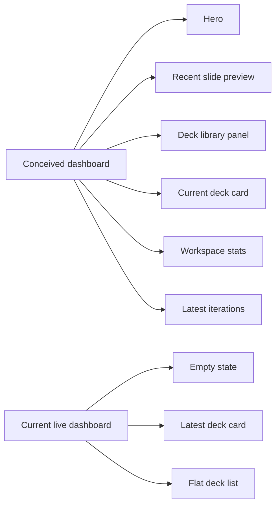

# Dashboard Conception Diagram

This document explains how the dashboard appears to have been conceived, how it is currently wired, and where the current implementation diverges from the richer dashboard component set already present in the repo.

Scope:

- frontend repo: `deck-frontend-rescue`
- signed-in dashboard route: `/dashboard`
- dashboard shell, data loader, and supporting dashboard components

## Executive Summary

The dashboard currently has a **live minimal implementation** and a **richer intended component architecture**.

The minimal live implementation is:

- one server loader
- one page
- one latest-deck card
- one flat deck list

The richer intended architecture is already partially built in components:

- welcome hero
- deck preview
- uploaded deck panel
- right rail
- current deck card
- workspace stats
- latest iterations

So the dashboard has not been erased. It has split into:

1. a simple route that is actually rendered today
2. a more complete dashboard design system that is only partially wired

## Canonical User Path

Dashboard user URL:

- `/dashboard`

Owning files:

- route loader: [src/routes/(product)/dashboard/+page.server.ts](/home/phoenix/Documents/andrea-projects-workspace/rescue-DECK/deck-frontend-rescue/src/routes/(product)/dashboard/+page.server.ts)
- route page: [src/routes/(product)/dashboard/+page.svelte](/home/phoenix/Documents/andrea-projects-workspace/rescue-DECK/deck-frontend-rescue/src/routes/(product)/dashboard/+page.svelte)

## Current Live Dashboard Flow



## Current Live Render Tree

```mermaid
flowchart TD
  A[/dashboard]
  A --> B[AppShell.svelte]
  B --> C[Sidebar.svelte]
  B --> D[TopBar.svelte]
  B --> E[dashboard/+page.svelte]
  E --> F[Empty state panel]
  E --> G[Latest deck link card]
  E --> H[All decks grid]
```

## Richer Intended Dashboard Composition

The repo already contains a more complete dashboard component family.

Primary files:

- [src/lib/components/dashboard/DashboardWelcomeHero.svelte](/home/phoenix/Documents/andrea-projects-workspace/rescue-DECK/deck-frontend-rescue/src/lib/components/dashboard/DashboardWelcomeHero.svelte)
- [src/lib/components/dashboard/RecentSlidesPreview.svelte](/home/phoenix/Documents/andrea-projects-workspace/rescue-DECK/deck-frontend-rescue/src/lib/components/dashboard/RecentSlidesPreview.svelte)
- [src/lib/components/dashboard/UploadedDecksPanel.svelte](/home/phoenix/Documents/andrea-projects-workspace/rescue-DECK/deck-frontend-rescue/src/lib/components/dashboard/UploadedDecksPanel.svelte)
- [src/lib/components/dashboard/DashboardRightRail.svelte](/home/phoenix/Documents/andrea-projects-workspace/rescue-DECK/deck-frontend-rescue/src/lib/components/dashboard/DashboardRightRail.svelte)
- [src/lib/components/dashboard/CurrentDeckCard.svelte](/home/phoenix/Documents/andrea-projects-workspace/rescue-DECK/deck-frontend-rescue/src/lib/components/dashboard/CurrentDeckCard.svelte)
- [src/lib/components/dashboard/WorkspaceStatsCard.svelte](/home/phoenix/Documents/andrea-projects-workspace/rescue-DECK/deck-frontend-rescue/src/lib/components/dashboard/WorkspaceStatsCard.svelte)
- [src/lib/components/dashboard/LatestIterationsCard.svelte](/home/phoenix/Documents/andrea-projects-workspace/rescue-DECK/deck-frontend-rescue/src/lib/components/dashboard/LatestIterationsCard.svelte)
- [src/lib/components/dashboard/SlidePreviewTile.svelte](/home/phoenix/Documents/andrea-projects-workspace/rescue-DECK/deck-frontend-rescue/src/lib/components/dashboard/SlidePreviewTile.svelte)

That richer conception looks like this:

```mermaid
flowchart TD
  A[/dashboard]
  A --> B[AppShell.svelte]
  B --> C[Sidebar.svelte]
  B --> D[TopBar.svelte]
  B --> E[DashboardWelcomeHero]
  B --> F[RecentSlidesPreview]
  B --> G[UploadedDecksPanel]
  B --> H[DashboardRightRail]
  H --> I[CurrentDeckCard]
  H --> J[WorkspaceStatsCard]
  H --> K[LatestIterationsCard]
```

## Conceived Information Architecture

The richer component set suggests the dashboard was conceived as a **workspace hub**, not just a deck list.

### Primary dashboard jobs

1. Continue the latest deck quickly.
2. Preview recent slide output visually.
3. Jump into iterations and review flows.
4. Show workspace health and activity totals.
5. Expose the uploaded deck library without making dashboard become the full library.

### User actions implied by the component set

- Continue latest deck
- Review iterations
- Upload new deck
- Open Smart Deck from preview tiles
- View all decks
- View all iterations

## Data Contract the Dashboard Expects

The dashboard types live in:

- [src/lib/types/workspace-dashboard.ts](/home/phoenix/Documents/andrea-projects-workspace/rescue-DECK/deck-frontend-rescue/src/lib/types/workspace-dashboard.ts)

Expected backend payload:

```ts
WorkspaceDashboardResponse {
  user
  stats
  latestDeck
  decks
  recentSlides
  latestIterations
}
```

This means the richer dashboard was conceived around these data domains:

- user summary
- workspace totals
- latest deck
- all or recent decks
- recent slide previews
- latest iteration history

## Current Loader Responsibilities

Current loader file:

- [src/routes/(product)/dashboard/+page.server.ts](/home/phoenix/Documents/andrea-projects-workspace/rescue-DECK/deck-frontend-rescue/src/routes/(product)/dashboard/+page.server.ts)

It currently owns:

- auth gate for `/dashboard`
- backend URL requirement
- backend dashboard fetch
- AI provider summary fetch
- light normalization into `workspace` and `decks`

It does **not** currently assemble the richer page composition in the page itself.

## Current Page Responsibilities

Current page file:

- [src/routes/(product)/dashboard/+page.svelte](/home/phoenix/Documents/andrea-projects-workspace/rescue-DECK/deck-frontend-rescue/src/routes/(product)/dashboard/+page.svelte)

It currently renders:

- empty state if no uploaded decks
- one latest deck card
- one flat list of decks

It currently does **not** render:

- `DashboardWelcomeHero`
- `RecentSlidesPreview`
- `UploadedDecksPanel`
- `DashboardRightRail`

## Gap Between Conception and Current Wiring



The gap is not missing backend data alone. The richer frontend composition already exists. The main gap is that the route page has not been rewired to use that component architecture end to end.

## Navigation Model Implied by the Dashboard

The dashboard components consistently point to these product routes:

- `/decks/:deckId/smart-deck`
- `/decks/:deckId/iterations`
- `/decks/new`
- `/decks`

This is important because it means the intended dashboard conception is aligned with the MVP deck spine:

- dashboard
- deck upload
- Smart Deck
- iterations
- library

That part is coherent.

## Risks and Drift

### 1. Dual dashboard reality

There is now a difference between:

- what the route renders today
- what the dashboard component inventory suggests the dashboard should be

### 2. Underused backend payload

The backend payload includes:

- `recentSlides`
- `latestIterations`
- `user`

But the current route page barely uses them.

### 3. Navigation clarity depends on product-only linking

The dashboard conception is clean only if its CTAs stay inside product routes and do not leak into admin routes.

### 4. The dashboard can feel broken even when the backend works

If the user expects a richer workspace hub but sees only a slim deck list, it feels like the product regressed even if the route technically functions.

## Recommended Mental Model

Treat the dashboard as:

- **not** the deck editor
- **not** the full deck library
- **not** the admin console
- **yes** the signed-in workspace control room

Its job should be:

1. show where the user currently is
2. show the fastest next deck action
3. show recent visual output
4. show recent iteration activity
5. route the user into the canonical product surfaces

## File Ownership Map

### Route ownership

- `/dashboard`
  - [src/routes/(product)/dashboard/+page.server.ts](/home/phoenix/Documents/andrea-projects-workspace/rescue-DECK/deck-frontend-rescue/src/routes/(product)/dashboard/+page.server.ts)
  - [src/routes/(product)/dashboard/+page.svelte](/home/phoenix/Documents/andrea-projects-workspace/rescue-DECK/deck-frontend-rescue/src/routes/(product)/dashboard/+page.svelte)

### Shell ownership

- dashboard shell
  - [src/lib/components/AppShell.svelte](/home/phoenix/Documents/andrea-projects-workspace/rescue-DECK/deck-frontend-rescue/src/lib/components/AppShell.svelte)

### Rich dashboard component ownership

- hero
  - [src/lib/components/dashboard/DashboardWelcomeHero.svelte](/home/phoenix/Documents/andrea-projects-workspace/rescue-DECK/deck-frontend-rescue/src/lib/components/dashboard/DashboardWelcomeHero.svelte)
- recent slides
  - [src/lib/components/dashboard/RecentSlidesPreview.svelte](/home/phoenix/Documents/andrea-projects-workspace/rescue-DECK/deck-frontend-rescue/src/lib/components/dashboard/RecentSlidesPreview.svelte)
- uploaded decks
  - [src/lib/components/dashboard/UploadedDecksPanel.svelte](/home/phoenix/Documents/andrea-projects-workspace/rescue-DECK/deck-frontend-rescue/src/lib/components/dashboard/UploadedDecksPanel.svelte)
- right rail
  - [src/lib/components/dashboard/DashboardRightRail.svelte](/home/phoenix/Documents/andrea-projects-workspace/rescue-DECK/deck-frontend-rescue/src/lib/components/dashboard/DashboardRightRail.svelte)
- right-rail current deck
  - [src/lib/components/dashboard/CurrentDeckCard.svelte](/home/phoenix/Documents/andrea-projects-workspace/rescue-DECK/deck-frontend-rescue/src/lib/components/dashboard/CurrentDeckCard.svelte)
- right-rail workspace stats
  - [src/lib/components/dashboard/WorkspaceStatsCard.svelte](/home/phoenix/Documents/andrea-projects-workspace/rescue-DECK/deck-frontend-rescue/src/lib/components/dashboard/WorkspaceStatsCard.svelte)
- right-rail latest iterations
  - [src/lib/components/dashboard/LatestIterationsCard.svelte](/home/phoenix/Documents/andrea-projects-workspace/rescue-DECK/deck-frontend-rescue/src/lib/components/dashboard/LatestIterationsCard.svelte)

## Conclusion

The dashboard was conceived as a richer signed-in workspace overview than what is currently rendered.

The good news:

- the component architecture is already partly present
- the backend payload shape already supports that richer experience
- the intended navigation mostly aligns with the MVP product flow

The main issue is not that the dashboard idea disappeared.

The main issue is that the **current route is underwired relative to the dashboard architecture already in the repo**.

That makes this recoverable:

- the conception is still legible
- the file ownership is identifiable
- and the route can be rewired toward the richer design without inventing a new dashboard from scratch

## Dashboard Behavior Audit

This section answers a narrower question:

- does the dashboard code work
- does the copy match the intended behavior
- do the dashboard buttons point to real routes
- and how are those buttons supposed to work

## Short Answer

The dashboard buttons mostly point to real product routes.

The bigger problem is not "dead links everywhere." The bigger problem is:

- the **live dashboard is much simpler** than the richer dashboard component set
- some CTA copy promises a fuller workspace experience than the current route actually renders
- the richer dashboard components are mostly **architecturally coherent**, but are not fully wired into `/dashboard`

So:

- most dashboard button targets are valid
- the richer dashboard conception is still readable
- but the live route does not yet deliver that full conceived experience

## Live Dashboard: Current Buttons and Copy

Live route page:

- [src/routes/(product)/dashboard/+page.svelte](/home/phoenix/Documents/andrea-projects-workspace/rescue-DECK/deck-frontend-rescue/src/routes/(product)/dashboard/+page.svelte)

### Empty state

Current copy:

- eyebrow: `Get started`
- title: `Upload your first deck`
- body: `AI analysis of narrative, traction, market fit, and ask quality.`
- button: `Get started`

Current button target:

- `/welcome`

Target route exists:

- yes, via [src/routes/(product)/welcome/+page.svelte](/home/phoenix/Documents/andrea-projects-workspace/rescue-DECK/deck-frontend-rescue/src/routes/(product)/welcome/+page.svelte)

How it is supposed to work:

- empty dashboard sends the user into the signed-in welcome/intake surface
- welcome page then routes the user to `/decks/new`

Assessment:

- technically valid
- one extra hop
- less direct than a dashboard CTA going straight to `/decks/new`

### Latest deck card

Current copy:

- eyebrow: `Latest deck`
- title: deck title
- body: raw deck status

Current button behavior:

- whole card links to `/decks/:deckId/smart-deck`

Target route exists:

- yes, via [src/routes/(product)/decks/[deckId]/smart-deck/+page.server.ts](/home/phoenix/Documents/andrea-projects-workspace/rescue-DECK/deck-frontend-rescue/src/routes/(product)/decks/[deckId]/smart-deck/+page.server.ts)

How it is supposed to work:

- open the active deck workspace directly

Assessment:

- route target is correct
- copy is weak because it shows raw status text instead of clearer product language
- conceptually correct, but visually underspecified

### All decks list

Current copy:

- eyebrow: `All decks`
- each row shows title and raw status

Current button behavior:

- each row links to `/decks/:deckId/smart-deck`

Target route exists:

- yes

How it is supposed to work:

- quick jump from dashboard into an existing deck workspace

Assessment:

- route target is correct
- behavior is coherent
- but it duplicates part of what `/decks` already owns

## Rich Dashboard Components: Button Audit

These components are not all currently rendered by `/dashboard`, but they show the intended interaction model.

## `DashboardWelcomeHero.svelte`

File:

- [src/lib/components/dashboard/DashboardWelcomeHero.svelte](/home/phoenix/Documents/andrea-projects-workspace/rescue-DECK/deck-frontend-rescue/src/lib/components/dashboard/DashboardWelcomeHero.svelte)

Buttons:

1. `Continue latest deck`
   - target with latest deck: `/decks/:deckId/smart-deck`
   - fallback target: `/decks`
   - route exists: yes

2. `Review iterations`
   - target with latest deck: `/decks/:deckId/iterations`
   - fallback target: `/decks`
   - route exists: yes, via [src/routes/(product)/decks/[deckId]/iterations/+page.server.ts](/home/phoenix/Documents/andrea-projects-workspace/rescue-DECK/deck-frontend-rescue/src/routes/(product)/decks/[deckId]/iterations/+page.server.ts)

3. `Upload new deck`
   - target: `/decks/new`
   - route exists: yes

How it is supposed to work:

- give the signed-in user the three top workspace actions:
  - continue work
  - review iteration history
  - start a new deck

Assessment:

- strong and coherent
- all targets are valid product routes
- this component is closer to the intended dashboard than the live page

## `RecentSlidesPreview.svelte`

File:

- [src/lib/components/dashboard/RecentSlidesPreview.svelte](/home/phoenix/Documents/andrea-projects-workspace/rescue-DECK/deck-frontend-rescue/src/lib/components/dashboard/RecentSlidesPreview.svelte)

Buttons and links:

1. `Open Smart Deck`
   - target: `/decks/:deckId/smart-deck`
   - route exists: yes

2. each slide tile
   - target: `/decks/:deckId/smart-deck?slide=:slideId`
   - route exists: yes

How it is supposed to work:

- act as a visual fast-entry point into Smart Deck with slide context preselected

Assessment:

- strong route design
- copy matches behavior
- likely one of the clearest pieces of the conceived dashboard

## `UploadedDecksPanel.svelte`

File:

- [src/lib/components/dashboard/UploadedDecksPanel.svelte](/home/phoenix/Documents/andrea-projects-workspace/rescue-DECK/deck-frontend-rescue/src/lib/components/dashboard/UploadedDecksPanel.svelte)

Buttons and links:

1. `View all`
   - target: `/decks`
   - route exists: yes, via [src/routes/(product)/decks/+page.server.ts](/home/phoenix/Documents/andrea-projects-workspace/rescue-DECK/deck-frontend-rescue/src/routes/(product)/decks/+page.server.ts)

2. deck cards
   - target: `/decks/:deckId/smart-deck`
   - route exists: yes

3. empty state button
   - target: `/decks/new`
   - route exists: yes

How it is supposed to work:

- keep dashboard short
- use `/decks` as the deeper browsing surface
- use Smart Deck as the open-deck destination

Assessment:

- coherent
- targets are valid
- better aligned with the product spine than the current flat list on the live page

## `CurrentDeckCard.svelte`

File:

- [src/lib/components/dashboard/CurrentDeckCard.svelte](/home/phoenix/Documents/andrea-projects-workspace/rescue-DECK/deck-frontend-rescue/src/lib/components/dashboard/CurrentDeckCard.svelte)

Buttons:

1. `Open current deck`
   - target: `/decks/:deckId/smart-deck`
   - route exists: yes

2. empty state button `Upload new deck`
   - target: `/decks/new`
   - route exists: yes

How it is supposed to work:

- right-rail quick action for current workspace focus

Assessment:

- correct route targets
- copy is clear
- one of the simpler components and structurally sound

## `LatestIterationsCard.svelte`

File:

- [src/lib/components/dashboard/LatestIterationsCard.svelte](/home/phoenix/Documents/andrea-projects-workspace/rescue-DECK/deck-frontend-rescue/src/lib/components/dashboard/LatestIterationsCard.svelte)

Buttons and links:

1. `View all`
   - target: `/decks/:deckId/iterations`
   - route exists: yes

2. iteration rows
   - target: `/decks/:deckId/iterations/:iterationId`
   - route exists: yes

How it is supposed to work:

- expose recent iteration review without turning dashboard into the full review surface

Assessment:

- route targets are correct
- good alignment with the batch/iteration workflow

## Copy Assessment

### Where the copy is conceptually strong

- `Continue latest deck`
- `Review iterations`
- `Upload new deck`
- `Open Smart Deck`
- `View all`
- `Open current deck`

These labels are direct and match real product destinations.

### Where the copy is weaker

- live dashboard empty state button `Get started`
- live dashboard latest deck card showing raw status text
- live dashboard all decks list showing raw backend status values

Why weaker:

- the labels are more generic
- some copy reflects backend-state language instead of product language
- the live page feels more like a data stub than a designed workspace control room

## Route Validity Summary

The main dashboard-linked product routes do exist:

- `/dashboard`
- `/welcome`
- `/decks`
- `/decks/new`
- `/decks/:deckId/smart-deck`
- `/decks/:deckId/iterations`
- `/decks/:deckId/iterations/:iterationId`

That means the dashboard link model is mostly technically valid.

## What Works Today

- Dashboard auth gate and data loading route are real.
- Latest deck links go to a real Smart Deck route.
- Deck list links go to real Smart Deck routes.
- The richer dashboard components mostly link to real product destinations.
- The conceived dashboard interaction model still maps onto real paths in the app.

## What Does Not Fully Work As Intended

### 1. The richer dashboard is not actually mounted on `/dashboard`

The most important issue is wiring, not button existence.

The richer dashboard components appear to be the intended UX, but the live page still renders a reduced version.

### 2. Some copy is lower-level than the intended UX

The live dashboard leaks raw statuses and generic phrasing instead of giving the user clearer product actions.

### 3. Empty-state navigation is valid but indirect

Current path:

- `/dashboard` empty state button -> `/welcome` -> `/decks/new`

This works, but it is not the most direct dashboard action path.

## How the Dashboard Is Supposed to Work

If the conceived dashboard were fully respected, the user experience would be:

1. Open `/dashboard`.
2. See workspace-level context:
   - latest deck
   - recent slide previews
   - uploaded deck library
   - recent iterations
   - workspace metrics
3. Use primary CTAs:
   - continue latest deck
   - review iterations
   - upload new deck
4. Land only on canonical product routes:
   - `/decks/new`
   - `/decks/:deckId/smart-deck`
   - `/decks/:deckId/iterations`
   - `/decks`

That model is still visible in the codebase.

## Final Judgment

The dashboard buttons are **mostly pointing where they are supposed to point**.

The deeper problem is:

- the **live dashboard implementation is smaller than the intended dashboard architecture**
- some live copy is too generic or too raw
- and the richer interaction model is present in components but not fully wired into the route

So the dashboard is not primarily failing because the buttons have nowhere to go.

It is failing because the conceived dashboard experience has only been partially materialized in the live route.
