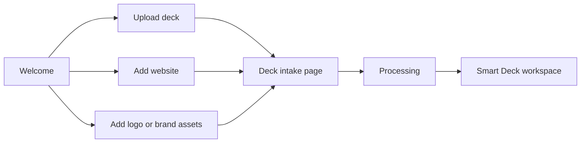

# Welcome Conception Diagram

This document explains how the signed-in welcome surface was conceived, why both `/welcome` and `/welcome-v2` existed, and how the route is now unified.

Scope:

- canonical signed-in welcome route: `/welcome`
- compatibility alias: `/welcome-v2`
- related compatibility redirect: `/welcome_back`

## Executive Summary

The repo had two overlapping welcome concepts:

1. a minimal canonical `/welcome`
2. a richer, more intentional `/welcome-v2`

The richer one better matches the current product direction:

- deck upload first
- optional company website context
- optional brand assets
- AI review workspace as the destination

The simpler `/welcome` was still the real route many other screens linked to, so the correct fix is not to promote `/welcome-v2` as a second canonical route. The correct fix is:

- keep `/welcome` as the canonical signed-in welcome path
- move the richer conception into that route
- turn `/welcome-v2` into a compatibility alias

## Original Split

### `/welcome`

Files:

- [src/routes/(product)/welcome/+page.server.ts](/home/phoenix/Documents/andrea-projects-workspace/rescue-DECK/deck-frontend-rescue/src/routes/(product)/welcome/+page.server.ts)
- [src/routes/(product)/welcome/+page.svelte](/home/phoenix/Documents/andrea-projects-workspace/rescue-DECK/deck-frontend-rescue/src/routes/(product)/welcome/+page.svelte)

Original concept:

- lightweight starter screen
- one upload CTA
- optional recent decks list
- three-step explanation: upload, analyze, improve

### `/welcome-v2`

Files:

- [src/routes/(product)/welcome-v2/+page.server.ts](/home/phoenix/Documents/andrea-projects-workspace/rescue-DECK/deck-frontend-rescue/src/routes/(product)/welcome-v2/+page.server.ts)
- archived route-local page implementation:
  [legacy-removed/deck-frontend-rescue/src/routes/(product)/welcome-v2/+page.svelte](/home/phoenix/Documents/andrea-projects-workspace/rescue-DECK/legacy-removed/deck-frontend-rescue/src/routes/(product)/welcome-v2/+page.svelte)

Original concept:

- richer signed-in onboarding/workspace entry
- multiple action cards
- visual workspace stage
- workspace signals and stats
- clearer explanation of upload + context + brand layering

Restriction:

- `welcome-v2` used to be a separate richer route. It now redirects to `/welcome` and no longer owns a live page component.

## Unified Target Model

The welcome surface should be:

- one canonical route: `/welcome`
- signed-in product-owned
- the default entry point for users with zero or low workspace context
- the place that introduces the deck-first workflow

## Conception Diagram

```mermaid
flowchart TD
  A[Signed-in user lands on /welcome] --> B[Load workspace summary]
  B --> C{Workspace available?}
  C -- no --> D[Show degraded notice but keep intake CTAs usable]
  C -- yes --> E[Show workspace signals and recent decks]
  D --> F[Primary actions]
  E --> F
  F --> G[Upload deck]
  F --> H[Add company website]
  F --> I[Add logo or brand assets]
  G --> J[/decks/new?firstBatch=slide_miniatures]
  H --> K[/decks/new?firstBatch=url_branding]
  I --> L[/decks/new?firstBatch=logo_branding]
```

## Intended Mental Model

The unified welcome route is not:

- the dashboard
- the deck library
- the Smart Deck editor

It is:

- the signed-in product entry surface for starting or resuming intake with the correct context

## Intended User Journey



## Information Architecture

The richer conception groups the welcome page into three layers:

### 1. Hero

Purpose:

- explain what DeckAiStack does
- expose the top two start actions
- show workspace signals

### 2. Action cards

Purpose:

- make the three valid start modes explicit
- deck upload
- website context
- brand asset upload

### 3. Secondary explanation rail

Purpose:

- explain the investor-grade review flow
- reassure the user that edits remain reviewable

## Supporting Components

Shared components now used by the canonical welcome surface:

- [src/lib/components/welcome/WelcomeWorkspaceEntry.svelte](/home/phoenix/Documents/andrea-projects-workspace/rescue-DECK/deck-frontend-rescue/src/lib/components/welcome/WelcomeWorkspaceEntry.svelte)
- [src/lib/components/welcome-v2/WelcomeActionCard.svelte](/home/phoenix/Documents/andrea-projects-workspace/rescue-DECK/deck-frontend-rescue/src/lib/components/welcome-v2/WelcomeActionCard.svelte)
- [src/lib/components/welcome-v2/WelcomeHeroStage.svelte](/home/phoenix/Documents/andrea-projects-workspace/rescue-DECK/deck-frontend-rescue/src/lib/components/welcome-v2/WelcomeHeroStage.svelte)

## Why the Split Was Problematic

Having both `/welcome` and `/welcome-v2` caused:

- duplicated route meaning
- uncertainty about which welcome route was canonical
- better UI trapped behind an admin-only alias
- many existing product links still pointing to the simpler page

## Canonical Welcome Rules

After unification, the intended rule set is:

- `/welcome` is the only canonical signed-in welcome route
- `/welcome-v2` is compatibility-only
- all product links that mean "start here" should target `/welcome`
- welcome should route users into `/decks/new` variants, not into admin or unrelated surfaces

## Relationship to `welcome_back`

`/welcome_back` is no longer a real product surface.

The original intent behind it was "resume an existing workspace/deck", but that role now belongs to `/dashboard` instead of a second welcome route.

So the intended separation is:

- `/welcome` = start / onboarding / intake entry
- `/dashboard` = return / resume / continue existing work
- `/welcome_back` = compatibility redirect to `/dashboard`

## Practical Conclusion

The richer welcome conception was the correct direction, but it was living behind a second route. The right architectural move is not to keep both. It is to:

- preserve `/welcome` as the route other pages already trust
- move the stronger UI conception into that route
- keep `/welcome-v2` only as an alias or migration seam
- keep `/welcome_back` only as a migration redirect, not as a maintained page

That keeps the route map cleaner while preserving the stronger product narrative.
